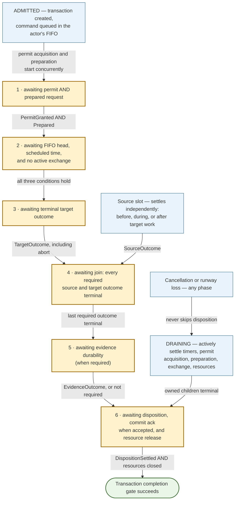
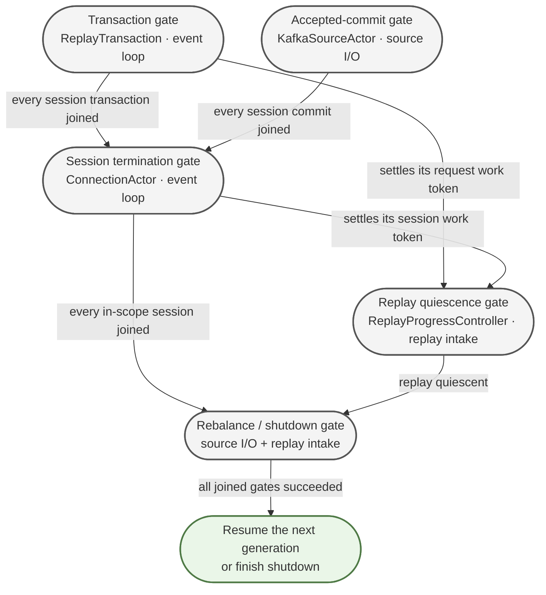
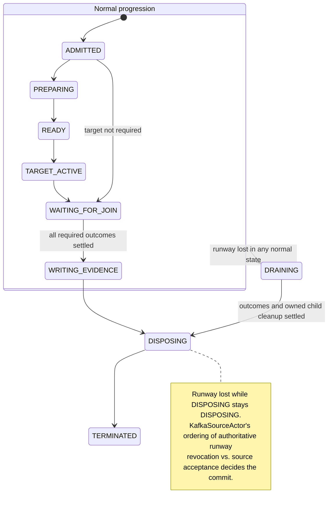

# Hardened Traffic Replayer Architecture

**Status:** Implemented foundations under convergence hardening

**Date:** 2026-09-08

**Revision note.** This revision resolves the decisions formerly collected as open questions in §19
and hardens §10's capture-side open-connection manifest design. In particular, it removes
finite-window exhaustion as a commit proof: without an external producer fence, a scan cannot
distinguish a dead proxy from a stalled proxy that may append records later. It also makes proxy
open-connection manifests complete, chunked, and ordered through the same producer-submission path as
traffic. The cancellation review additionally made two contracts explicit: aborting an active target
exchange must actively settle and clean up every owned sub-operation rather than wait for the normal
response path, and reassignment/shutdown revokes a transaction's generation-scoped runway
independently of source and target outcomes. A later editorial pass reworked the §7 and §13.2
diagrams for legibility (per-component nodes, one message per arrow, ownership moved to companion
tables) and tightened prose; it changed no contracts, invariants, or decisions.

**Companion mapping:** [replayerCurrentToProposedArchitectureMap.md](replayerCurrentToProposedArchitectureMap.md)
— which current class becomes what, and in which migration slice.

**Policy input:** [replayer-expiration-hardening.md](replayer-expiration-hardening.md)
— the expiration and commit policy exploration that led here. This document's §10 supersedes its
idle-only manifest and finite-window-exhaustion proposals.

**Lifecycle audit:** [replayerWorkLifecycleResponsibilityAudit.md](replayerWorkLifecycleResponsibilityAudit.md)
— the 31 concerns (R1–R18, C1–C13) this design assigns owners to.

**Tactical alternative:** [replayerSimplifiedLifecycleDesign.md](replayerSimplifiedLifecycleDesign.md)
— the same invariants achieved by flattening contracts instead of changing the execution model.

**Scaling proposal (sketch, partially implemented):**
[proxyHorizontalScalingAndNodeDeath.md](proxyHorizontalScalingAndNodeDeath.md)
— horizontal proxy scaling via consumer-group membership, plus a per-`(nodeId, partition)`
writer-completion record. Exact manifests, `NoMoreWrites`, group membership foundations, and
interleaved chunk reconstruction are implemented. The final admission protocol uses
`JOINING`/`READY`/`ACTIVE`, pairwise witnesses, and conservative versioned write footprints; that
revision must land before proxy scaling is complete. A total fleet loss has no automated settlement
path: unresolved work is retained, diagnosed, and may either wait indefinitely or terminate the
replay run. A fresh replacement process cannot speak for an old `nodeId`.

---

## Implementation Status (2026-09-07, branch `integrating3231`)

This design is now substantially **implemented** on this branch; "Draft for discussion" above
describes its origin, not its state. The table below marks what is finished, what was deliberately
scoped out of the first implementation, and what is future work. Component names in §3.3 were
working names: some became classes verbatim, others landed inside retained current classes per the
crosswalk — naming drift is listed under the table.

| Mechanism | Status | Where |
| --- | --- | --- |
| §6.4 Completion gates | **Done** | `lifecycle/CompletionGate.java`; gate discipline through actor/session/shutdown paths |
| §9 Typed identity | **Done** | `lifecycle/ReplayIdentity.java` — all five key records plus work/record ids |
| §10.2 One consumer, two cursors | **Done** | `TrackingKafkaConsumer.scanAhead` |
| §10.3 Proof-bearing verdicts | **Done** | `traffic/source/ScanEvidence.java`, `AbsenceProof`, `FollowUpRequirement`; one complete exact manifest after the last connection record is sufficient |
| §10.4 Verdicts via control loop | **Done** | scan-blocker listener in `CapturedTrafficToHttpTransactionAccumulator`; `runLivenessScanIfDue` |
| §10.5 Expiration policy matrix | **Done** | `lifecycle/ReplayDispositionPolicy.java` |
| §10.6 Epsilon lookahead | **Done as an optimization** | `ReplayReadGate`, `ReplayProgressController`, `ReplayEngine`; it is not commit authority and scanner-disabled parity remains a verification target |
| §10.7 Capture-side duration cap | **Not implemented** — and explicitly optional here | No proxy flag exists. The scaling sketch removes its residual correctness role entirely, so implement it (if ever) as operational policy only |
| §10.8 Proxy manifests and writer completion | **Foundations done; admission revision required** | Exact registry, chunked manifests, ordered publisher, `NoMoreWrites`, reassembly, and membership foundation exist. Final states/witnesses/footprints are specified in the scaling design. |
| §11 Connection actor | **Done** | `lifecycle/ConnectionActor.java`, `ActorMailbox`, `NettyEventLoopActorMailbox`; sorter and schedule map **deleted** (acceptance criterion 15) |
| §12 Async permit pool | **Done** | `lifecycle/AsyncPermitPool.java`; `TrafficStreamLimiter` **deleted** |
| §13 Replay transaction | **Done** | `lifecycle/ReplayTransaction.java`, `ReplayOutcomes`, `TargetExchangeState`, `ReplayTransactionRegistry` |
| §14 Record disposition | **Done** | `lifecycle/RecordDisposition.java`, `RecordDispositionLedger.java`, `ReplayDispositionPolicy.java` |
| §15 Resource ownership | **Done** | `lifecycle/ResourceOwnership.java` (tracker + metrics) |
| §16.1–16.2 Rebalance / shutdown | **Done** | synthetic-close pipeline, generation fencing, drain-before-Netty-stop, shutdown-before-JVM-exit (see branch history) |
| §16.3 Event-loop death | **Policy corrected; simplification pending** | Unexpected live-session loop death signals process-fatal shutdown. Cross-thread mailbox-loss recovery machinery is a migration residue to delete, not architecture to preserve. |
| §17 Evidence API | **Done to first-impl scope** | whole-tuple sink retained; disposition depends on explicit evidence; part-level receipts remain internal per §19.5 |
| §19.1 Poison classifier | **Done** | `TargetResponseClassifier` + shared `ExceptionTypeAllowlist`, default empty |
| §19.7 Group-assigned routing + manifest interval | **Migration pending** | Current `PartitionRoutingPlan` and shard-width flag are replaced by admission-aware group assignments and per-connection stored partitions. |

Naming drift between this document and the code: `ProxyOmissionProof` → `AbsenceProof`;
`ProxyOpenConnectionRegistry` → `ProxyLivenessRegistry`; current
`ProxyLivenessSnapshotChunk`/snapshot-interval names should migrate to precise manifest
terminology. Of the §3.3 working names, `KafkaSourceActor`,
`SourceAssembler`, `ReplayCoordinator`, `ConnectionRuntime`, `TargetExchange`,
`RequestPreparationService`, and `EvidenceWriter` did not become classes — their responsibilities
live in the retained current classes (`TrackingKafkaConsumer`/`KafkaTrafficCaptureSource`,
`CapturedTrafficToHttpTransactionAccumulator`, `RequestSenderOrchestrator` and its `ActorRuntime`,
`NettyPacketToHttpConsumer`, the transformation pipeline, and the tuple sink), adapted to the
contracts here.

**Future work** is concentrated in the final scaling protocol
([proxyHorizontalScalingAndNodeDeath.md](proxyHorizontalScalingAndNodeDeath.md)), separation of the
Kafka source-I/O and replay-intake owners, removal of mailbox-loss recovery, mandatory lifecycle
interfaces, and layered real-Kafka verification. Until the scaling protocol lands, this document's
§10.5 retain-and-halt row is the no-survivor behavior.

---

## 0. How to Read This Document

**The short version.** Today the replayer's lifecycle decisions are spread across a graph of
callbacks running on whichever thread happens to settle a future, so answering "does this Kafka
record reach a deliberate commit-or-retain decision on every path?" requires inspecting every path.
This design replaces the graph with two single-owner state machines — a **connection actor** owning
ordered target-side execution and connection termination, and a **replay transaction** owning one
request's resources, evidence, and final record disposition. Everything else becomes a producer of
typed messages to one of those two, so each lifecycle question is answerable from one state machine.

**What is *not* being claimed.** Kafka delivery stays at-least-once: a record may be redelivered
after a crash, a rebalance, or any staged offset never durably acknowledged — and deliberate
`Retain` decisions exist precisely to cause that. The guarantee is one **explicit disposition
decision per accepted record inside a process** — never zero (an orphaned offset), never two (a
double-commit crash). Nor does correctness become purely local: actors and transactions localize the
lifecycle state that today leaks across callbacks, but source assembly, offset low-watermarks,
permit accounting, and the disposition ledger remain genuinely cross-component, held together by
§6's invariants.

**Reading order.** §1–§4 are conceptual and worth reading in sequence: the problem, the core
idea, the vocabulary, and a worked example that traces one request end to end. §5–§14 are the
mechanisms; each opens with the problem it solves, so they can be read in any order once you have
the example in mind. §15–§18 are rules, metrics, tests, and gates. §19 records the design decisions
that constrain the first implementation.

**Deliberate omissions.** Current class names and the migration sequence live in the companion
crosswalk, not here. And the current replayer is not claimed to be broken in general: Kafka
consumption, HTTP reconstruction, transformation, Netty I/O, tuple sinks, and offset-commit
mechanics are all retained. Only their orchestration contracts change.

---

## 1. The Problem

The trouble is concentrated in one place: **the connective tissue that decides when work is
finished.** Four distinct failure mechanisms found there share one shape, and that shape is what the
design makes impossible. They are four *mechanisms*, not four outages — F3 and F4 surfaced while
diagnosing the same rebalance incident, which is itself telling: one incident hid two independent
instances of the same structural defect.

### 1.1 The recurring failure: a required signal silently disappears

| Mechanism | What silently disappeared |
| --- | --- |
| F1 | A request spanning two Kafka records hit a `connectionException`. The handler reset state and discarded the held record keys *without committing them*. Those offsets pinned their partition forever. |
| F2 | An expiring keep-alive connection committed its held keys, then a `finally` block committed the same keys again and threw. Because commits are only staged, the crash meant Kafka never learned — so restart re-delivered the records and re-crashed. |
| F3 | `BlockingTrafficSource` implements the traffic-source interface but did not override two lifecycle methods, which are `default {}` no-ops. Production wires the close callback *through* that wrapper, so every close notification was swallowed and the drain gate never reopened. |
| F4 | Closing a connection called `schedule.clear()`, dropping pending futures without completing them. Everything waiting on them — limiter permits, tracker entries, the ordering sorter — waited forever. |

None of these is an exotic race. Each is a **required notification or decision that had no
owner**, so when one path forgot it, nothing noticed. F3 is the purest form: an empty default
method on an interface is a legal, invisible way to lose a mandatory signal.

### 1.2 Why the current structure invites this

Four structural properties, each of which this design targets directly.

**Ordering is reconstructed after the fact.** Requests are admitted in source order, then pass
through a concurrency limiter, asynchronous transformation, and an event-loop submission — after
which an `OnlineRadixSorter` puts them *back* in order using a request index. Ordering is a repair
operation, and the repair needs its own cancellation and drain semantics, which are themselves
state that can leak (that is F4).

**Terminal decisions are inferred rather than stated.** Whether to commit an offset is derived
from a `ReconstructionStatus` plus a boolean, at a call site that may or may not be reached.
`EXPIRED_PREMATURELY` commits; `CLOSED_PREMATURELY` does not. One status therefore cannot express
"expired because we *proved* it dead" (safe to commit) versus "expired because we ran out of
runway" (must not commit) — and the code has no third value to reach for.

**Cancellation can masquerade as success, or as nothing at all.** A cancelled send produces an
exception that is rethrown during tuple packaging, *before* the commit decision. So the request's
local bookkeeping drains — making dashboards look healthy — while its offsets stay pinned and its
tracing contexts stay open. Cancellation is neither success nor failure in the current vocabulary.
It is a gap.

**"Done" is not represented by anything.** `cancelConnection` returns an already-completed future
while its drain, channel close, and acknowledgement are still in flight. A synthetic-close gate is
an `AtomicInteger` that a missing callback can leave nonzero forever. Shutdown relies on the
process exiting. No object anywhere means "this operation's entire effect has settled."

---

## 2. The Core Idea

Give every mutable thing exactly one owner, and make every "done" a real completion.

Two new owners absorb the *per-connection and per-request* lifecycle responsibilities that are
currently spread across callbacks. They are not the only owners in the system — §3.3 lists the rest,
and source intake, progress accounting, and record disposition stay separate on purpose — but they are
where the failures in §1 live:

**A connection actor** owns everything about one target connection: the queue of things to do on
it (send this request, then close), the timer for when the next thing is due, the Netty channel,
the single exchange in flight, and the connection's terminal state. It processes one command at a
time, in admission order.

**A replay transaction** owns everything about one request: source request and response state, the
Kafka records carrying it, the concurrency permit, the transformed request buffers, the target
outcome, the evidence outcome, its generation-scoped runway state, the tracing contexts, and —
crucially — the final decision about that request's Kafka offsets.

Everything else becomes a *producer of typed messages* to one of those two. The assembler produces
source outcomes. Preparation produces a `Prepared` message. Netty produces a target outcome. The
evidence writer produces a durability outcome. The Kafka scanner produces proof-bearing control
events. None of them decides anything terminal.

Three consequences make this worth doing:

- **Ordering stops being a repair.** A request is admitted to its actor's queue *while source
  order is still known* — before the permit, before transformation. Preparation may then finish in
  any order, because the actor only ever looks at the head of its queue. Ordering holds by
  construction, so the sorter and schedule map are deleted rather than hardened.

- **Every terminal decision has one home.** One function decides a record's fate and receives
  everything relevant: what the source did, what the target did, whether evidence is durable.
  Cancellation becomes a first-class outcome that can never select a commit.

- **"Done" becomes checkable.** Aborting an actor returns a gate that completes only after its
  queue is settled, its in-flight exchange has been actively cancelled and its owned cleanup joined,
  its channel is closed, every transaction has dispositioned, and its source acknowledgement is
  delivered. Gates await real completions instead of counting or passively waiting for a normal
  callback that cancellation made impossible.

The design also carries the expiration-hardening policy: optional read-ahead bounded by a small
epsilon and coupled to replay progress; expiration commits requiring proxy-issued structural proof
and never elapsed wall-clock time; optional metadata scanning on the same Kafka consumer and
assignment as replay;
proxy-confirmed absence commits while reassignment, shutdown, and an unfenced silent proxy retain for
redelivery; a capture-side maximum connection duration that produces ordinary close observations and
bounds resource use without pretending to fence a stalled producer; and an evidence API that can
evolve toward independent tuple parts.

---

## 3. Vocabulary

Several of these words are overloaded in the existing code and docs. This section is the authority
for what they mean here.

### 3.1 The five different things called "close"

This ambiguity is a real source of bugs, so the design keeps the five lexically distinct:

| Term used here | Means |
| --- | --- |
| **Captured close** | A `close` observation *in the recorded data* — the original client's connection ended. This is input to be reconstructed. |
| **Source-side settlement** | The assembler's conclusion that a captured connection or request is finished, for any reason (complete, captured close, proven dead, interrupted, shutdown). |
| **Ordered close command** | A target-side close placed in a connection actor's queue at its time-shifted position, so it happens *after* the requests preceding it. |
| **Channel close** | The Netty target socket actually closing. |
| **Source acknowledgement** | Telling the Kafka layer "that session is gone," which is what releases its drain gate. **Not** an offset commit. |

### 3.2 Terminal-decision vocabulary

- **Settled / terminal** — reached a final state that will never change. Said of outcomes and
  gates, never of "the callback ran."
- **Disposition** — the terminal decision for a Kafka record: close its contexts, and either
  `Commit` or `Retain`. Every accepted record gets exactly one.
- **Commit** — advance the Kafka offset past this record, meaning *on restart we will never see it
  again*. This is the irreversible act, which is why it requires commit authority.
- **Retain** — deliberately do *not* advance the offset. The record stays eligible for redelivery
  to this or another consumer. Contexts still close; only the offset is held.
- **Commit authority** — the justification required before advancing a Kafka offset. There are two
  alternatives, not two pieces that every commit must contain:
  - **Replay evidence** — durable output written to a store (today, the tuple) recording *what replay
    did*. Normal replay requires this evidence.
  - **Proxy omission proof** — an offset-ordered assertion about *which connections the proxy's
    manifest contains* (§10.3's `ProxyOmissionProof`). A confirmed-dead discard requires this proof instead
    of replay evidence because it has no replay result to record.
  The proxy omission proof requires one complete, exact manifest copied after the connection's last
  record and omitting that connection; that is separate from the choice between the two
  commit-authority alternatives. Confirmed-dead discard does not require a durable discard receipt
  in the first implementation. Metrics and trace/debug logs record the diagnostic reason; they do
  not replace the proof.
- **Evidence** — reserved for the normal replay output managed by `EvidenceWriter`. A structural proof
  is commit authority, but is not an `EvidenceWriter` artifact.
- **Completion gate** — see §6.4. A future for a whole lifecycle operation, with an owner and
  documented postconditions that are already true when it completes successfully.
- **Obligation** — a per-item record that something must be acknowledged or disposed of, completed
  exactly once. It replaces a counter because it is *attributable* — an unfulfilled obligation names
  the connection, session, and record still owed, where a leaked counter only says the total is
  wrong — and because double-fulfillment becomes structurally impossible (the other half of F2).
  Completion is not automatic: an obligation can sit unfulfilled forever, exactly as a counter can
  stay nonzero forever; it just tells you what is stuck.
- **Out of runway** — we lost the right or the time to finish this work (partition reassigned,
  process shutting down). Never commit-eligible: someone else must be able to pick it up.
- **Runway state** — generation-scoped authority to enter a commit disposition. `KafkaSourceActor`
  owns the authoritative source-generation state. `RecordDispositionLedger`, on the replay-intake
  owner, keeps a monotonic observed runway so it can reject known-stale commits early, but source
  acceptance is final only when the source actor processes the commit command in order with poll
  and rebalance callbacks. It starts `Available` and may transition once to
  `Lost(REASSIGNMENT)` or `Lost(SHUTDOWN)`. Transactions hold only a monotonic local observation
  delivered as `RunwayLost`. Runway is orthogonal to source and target outcomes: reassignment can
  occur after both have already settled but before evidence or disposition has finished. Losing
  runway never rewrites an existing outcome; it vetoes any commit that the source actor has not
  already accepted.
- **Commit proposed / accepted / acknowledged** — three deliberately distinct stages. A transaction
  proposes a commit disposition to `RecordDispositionLedger`. The ledger sends a typed commit
  command to `KafkaSourceActor`; the source accepts it only after checking the current generation
  and registering the offset on its owner thread. Kafka acknowledges it only when the broker commit
  succeeds. Revocation ordered before source acceptance selects `Retain`; after source acceptance,
  the pending obligation remains ledger-owned until acknowledgement or an explicit failure.
- **Confirmed dead** — the owning proxy produced a complete, offset-ordered manifest proving that
  it no longer owns the connection. Commit-eligible, because it is structural proof. Silence, elapsed
  time, and scanning to the current end of an unfenced producer's log are not confirmation.
- **Epsilon** — an optional small read-ahead margin (~30s) that smooths source admission. It is not
  an expiry trigger, proof source, or hard memory bound.
- **Settled watermark** — the contiguous point in source time up to which all admitted work has
  settled. The read gate is `settledWatermark + epsilon`.

### 3.3 Component names

All working names; the crosswalk maps them to current classes. `Side` identifies where a term
originates so a proxy manifest is not mistaken for a direct replayer observation.

| Name | Side | One-line role |
| --- | --- | --- |
| `KafkaSourceActor` | Replayer | Owns the Kafka consumer, both cursors, offset tracking, and rebalance |
| `ProxyManifestIndex` | Replayer | Reconstructs open-connection manifests and their Kafka offset spans per `(nodeId, partition)` |
| `CaptureKafkaPublisher` | Proxy | Serializes proxy traffic, manifests, and writer-completion records to Kafka |
| `ProxyOpenConnectionRegistry` | Proxy | Exact capture-side registry from which open-connection manifests are copied |
| `ProxyOpenConnectionManifest` | Proxy record | Complete, immutable set of the proxy's open connections for one partition |
| `PartitionRoutingPlan` | Shared protocol | Immutable per-process partition count, shard set, and hash policy |
| `ReplayProgressController` | Replayer | Owns work tokens and the contiguous settled watermark |
| `ReplayReadGate` | Replayer | Decides whether another source record may be admitted |
| `SourceAssembler` | Replayer | Reconstructs requests, responses, and closes; single-threaded |
| `ReplayCoordinator` | Replayer | Registries; creates transactions; admits commands to actors |
| `ConnectionRuntime` | Replayer | A session's event-loop assignment, holding its actor and transactions |
| `AsyncPermitPool` | Replayer | Cancellable, future-based replacement for `TrafficStreamLimiter` |
| `RequestPreparationService` | Replayer | Transformation and signing; yields an owned prepared request |
| `ConnectionActor` | Replayer | FIFO command queue, one head timer, channel, one live exchange |
| `TargetExchange` | Replayer | Owner-controlled target attempt, retry, response/finalizer, abort, and cleanup lifecycle |
| `ReplayTransaction` | Replayer | One request's resources, outcomes, and disposition |
| `EvidenceWriter` | Replayer | Durable whole-tuple output; internal adapters may model future parts |
| `RecordDispositionLedger` | Replayer | Owns generation runway and record obligations; closes contexts; commits or retains |

---

## 4. Worked Example: One Request, End to End

This is the section to return to when a later mechanism seems abstract. Nothing here is new
machinery — it is §2 traced concretely.

### 4.1 The normal path

1. **Read.** `KafkaSourceActor` polls and decodes records on its source-I/O owner thread. It sends
   one immutable source batch, including generation identity, to the replay-intake owner.
   `RecordDispositionLedger` registers each `RecordObligation`: this record now *must* receive a
   disposition. `ReplayReadGate` admits the batch only if its source time is within
   `settledWatermark + epsilon`.

2. **Reconstruct.** `SourceAssembler`, on the replay-intake owner, feeds observations into the
   per-connection state machine and recognizes the end of a request.

3. **Admit — the pivotal step.** `ReplayCoordinator`, still on the replay-intake owner and therefore
   still in source order, does three things at once:
   - finds or creates the session's `ConnectionRuntime`, pinning it to one existing Netty event
     loop;
   - transfers the held record obligations to a new transaction owner and registers a work token with
     `ReplayProgressController`;
   - posts one immutable `AdmitRequest` envelope to the assigned event loop. That event loop creates
     the mutable `ReplayTransaction` and appends its `ReplayRequest` command to the actor's FIFO queue.

   Nothing has been transformed and no permit has been acquired yet. Because admission precedes
   all asynchrony, **the actor's queue is source order** — which is why no sorter is needed later.
   Admission itself is bounded O(1) control work (registry lookup, occasional runtime creation,
   token allocation, one event-loop enqueue); it never waits for a permit, transformation, signing,
   a timer, target I/O, retry, or evidence output. Benchmarks should confirm the intake owner
   stays cheap, but no expensive request processing moves onto it.

4. **Prepare, concurrently.** The transaction asynchronously acquires a permit from
   `AsyncPermitPool`, then asks `RequestPreparationService` to transform and sign. That yields an
   `OwnedPreparedRequest`: one explicit handle the transaction now owns. Preparation for many
   requests runs in parallel and may finish in *any* order. That is fine.

5. **Execute in order.** The actor examines only its head command. It sends when two conditions
   hold: the head's preparation has completed, and its time-shifted send time has arrived. If a
   later command became ready first, it waits. The actor never blocks its event loop — it reacts to
   a `Prepared` message or a timer firing.

6. **Target exchange.** The actor performs one request/response against the target (with retries
   per policy) and settles the command with a `TargetOutcome`. Because the transaction lives on the
   same event loop, that outcome is delivered without another executor hop.

7. **Source settles independently.** Meanwhile the assembler has been accumulating the captured
   *response*. When it finishes, it posts `SourceOutcome.Complete` to the transaction. This may
   arrive before, during, or after step 6 — the transaction does not care about order, only that
   both slots become terminal.

8. **Join and write evidence.** With every required outcome terminal, the transaction asks
   `EvidenceWriter` to persist the tuple and waits for an `EvidenceOutcome`.

9. **Dispose exactly once.** The transaction sends its record obligations, all three outcomes, and
   its runway observation to `RecordDispositionLedger` on the replay-intake owner. The ledger
   rechecks observed runway, closes each record's contexts and — this row being (Available,
   Complete, Succeeded, Durable) — sends a `CommitProposed` command to `KafkaSourceActor`. The
   source actor serializes it with rebalance and poll state, accepts or rejects it after validating
   the generation, and reports the result; the ledger then joins the broker acknowledgement.

10. **Release.** The transaction closes its owned resources exactly once: prepared request, permit,
    tracing contexts. Its completion gate completes only after disposition has settled, and the
    coordinator removes it from the registry then — so registry drain genuinely implies "offset
    decided, contexts closed."

11. **Progress.** The transaction gate settles its work token, `ReplayProgressController` advances
    the settled watermark, `ReplayReadGate` raises, and step 1 can happen again.

### 4.2 The same request, cancelled by a partition reassignment

This is the failure path that motivated the design, and it shows where each mechanism earns its keep.

1. `KafkaSourceActor`'s rebalance callback fires: this partition is revoked. On its owner thread it
   marks the old generation's authoritative runway `Lost(REASSIGNMENT)`, stops admitting records
   from that generation, and sends one ordered **interruption control event** to replay intake.

2. The replay-intake owner applies that event in order with delivered source batches. The
   disposition ledger marks its observed runway lost; the assembler settles an unfinished source
   side as `SourceOutcome.Interrupted` without rewriting an already terminal outcome. Independently,
   the coordinator posts `RunwayLost(REASSIGNMENT)` to every still-active transaction in the
   generation. This covers a request whose source and target already completed but whose evidence or
   record disposition has not. Source acceptance remains race-free because commit commands and
   authoritative revocation are serialized by `KafkaSourceActor`; the intake-side runway is an
   early rejection and drain signal.

3. The coordinator aborts the matching connection actors **by typed `ConnectionSessionKey`** — not
   by a concatenated string, not via a placeholder session number. `abort()` returns a **session
   termination gate**.

4. Each actor, on its own event loop: marks itself terminal; settles every queued command as
   `TargetOutcome.Cancelled(REASSIGNMENT)` **without invoking their send callbacks**; actively aborts
   the in-flight exchange; joins its owned cleanup; closes the channel and awaits it; removes itself
   from the cache. "Abort" means settling retry and pacing timers, channel acquisition, packet
   sending, response decoding/finalization, attempt resources, and the owner-controlled exchange
   result. It does not mean closing the channel and then waiting for the ordinary response future.

5. Each active transaction drains its owned children and reaches `DISPOSING`. Transactions that were
   still reconstructing usually have source `Interrupted` and target `Cancelled`; transactions that
   had progressed further may retain earlier terminal source or target outcomes. In both cases lost
   runway selects `Retain` unless the source had already accepted the commit by validating the
   generation and registering the offset. The ledger closes every record context exactly once. Any
   source-accepted commit remains ledger-owned and must reach a broker acknowledgement or an explicit
   failure before the session can terminate; a transaction-level proposal alone has no such status.

6. Only now — after step 5 has settled for *every* transaction of the session — does the actor deliver
   its source acknowledgement and its session termination gate complete. Per §6.4 rule 5, transaction
   settlement is one of that gate's postconditions, so step 4's channel-level teardown is a *child* of
   the gate, not the whole of it. An actor whose channel is closed but whose transactions have not
   yet disposed is not terminated.

7. The coordinator awaits every session termination gate for the revoked generation, including an
   explicit acknowledgement for connections that never opened a session at all. Real records for
   the new generation resume only after all of them complete — which, by step 6, means after every
   affected record has been dispositioned and no actor, transaction, target exchange, timer, permit,
   target context, or in-memory source obligation from the old generation remains.

**What joining an exchange means.** The exchange adapter owns a terminal result and a cleanup gate
that it can settle without cooperation from the normal response path. A library future may be
uncancellable, but it is not allowed to own the session lifecycle: abort fences its late completion,
settles the adapter's result as `Cancelled`, closes or detaches every owner-held context, and joins the
adapter's cleanup. A late callback may release a self-owned library resource; it may not restart work,
complete a transaction a second time, or find mutable state belonging to a newer generation.

---

## 5. Goals

1. Make correctness locally provable from state-machine transitions rather than global callback
   inspection.
2. Preserve source ordering for requests on the same connection.
3. Preserve replay timing where possible without weakening connection ordering.
4. Guarantee that every admitted request and connection command terminates exactly once.
5. Guarantee that every accepted Kafka record receives exactly one explicit disposition decision
   within a process — never zero, never two. This is not exactly-once delivery; Kafka may still
   redeliver a retained or unacknowledged record (§0).
6. Guarantee that cancellation cannot be interpreted as successful replay.
7. Bound read-ahead and make expiration evidence-based.
8. Make rebalance and shutdown completion observable through real completion gates.
9. Give every reference-counted resource one documented owner.
10. Support deterministic tests over all terminal transitions and event interleavings.

---

## 6. Governing Invariants

The rules, each with the failure it prevents. Where a rule maps to an audit row or an incident
from §1.1, that is named.

### 6.1 Ownership

| Rule | Without it |
| --- | --- |
| Every mutable state object has one executor or thread owner | Concurrent mutation of accumulator or session state — the class of bug that a `volatile` on one flag does not fix |
| Cross-thread completions post typed messages to the owner; they never mutate foreign state | A second thread calling into single-threaded machinery (the wall-clock heartbeat-expiry hazard) |
| Generation runway authority is owned by `RecordDispositionLedger`; transactions hold only a local observation | A transaction and the commit adapter disagree about whether an old generation may still commit |
| Every resource is released by whoever accepted ownership of it | The refcount leaks of §13 (R16–R18) |
| No required lifecycle notification is an optional no-op callback | **F3** — a `default {}` method silently swallowing every close notification |

Mandatory lifecycle interfaces use **no Java default methods and no built-in `NO_OP` instance**.
Every required collaborator is an explicit constructor argument, so omitting lifecycle forwarding
is a compile failure. If a capability is genuinely optional, split it into a separate interface and
make the composition root choose an explicit adapter. Do not make a required interface look
optional for test convenience.

### 6.2 Ordering

| Rule | Without it |
| --- | --- |
| Connection commands are admitted while source order is still known | You need a sorter, and the sorter needs its own cancellation and drain semantics — more state to leak (**F4**) |
| An actor executes one command at a time in FIFO admission order | Out-of-order sends on one connection |
| Asynchronous preparation may complete out of order but cannot reorder execution | A fast-transforming request overtaking a slow one ahead of it |
| Sequence numbers are validation and diagnostic data, not the ordering mechanism | Ordering silently depends on an index staying consistent across rebuilds |

### 6.3 Disposition

| Rule | Without it |
| --- | --- |
| Closing a traffic-stream context and committing its offset are separate actions | Retained records leak open contexts — F1/F2 territory |
| Every accepted record is deliberately committed or deliberately retained | Records with no decision at all: offsets pinned, dashboards clean (**F1**) |
| Normal replay commits only after required evidence is durable | Committing data whose evidence was never written |
| Work whose runway is lost before source acceptance, and any unclassified failure, does not commit | Teardown masquerading as successful replay — silent data loss |
| A deterministic poison record commits only under an explicit classifier, with durable, loud skip evidence | Either an unskippable crash loop or a silent skip — and no way for an operator to choose which |
| Proxy-confirmed absence delivered by the scanner may commit because it carries proxy omission proof; elapsed time may not | Impatience committing live data |

### 6.4 Completion gates

A **completion gate** is the future for a lifecycle operation *together with* an explicit owner and
documented successful postconditions. It is deliberately none of the following: a Java Memory Model
barrier, a separately cancellable aggregate waiter, or a notification that cleanup has merely
started. Getting this distinction wrong is exactly what makes `cancelConnection` return "done"
while work is still in flight.

1. Every public lifecycle operation that starts, stops, cancels, or waits for work returns **one**
   gate representing the complete operation.
2. The operation owner registers every child operation before it can run, and composes every
   child's terminal stage into the gate. No owned child may be launched as an unreturned
   fire-and-forget branch.
3. Successful gate completion means all documented postconditions are **already** true. A child
   failure propagates through the gate unless the operation's typed result explicitly accounts for
   it.
4. Requesting cancellation does not complete the gate. The gate completes only after queued and
   active children have reached terminal outcomes *and* their owned resources have been released.
   The owner must actively drive cancellable children to those outcomes; waiting on the normal
   success path after making success impossible is not a cancellation implementation.
5. Session termination completes only after queued commands, active work, channel closure, cache
   removal, transaction settlement, and source acknowledgement have all settled. No mutable or
   resource-owning object from the terminated generation may remain reachable by the next generation.
6. Active target-exchange abort is total over every phase: before channel acquisition, during
   acquisition, pacing, packet send, response wait, retry delay, response finalization, and late
   completion. Its gate describes owned cleanup, not merely the exchange result.
7. A timeout or watchdog may report or fail the operation. It may never reset state or complete the
   gate successfully while postconditions remain false.
8. Reusable shutdown does not rely on process exit for cleanup.
9. End-of-input drain uses a replay-quiescence gate owned by `ReplayProgressController`. Admission
   opens a new interval when outstanding work changes from zero to one; settlement completes that
   interval only when the count returns to zero. The top-level drain joins this gate with request
   tracking while servicing the replay-intake mailbox. It does not poll `isWorkOutstanding()`, and
   cancellation of a caller's aggregate waiter cannot cancel the controller's authoritative gate.

Callers chain subsequent lifecycle work from the gate. They do not infer completion from a callback
firing, a counter reaching zero, a cache entry disappearing, or the cancellation of a separate
aggregate waiter.

**Enforce this mechanically, not by convention** — every one of the four failure mechanisms in §1.1
was a convention that one code path did not follow:

- The owner keeps the mutable `CompletableFuture` private and exposes a non-mutable view, such as
  `minimalCompletionStage()` or a dedicated wrapper.
- Cancellation is requested through an owner method such as `abort(reason)`. Callers cannot cancel
  or complete the gate directly.
- Each child enters the owner's pending set *before* its asynchronous work is launched, and leaves
  that set exactly once when its terminal message is processed.
- Pending-child diagnostics include the child identity and phase, so a stuck response finalizer,
  retry delay, context close, disposition acknowledgement, or source acknowledgement is distinguishable
  without a thread dump.
- One owner-thread method — `tryCompleteTermination()` — is the only code allowed to complete the
  gate successfully.
- That method asserts the operation is terminal, the pending set is empty, all required resources
  are released, and all required acknowledgements and dispositions have settled.

Tests must attempt early completion, caller-side cancellation, child failure, late child
completion, timeout paths, and multiple consecutive generation terminations, and prove that none can
produce a false successful result or leave state that the next generation can observe.

---

## 7. Proposed System

Three views answer three different questions: §7.1 which thread owns which state, §7.2 what one
request waits on and what releases each wait, §7.3 what must drain before a lifecycle operation may
complete. In every diagram an arrow is a message, a future completion, or a network exchange — never
direct cross-thread mutation, and never a thread blocking.

### 7.1 Thread ownership and cross-thread messages

Containers are execution domains: everything inside one mutates state only on that container's
thread. **Solid arrows cross a thread boundary** and are always queued messages or future
completions. **Dotted arrows stay on one thread** and show phase order or direct delivery.


`AdmitRequest` lands on the session's assigned event loop, which creates the `ReplayTransaction` and
appends its command to the actor's FIFO — so the actor, exchange, and transaction for one session
share one event loop and exchange no cross-thread messages among themselves. Other sessions may use
other loops from the existing group.

Kafka polling, scanning, source-generation state, and commit acceptance belong to the source-I/O
actor. Reconstruction, admission, permits, progress, and disposition bookkeeping belong to replay
intake. The two owners exchange immutable batches, lifecycle events, source commands, and
acknowledgements. When source admission is closed, the source actor keeps servicing Kafka
heartbeats, commits, rebalances, and bounded scans while replay intake continues draining mailbox
work. `ReplayTransaction` receives `RunwayLost` so it can begin draining promptly; the source actor
still makes the final source-acceptance decision.

### 7.2 One request: wait states and their releasing events

The numbered states are the only places a request can be waiting. No wait blocks an OS thread: the
owner records which conditions remain unsatisfied, returns to its event loop, and reevaluates only
when one of the labeled events arrives. The table under the diagram gives each wait's owner and
thread.



| # | Waiting for | Wait owner (thread) | Released by |
| --- | --- | --- | --- |
| 1 | Permit and prepared request | `ReplayTransaction` (event loop) | `AsyncPermitPool`: `PermitGranted` **and** `RequestPreparationService`: `Prepared` |
| 2 | FIFO head, scheduled send time, previous exchange terminal | `ConnectionActor` (event loop) | All three conditions holding at once |
| 3 | Terminal target outcome | `ConnectionActor` (event loop) | `TargetExchange`: `TargetOutcome` or abort outcome |
| 4 | Every policy-required source and target outcome | `ReplayTransaction` (event loop) | The last required outcome turning terminal |
| 5 | Evidence outcome, when required | `ReplayTransaction` (event loop) | `EvidenceWriter`: `EvidenceOutcome`, or policy: not required |
| 6 | Authoritative disposition, source acceptance and commit acknowledgement when accepted, owned-resource release | `ReplayTransaction` waits (event loop); `RecordDispositionLedger` decides disposition (replay intake); `KafkaSourceActor` accepts and acknowledges commit (source I/O) | Source result settles the ledger; transaction closes its resources |

The two side entries are orthogonal to the main path on purpose. The source slot may settle at any
time relative to target work — state 4 simply requires both. Cancellation from any phase actively
settles every owned child, then rejoins the same disposition path; it never jumps to successful
completion. And a later request may already hold `Prepared` yet sit in state 2 until it is the FIFO
head — that is the ordering rule.

### 7.3 Drain dependencies and completion gates

An arrow means the downstream gate cannot complete until the upstream gate has completed. Each gate
additionally has local postconditions (table below) that must already be true when it completes.
Requesting cancellation, closing a channel, removing a cache entry, or observing a counter change
releases nothing by itself.



| Gate | Local postconditions, beyond joined child gates |
| --- | --- |
| Transaction | Required outcomes terminal; disposition accepted; contexts and resources released |
| Accepted commit | Generation-valid broker acknowledgement received, or an explicit failure |
| Session termination | Queue empty; `TargetExchange` cleanup joined; channel closed; cache entry removed; source acknowledgement delivered |
| Replay quiescence | Every admitted request and session work token settled — outstanding work reaches zero |
| Rebalance / shutdown | Every in-scope transaction, accepted-commit, session, and quiescence gate succeeded. Transactions and commits join through their session gates in the picture, but the lifecycle owner verifies all four kinds. |

Two further waits gate record flow rather than lifecycle completion: `ReplayReadGate` admits another
source record only when the settled watermark plus epsilon allows it and lifecycle admission is
open, and `RecordDispositionLedger` advances a partition's contiguous offset only when every
preceding obligation has been deliberately committed or retained, with accepted commits
acknowledged.

`ReplayProgressController` computes the contiguous settled watermark and owns the replay-quiescence
gate. Completion gates and `ScanEvidence` are threadless values: each owner completes its private
mutable future on its own thread, while other components hold only a non-mutable stage view.

---

## 8. Thread and Executor Model

**The design uses two explicit serialized source-side owners: one Kafka source-I/O actor and one
replay-intake mailbox.** Kafka's consumer API is blocking and thread-confined, while replay intake
must continue servicing actor completions, permits, progress, and disposition callbacks. Treating
those as one thread forced the implementation toward locks and concurrently mutable maps. The
sound boundary is two owners with typed messages, not three threads sharing lifecycle state.

The application-owned execution domains on the normal request path are therefore:

1. Exactly one Kafka source-I/O owner thread.
2. Exactly one replay-intake owner thread.
3. The existing transformation worker pool, with its configured worker count.
4. The existing Netty event-loop group, with its configured thread count; each session is pinned to
   one of those threads, not given a new thread.
5. The sink-specific evidence executor, when the configured sink uses one.

Actors, transactions, completion gates, permit waiters, and source accumulations do not create
threads. Kafka or Netty libraries may own internal housekeeping threads, but those threads own none of
the replay lifecycle state described here. A blocking read adapter may not own or mutate source
lifecycle state and may not invoke the Kafka source from a third thread. The current
`BlockingTrafficSource` executor is therefore migration residue: replace its blocking handoff with
an asynchronous read-gate signal or fold it into replay intake.

When the first command for a `ConnectionSessionKey` is admitted, `ReplayCoordinator` assigns a
`ConnectionRuntime` to one existing Netty event loop and records that assignment in the session
registry. The runtime is created *before* permit acquisition, transformation, or target-channel
creation. Its `ConnectionActor` and every `ReplayTransaction` for that session execute all state
transitions on that same event loop. An actor or transaction is a **mailbox-bound state machine,
not a dedicated thread.**

| Owner | Thread/executor | Mutable state |
| --- | --- | --- |
| `KafkaSourceActor` | One source-I/O owner thread | Consumer assignment, source-generation runway, replay/scan positions, offset trackers, commit acceptance and acknowledgement, source-side active-connection index |
| `SourceAssembler` and `ReplayCoordinator` | One replay-intake owner thread | Reconstruction state, session admission, affinity registry |
| `AsyncPermitPool` | Replay-intake owner | Permit queue and available capacity; releases are posted back to this owner |
| `ConnectionRuntime` | One assigned existing Netty event loop | `ConnectionActor`, session transactions, command mailbox, timers, target channel, terminal state |
| `RequestPreparationService` | Transformation/event-loop workers as appropriate | No shared connection lifecycle state |
| `EvidenceWriter` | Sink-specific executor | Sink-local buffering and durability |
| `ReplayProgressController` | Replay-intake owner | Admitted-work tokens, replay-quiescence gate, and contiguous settled watermark |
| `ReplayReadGate` | Replay-intake owner | Source admission using settled watermark, epsilon, and lifecycle state |
| `RecordDispositionLedger` | Replay-intake owner | Record obligations, observed runway, context closure, disposition state, retained-record release |

Cross-thread completions are converted into messages: `Prepared`, `SourceSettled`,
`EvidenceSettled`, `PermitReleased`, `RunwayLost`, `CommitProposed`, `CommitAccepted`,
`CommitAcknowledged`, and `AbortRequested`. Target exchange callbacks already run on the assigned
Netty event loop, so **the actor and transaction communicate with no extra executor hop** — this is
why co-locating the transaction with its actor matters rather than giving transactions their own
executor.

Every mutable owner has an always-enabled `OwnerThreadGuard`. Every state-mutating method checks the
guard and invokes the fatal replay handler on violation; this is not a Java `assert`, which
production commonly disables. Interfaces exposed across owners accept immutable command values and
return `CompletionStage` acknowledgements where ordering matters. They never expose live maps,
queues, lifecycle registries, or callbacks that mutate foreign-owned state directly. A lock or
`ConcurrentHashMap` is not a substitute for assigning an owner.

The normal logical handoffs are bounded and explicit:

1. Kafka source-I/O owner → replay-intake owner, with an immutable decoded batch or source-lifecycle
   event.
2. Replay-intake owner → Kafka source-I/O owner, with commit, release, scan-blocker, or session-
   termination commands; the source replies with immutable acceptance/acknowledgement results.
3. Replay-intake owner → the assigned Netty event loop, with an immutable admission envelope.
4. Netty event loop → replay-intake owner for permit acquisition, and back when granted.
5. Netty event loop → a transformation worker, and back with `Prepared`.
6. Netty event loop → the evidence sink, and back with `EvidenceSettled`.
7. Netty event loop → replay-intake owner, with immutable disposition, progress, and permit-release
   messages.

Removed relative to today: direct intake-thread mutation of `TrackingKafkaConsumer`,
`commitDataLock`, source-state `ConcurrentHashMap` sharing, the blocking-source third-thread call
into Kafka, the limiter-feeder thread, the post-transformation sorter handoff, the independent
schedule executor, any actor-to-transaction hop, and any per-connection thread. Actual OS context
switches remain scheduler-dependent.

The Kafka source actor must remain responsive to Kafka's poll contract. It processes source commands
under a bounded record-count or elapsed-time budget and returns to Kafka before that budget can
threaten `max.poll.interval.ms`. When `ReplayReadGate` closes, replay intake stops requesting
ordinary data; the source actor continues short polls or equivalent touches for heartbeats, commits,
rebalance callbacks, source-control messages, and bounded scanner cycles. The replay-intake mailbox
continues servicing transaction completions independently, so neither owner blocks the other's
progress.

---

## 9. Identity Model

**The problem.** Identity is currently assembled ad hoc — `connectionId + ":" + sessionNumber +
":" + generation` strings, with a `PENDING_CLOSE_SESSION_NUMBER_PLACEHOLDER` constant that three
separate call sites must keep in lockstep or the drain gate leaks forever. Elsewhere identity is
recovered from "whichever traffic-stream key is still in this list," which is why a normal close
with an empty key list can skip a required notification.

**The mechanism.** Identity is typed and travels with every message:

```java
record SourceConnectionKey(String nodeId, String connectionId) {}

record ConnectionSessionKey(
    SourceConnectionKey connection,
    int sessionNumber,
    int sourceGeneration
) {}

record ReplayRequestId(
    ConnectionSessionKey session,
    int requestIndex
) {}

record KafkaRecordId(String topic, int partition, long offset, int generation) {}
```

All source acknowledgement, actor lookup, scan evidence, tracing, and record disposition use these.
No callback reconstructs identity from whichever traffic-stream key happens to remain in a list.

**Why this shape.** Two sites cannot disagree about a key when the key is one shared type — the
lockstep problem is *deleted* rather than documented. `sessionNumber` distinguishes logical sessions
on one captured connection (keep-alive reuse, restarts). `sourceGeneration` is what makes a stale
commit from a previous assignment structurally impossible rather than defensively filtered.

**`nodeId` is a per-process identity, and that is load-bearing.** The capture proxy generates a fresh
`UUID.randomUUID()` on every start rather than deriving a stable id from its host. It therefore
identifies *a process*, not a machine — and that is what makes it safe for a proxy's own
open-connection manifests (§10.8) to be treated as authoritative. A stable id would let a
replacement process speak about a stalled predecessor's still-open connections; a per-process id
fences **manifests**, so a manifest can only ever cover connections the emitting process
actually owns. It does not fence the Kafka producer itself, which is why silence cannot prove death.
See §10.8 for both failure modes.

---

## 10. Source Intake and Structural Scanning

### 10.1 Why metadata lookahead is useful

Expiry must answer a **structural** question: *does a follow-up observation for this connection
exist, or has its owning proxy produced an authoritative manifest that omits it?* "Has enough time
passed?" is the wrong question because a legitimately long transaction is indistinguishable from a
dead one by elapsed time. Committing on elapsed time would skip records on restart.

The replay cursor will eventually encounter the same traffic and manifests in normal offset order.
The scan cursor is therefore not required for correctness. It is a metadata-only optimization that
can reach a distant follow-up or manifest without buffering all intervening payloads. Its job is to
decouple **proof distance** from **buffered bytes**.

Scanner enabled, scanner disabled, and scanner budget exhausted must produce the same eventual
disposition for the same durable log. They may differ in memory use, latency, and whether a bounded
run must pause before reaching the evidence. If hard byte, record, or owned-resource budgets prevent
normal replay from reaching it, the system retains and waits or terminates the run; it does not
manufacture a different disposition.

A dead proxy emits no manifest, but a stalled proxy also emits no manifest and may later append
buffered records. A duration cap, a source timestamp, and reaching the current end of the log do not
fence that producer. A silent `nodeId` therefore remains `Inconclusive`. The replay run retains the
blocking records, emits diagnostics and metrics, and may wait indefinitely or terminate. It becomes
self-healing only if the original process resumes authoritative manifests or a surviving fleet
member records a future `NoMoreWrites` writer-completion record (§10.8). A fresh replacement `nodeId` cannot
retroactively speak for the old process.

### 10.2 One consumer, two logical cursors

`KafkaSourceActor` owns the Kafka consumer and provides:

* **Replay cursor:** polls full records for normal reconstruction.
* **Scan cursor:** temporarily seeks ahead and reads the metadata needed to determine whether a
  blocked connection has follow-up observations.

A scan cycle:

1. Copy assignment, generation, and the exact replay position for every partition.
2. Select commit-head blockers and the required follow-up kind for each.
3. Seek ahead within a bounded operational scan budget.
4. Poll and decode **only** connection identity, timestamps, observation kinds, and proxy
   open-connection manifest chunks.
5. Discard payloads.
6. Stop early per blocker when a required follow-up is found or one complete, exact proxy manifest
   after the connection's last record proves omission (§10.8).
7. Restore every replay position before returning control.
8. Discard all scan results if assignment or generation changed during the cycle.

The scanner never advances replay positions, record lifecycles, replay time, or commit offsets.
Exhausting the operational scan budget produces `Inconclusive`, never `ConfirmedAbsent`.

**Why the same consumer rather than a second consumer?** A separately grouped consumer does not
automatically share assignment or generation with replay; manual assignment could reproduce that
relationship, but would create a second ownership and rebalance protocol to keep correct. One consumer
with two logical cursors gives exact assignment and generation coupling by construction.

### 10.3 Verdicts are proof-bearing

```java
sealed interface ScanEvidence {
    record FollowUpPresent(...) implements ScanEvidence {}
    record ConfirmedAbsent(ProxyOmissionProof proof, ...) implements ScanEvidence {}
    record Inconclusive(...) implements ScanEvidence {}
}

/** The only proxy-omission proof available in the first implementation. */
sealed interface ProxyOmissionProof {
    /** One complete manifest from the owning proxy omitted this connection. */
    record LivenessOmission(
        String nodeId,
        int partition,
        CompleteManifestSpan omittingManifest,
        long lastRecordOffsetForConnection
    ) implements ProxyOmissionProof {}
}

record CompleteManifestSpan(
    long sequence,
    long firstOffset,
    long lastOffset,
    String routingPlanId
) {}

enum FollowUpRequirement {
    REQUEST_COMPLETION,
    RESPONSE_COMPLETION,
    CONNECTION_TERMINATION
}
```

Only `ConfirmedAbsent` may trigger a commit-eligible expiration, and it must include partition,
generation, connection/session identity, required follow-up kind, and a `ProxyOmissionProof` whose
invariants hold:

* The manifest span is complete: every index in `0..chunkCount-1` was consumed exactly once and all
  chunks carry a consistent header.
* `lastRecordOffsetForConnection < omittingManifest.firstOffset()`.
* Traffic and the manifest use the same `nodeId`, partition, and immutable routing-plan identity.
* The partition and routing-plan identity stamped inside every traffic record and manifest chunk
  equal the partition and plan under which they were consumed.
* The reconstructed open-connection set does not contain the connection.
* If multiple complete manifests follow the last record, the latest one controls: later presence
  prevents expiration, while later omission supersedes earlier presence.

Anything else is `Inconclusive` — **not** confirmed absence. In particular, elapsed time, a configured
duration cap, reaching a source-time threshold, reaching the current partition end, or observing no
manifests cannot construct a `ProxyOmissionProof`.

The proof is retained in the in-process disposition decision and emitted to metrics and trace/debug
logs. A durable discard receipt is not required in the first implementation (§19.2); the structural
proof itself is the safety precondition for the commit.

### 10.4 Verdicts enter through the normal control loop

The scanner does not call into mutable assembler state reentrantly. On the Kafka source actor it
creates a typed `SourceControlEvent.ConfirmedDead` and delivers it through the same ordered
source-batch channel used for traffic records. The explicit message boundary preserves ordering and
keeps source-I/O callbacks from mutating reconstruction state directly. `SourceAssembler`, on
replay intake, applies the event to the matching generation and emits a source outcome to the owning
transaction or connection coordinator.

This preserves the accumulator's single-threaded contract and — more valuably — provides **one
ordering point** for five things that would otherwise race:

* real source observations,
* captured closes,
* scanner-delivered proxy-confirmed expiration,
* partition-reassignment interruption,
* shutdown.

### 10.5 Expiration policy

| Cause | Commit authority or observation | Commit eligible? | Required action |
| --- | --- | --- | --- |
| Complete request/response | Captured observations | Yes | Finish transaction and evidence requirements |
| Captured close with incomplete request | Captured close | Explicit discard policy | Record evidence; do not claim replay success |
| Proxy-confirmed absent | One complete, exact proxy open-connection manifest omits the connection after its last record | Yes | Settle source side as confirmed dead |
| Follow-up found | Scan metadata, or presence in a proxy open-connection manifest | No expiration | Leave state alive |
| Scan inconclusive | Incomplete proof | No | Continue or halt according to resource policy |
| No proxy manifests arriving | Silence from an unfenced `nodeId` | **Never** | Retain; halt loudly if it blocks progress |
| Partition reassignment | Ownership lost | No | Abort old generation and redeliver |
| Shutdown | Process runway ended | No | Abort and retain |
| Wall-clock age | Elapsed time only | **Never** | Diagnostic only |

The last row is a hard rule with a specific reason: if a wall-clock expiry mechanism coexists with
the scanner, the two resolve in favor of whichever fires first — and the impatient one always does.
That would defeat the scanner entirely while leaving it in the codebase looking authoritative.

The "No proxy manifests arriving" row is the accepted no-survivor behavior. If a proxy dies with
connections open and no peer wrote `NoMoreWrites`, the replay run retains them and may wait
indefinitely or terminate after emitting metrics and diagnostics. A newly started process has a
different `nodeId` and cannot settle its predecessor. This is an availability loss, not a reason to
weaken commit safety.

That rule governs Kafka and any other source with durable redelivery or offset obligations. Finite
legacy sources such as an in-memory array or an input stream have no Kafka commit authority to
advance. They may continue to use the configured inactivity timeout to end local reconstruction and
release their records, preserving their existing session-splitting behavior. The lifecycle records
that result as `LegacyExpired`, not `Complete` or `ConfirmedDead`: it is an explicit compatibility
outcome, not structural proof, and it must never be constructed for a structurally expiring source.

### 10.6 Epsilon lookahead

Lookahead is an optional smoothing margin rather than the expiry mechanism. The intended default is
approximately 30 seconds, subject to measurement; disabling it must not change any disposition.

`ReplayProgressController` tracks admitted replay work and advances a contiguous settled source-time
watermark. Reads are allowed up to:

```text
settledReplayWatermark + epsilon
```

When no replay work is outstanding, the watermark may advance toward the replay clock. An unsettled
target request prevents idle advancement past the relevant work frontier. This coupling reduces
read-ahead, but it is not by itself an exact memory bound: hard byte, record, and owned-resource
budgets provide that bound. A partial source request that has never become replay work can be
resolved when normal replay reaches its follow-up or manifest, or sooner through the optional
metadata scanner.

Removing the existing `isWorkOutstanding()` coupling without an equivalent low-watermark rule is not
permitted. Read-ahead bounded only by the replay clock is unbounded in exactly the scenario where
bounding matters most: a stalled target. Scanner budget exhaustion pauses or retains; it never
changes the eventual disposition.

### 10.7 Capture-side duration cap

The capture proxy should optionally enforce a maximum connection duration. When the cap fires, it
requests the same idempotent capture-close path used by ordinary channel teardown: write exactly one
real close observation, submit the final traffic record, then close the channel. It must not call
`addCloseEvent` independently and then trigger a second close from `channelUnregistered`.

The cap has two useful jobs. It bounds ordinary long-lived resource ownership, and in the common case
it turns a connection that would otherwise linger into a normal captured close that needs no scanner
verdict. It is **not** an absence proof and is not combined with `connectionTimeout` to manufacture
one. A paused event loop may run its timer late, and a stalled producer may append previously captured
records later; neither fact is changed by configuration arithmetic.

The cap is therefore recommended and operator-configurable, but it is not mandatory for safety. Its
absence affects ordinary proxy resource bounds and how often a silent-proxy blocker appears, not
whether `ConfirmedAbsent` is constructable.

### 10.8 Proxy open-connection manifests and writer completion

**The problem.** Absence-based verdicts are the weakest link in this design: they are the one place a
commit rests on an inference rather than an observation, and a wrong one silently discards live data.
The proxy holds the channels, so it can replace the inference with a statement.

The earlier mechanism exploration, sizing work, and rejected alternatives are in
[`replayer-expiration-hardening.md`](replayer-expiration-hardening.md) §5.4. The contracts below
supersede that document's idle-only manifests and finite-window fallback.

Manifests still cannot say anything about a node that has stopped emitting them. There is no
wall-clock backstop and no finite-window inference. In the no-survivor case, unresolved work remains
retained and the run either waits or terminates with metrics and diagnostics.
[`proxyHorizontalScalingAndNodeDeath.md`](proxyHorizontalScalingAndNodeDeath.md) closes ordinary
observed departures with a positive writer-completion record:
`NoMoreWrites{writerNodeId, partition, emitterNodeId}`. The writer emits it as it finishes with a
partition, or every surviving group member emits it after witnessing the writer leave. Each record
is partition-scoped because a reader settles one partition from that partition's ordered records.
It is additional evidence, not a change to the omission predicate below.

The capture membership protocol uses no coordination topic. `JOINING`, `READY`, `ACTIVE`, pairwise
witness acknowledgements, and conservative versioned write footprints travel only through group
subscription and assignment `userData`. A writer cannot become ACTIVE or expand onto a new
partition until the configured number of mature peers have acknowledged it and the footprint
revision. On departure, every survivor emits `NoMoreWrites` only across the last footprint it
observed; UNKNOWN falls back to every partition. The replayer does not consume this membership
metadata and needs no group or admin access.

A survivor waits the bounded producer-quiescence interval defined by the scaling design before
emitting peer `NoMoreWrites`. A later traffic record from that writer/partition is nevertheless
treated as a fatal protocol contradiction: retain the record, halt the affected replay path, emit
the protocol-violation metric, and do not commit past it. It is never silently discarded. A
self-emitted record does not install a terminal fence because ordinary scale-down may later
reauthorize the same live process through a new footprint expansion.

There is no synthetic "post-declaration" or "superseded traffic" record in the target design.
`KafkaSupersededTrafficRecord` is deleted rather than renamed. The source raises
`TrafficAfterPeerCompletionException` while retaining the underlying Kafka record. Internal
writer-completion evidence uses `NoMoreWrites`/`emitterNodeId` terminology; generic "declaration"
names are migration residue.

**What is emitted.** Every `manifestInterval` (default 30s), each proxy records **all** open
connections whose traffic routes to each relevant partition. Active connections are not omitted as
redundant: "it was active before the first manifest" does not imply that it will emit a record after
that manifest, and combining such an intentional omission with one concurrent-map miss can falsely
prove death.

The manifest is chunked before serialization:

```proto
message ProxyOpenConnectionManifestChunk {
  string nodeId = 1;
  int32 partition = 2;
  string routingPlanId = 3;
  int64 manifestSequence = 4;
  int32 chunkIndex = 5;
  int32 chunkCount = 6;
  int64 emittedAtMillis = 7;      // diagnostic only
  repeated bytes openConnections = 8;
}
```

The replayer validates and reconstructs complete manifests into its `ProxyManifestIndex`. The
index is derived replayer state; it is not the proxy registry and does not independently observe
whether connections are alive.

An empty set still emits one chunk. The scanner may use a manifest only after receiving every chunk
exactly once and validating a consistent header. A missing, duplicate, oversized, or contradictory
chunk makes that manifest unusable; it can never be interpreted as an empty manifest. Chunking is
required because inbound frontside connections are not bounded by one host's ephemeral-port range,
so no fixed connection-count estimate proves that one record fits under Kafka's pre-compression size
limit. `manifestSequence` increases monotonically per `(nodeId, partition)`, and `chunkIndex` covers
exactly `0..chunkCount-1`. The publisher allocates one `emittedAtMillis` value for the complete
manifest, copies it to every chunk, and makes it strictly increase for each subsequent manifest on
that `(nodeId, partition)`, even if the wall clock stalls or moves backward. Captured observations
retain their own source timestamps. These strict timestamp rules make diagnostics traceable; they do
not participate in omission authority, which rests on Kafka offsets.

**The registry is exact, not weakly consistent.** A `ProxyOpenConnectionRegistry` linearizes
connection registration, removal, and manifest-copy operations. Registration occurs before the first
traffic record can be submitted. Removal occurs only through the idempotent close path, after Kafka
acknowledges the final traffic record. Manifest construction takes an immutable copy at one
linearization point; it does not assign proof semantics to a
`ConcurrentHashMap` traversal that may miss entries.

**Kafka submission order is part of the proof.** Same-partition routing creates a total order only
over calls that actually enter `KafkaProducer.send` in a known order. The current common-pool
dispatch does not provide that guarantee. A `CaptureKafkaPublisher` therefore owns every producer
submission for both traffic and proxy open-connection manifests:

1. Channel event loops post immutable traffic records and registry transitions to the publisher.
2. The publisher submits them serially; a manifest's chunks for one partition are submitted as one
   non-interleaved batch.
3. The producer uses idempotence and ordering-preserving retry settings that configuration cannot
   weaken.
4. A synchronous or asynchronous send failure moves the publisher to a failed state, stops
   authoritative manifests and writer-completion records, and fails closed. It does not continue
   emitting omissions after losing traffic.

With those contracts in place, the rule is offset-ordered rather than time-ordered:

> `C` is confirmed dead when the latest complete manifest from its `nodeId` for partition `P`
> after `C`'s last record omits it.

One complete manifest is sufficient because the exact registry gives a simple ordering proof:
registration precedes first traffic; while registered, every linearized manifest copy includes the
connection; removal follows acknowledgement of the final traffic record. Therefore an omitting
manifest whose first chunk follows the last observed record was copied after final acknowledgement.
Two omissions would add delay but would not repair an early-removal bug; both could be copied after
an incorrect removal and before a delayed final record. `LivenessOmission` carries the manifest's
offset span and no timestamp because elapsed time is irrelevant to the proof.

**Structural requirements this places on the rest of the design.**

| Requirement | Why |
| --- | --- |
| One immutable routing decision is shared by traffic, registry, and manifest publishing for each connection | Computing routing independently can split one connection across partitions while every individual record still looks valid |
| A proxy writes traffic and manifests for one connection to the same explicit partition | The proof needs same-partition offset ordering; Kafka key hashing or a configurable partitioner is not sufficient |
| The partition and routing identity are stamped in every traffic record and manifest chunk and asserted on read | A mismatch invalidates the record and halts loudly; validating both sides detects routing changes instead of trusting that publishers used the same helper |
| Manifest batches are complete and size-bounded before submission | A truncated manifest must never look like an empty one |
| Manifest chunks do not create replay accumulations or long-lived record obligations | When encountered by the replay cursor they are immediately marked settled, subject to the partition's ordinary contiguous commit low-watermark; scan-cursor decoding remains read-only |

Kafka metadata discovery runs on a dedicated initialization lane; it is not a prerequisite for
binding the frontside listener. Connections accepted before discovery completes serialize provisional
chunks into a bounded in-memory queue. They are entered in the exact open-connection registry before
the first manifest can run, then each chunk is stamped with the resolved partition and
`routingPlanId` before entering the ordinary ordered publisher lane. No provisional or unstamped
record is submitted to Kafka. The initial queue is bounded by both bytes and record count; exhaustion
fails capture closed, prevents authoritative omission manifests, and remains visible through failed
capture futures and diagnostics without blocking request forwarding. The first implementation caps
this queue at 64 MiB and 4,096 closed chunks; each open connection may additionally own its ordinary
in-progress serialization buffer.

The initialization lane retries transient metadata failures. Once it discovers the topic partition
count `M`, the default shard width is the full set, `K = M`, preserving the broadest distribution and
avoiding a hidden fleet-sizing guess. An optional command-line setting may reduce `K`; validation
requires `1 <= K <= M`. The resulting partition set and hash algorithm are frozen in
`PartitionRoutingPlan` for the lifetime of the process. A later topic expansion does not move an
existing process's connections; new processes may use the new count under new `nodeId`s. Topic
recreation or loss of a selected partition fails the publisher rather than silently recomputing the
plan.

**Why `nodeId` must stay per-process.** A stable per-host id looks strictly better — a restarted proxy
could then prove its predecessor's connections dead. It is unsafe. A proxy that is merely *stalled*
(GC pause, partitioned from Kafka, producer backed up behind a slow broker) while a replacement comes
up with the same id would have its live connections omitted by the replacement's manifests; the
replayer would prove them dead, commit past their records, and the original would then flush the
remainder at higher offsets — silently lost, because committed means skipped on restart. A fresh UUID
per process makes that particular false omission unrepresentable (§9). It does **not** fence the
old Kafka producer: a stalled process with its original `nodeId` may still resume. That is why silence
remains `Inconclusive`, and why an automated dead-proxy commit would require an external producer
fence rather than a stable identity convention.

The accepted cost is stated in §10.1: an unavailable proxy's unresolved connections retain and halt
progress rather than being guessed away.

---

## 11. Connection Actor

**The problem.** Per-connection ordering is currently reconstructed *after* transformation by a
sorter, alongside a separate due-time schedule map, a separate transformation-timer collection, a
volatile cancellation flag, and a close-callback graph. Each is state with its own drain and
cancellation semantics, and F4 is what happens when one of them is cleared without settling.

**The mechanism.** One actor per connection session owns all of it.

### 11.1 Command model

```java
sealed interface ConnectionCommand permits ReplayRequest, CloseConnection {}
```

Conceptually:

```java
record ReplayRequest(
    ReplayRequestId id,
    Instant scheduledStart,
    CompletionStage<PreparationOutcome> preparation,
    CompletableFuture<TargetOutcome> completion
) implements ConnectionCommand {}

record CloseConnection(
    ConnectionSessionKey session,
    Instant scheduledStart,
    CloseReason reason,
    CompletableFuture<SessionOutcome> completion
) implements ConnectionCommand {}
```

Commands are admitted from the serialized source path **before** limiter acquisition or
transformation. Admission creates or finds the session's `ConnectionRuntime` and enqueues the command
onto its assigned Netty event loop. **This is the key change that makes a plain FIFO sufficient.**

### 11.2 Actor state

```text
OPEN
  -> command queued
  -> head waiting for preparation and scheduled time
  -> ACTIVE
  -> head settled
  -> next command
  -> ORDERED_CLOSE
  -> TERMINATED

OPEN / ACTIVE
  -> ABORTING
  -> queued commands cancelled
  -> active exchange abort requested
  -> active exchange cleanup joined
  -> channel closed
  -> source acknowledged
  -> TERMINATED
```

The actor owns:

* the FIFO command deque,
* **one** head timer,
* **one** active target exchange,
* channel creation and reconnection policy,
* the cancellation token,
* the target-exchange abort and cleanup gate,
* the session close acknowledgement,
* the termination completion gate.

Every method that reads or mutates this state must run on the runtime's assigned Netty event loop.

There is no independent sorter, schedule map, cancellation marker, or close-callback graph. Those are
not hardened — they are **deleted**.

### 11.3 Ordering and asynchronous preparation

Preparation may run concurrently across requests and connections, so a later command may become ready
first. The actor examines only the head command. That single rule preserves ordering without
re-sorting completed preparation callbacks, and it is why the sorter can go.

The actor never blocks its Netty thread. It reacts when the head's preparation future posts a
`Prepared` message, or when its scheduled timer fires.

### 11.4 Failure behavior

* Ordinary target failure settles the request with `TargetOutcome.Failed`. Policy is decided by the
  **transaction**; the actor does not advance as though it succeeded.
* Session abort settles queued commands as cancelled **without invoking their send callbacks** — a
  cancelled command must never look like it ran.
* An active exchange is explicitly aborted and its owned cleanup joined before session termination
  completes. Channel close is one child of that cleanup, not a substitute for it.
* Late preparation or target callbacks observe terminal session state, release their own resources,
  and do not restart the session.

### 11.5 Active target-exchange abort contract

`TargetExchange` is the adapter between actor lifecycle and the existing Netty/request machinery. It
owns the wrapper result returned to the actor and a separate cleanup gate:

```java
interface TargetExchange<P, R> {
    CompletionStage<TargetOutcome<R>> execute(P request);
    CompletionStage<Void> close();
    CompletionStage<Void> abort(CancellationException cause);
}
```

Successful `abort` completion proves all of the following:

1. The owner-controlled `execute` result is terminal exactly once, normally as
   `TargetOutcome.Cancelled` carrying the original cause.
2. No new pacing timer, retry delay, channel acquisition, packet send, response decode, or response
   finalization for that exchange can start.
3. Every scheduled timer is cancelled and the future or mailbox obligation depending on it is
   settled. Cancelling only the scheduler handle is insufficient.
4. An active packet receiver/decoder/finalizer has received the cancellation signal and released its
   target request/response contexts. Its cancellation path must not depend on receiving another byte
   or a normal end-of-response callback.
5. Channel acquisition and close are accounted for. A channel that arrives after abort is immediately
   closed and cannot be installed into the runtime.
6. Attempt payloads, response buffers, tracing scopes, and other exchange-owned resources are closed
   exactly once.
7. Any uncancellable foreign callback is fenced by the exchange identity and generation. It may
   perform only self-cleanup when it eventually runs; the session gate does not wait for a semantic
   result that the adapter has already replaced with cancellation.

The exchange also owns the target-response timeout. That timeout begins only after the complete
request has been handed to the target channel and the exchange starts waiting for a response. Channel
acquisition, replay pacing, transformation, and time between request fragments do not consume the
target's response budget. Once response waiting begins, decoded response activity may refresh the
inactivity timer, while cancellation settles the timer as part of the exchange's owned cleanup.

`abort` and `close` are idempotent. Repeated calls join the same cleanup rather than starting another
teardown. This contract is what makes a never-completing response finalizer a test case instead of a
permanent session drain.

---

## 12. Asynchronous Permit Pool

**The problem.** The concurrency limiter hands work to a dedicated `requestFeederThread`, which is what
blocks on the semaphore — intake itself does not block; `queueWork` only `offer`s onto an unbounded
queue. So the cost is not a stalled intake thread but three other things: a queued acquisition is not
addressable, so "cancel this request's pending acquisition" cannot be expressed at all; `close()`
interrupts the feeder and leaves every queued `WorkItem` stranded, its task never invoked and its
waiters never settled (audit row R2, and one of the ways a shutdown fails to be a shutdown); and the
unbounded queue means backpressure shows up as memory rather than as refusal.

`AsyncPermitPool` is the replacement for `TrafficStreamLimiter`, not a wrapper, subclass, or second
limiter. It preserves the weighted-capacity policy while replacing the feeder thread, blocking
semaphore acquisition, anonymous `WorkItem`, and callback-based release with an addressable waiter and
an explicitly owned permit. The first implementation currently charges one unit per replay request;
the `cost` field preserves the existing weighted-policy option.

**The mechanism.** A lease expressed as a future:

```java
interface AsyncPermitPool {
    CompletionStage<Permit> acquire(ReplayRequestId requestId, int cost);
}

interface Permit extends AutoCloseable {
    @Override
    void close();
}
```

Requirements:

* Fair FIFO acquisition unless an explicit policy says otherwise.
* Queued acquisition can be cancelled by request, session, partition, or shutdown.
* Pool shutdown settles **every** queued acquisition exceptionally.
* Permit release is idempotence-guarded and owned by `ReplayTransaction`.
* Queue mutation occurs on the replay-intake owner; cross-thread release posts a `PermitReleased`
  event to that owner.
* No dedicated feeder thread, and no bare callback accepting a `WorkItem`.

**Why.** A cancellable future makes "cancel this request's queued acquisition" expressible at all,
which an anonymous queue entry behind a blocking `acquire` does not. Making the permit `AutoCloseable`
and transaction-owned turns "the permit gets released somewhere in a `whenComplete`" into a single
named owner. Removing the feeder thread is a secondary benefit — its real defect is that its queue has
no settlement contract, not that it exists.

---

## 13. Replay Transaction

**The problem.** A request's concerns are spread across several owners: the limiter releases the
permit, the orchestrator releases a temporary buffer retain, a tracker holds the join future, tuple
packaging closes some contexts, and a commit helper may or may not be reached. Audit rows R13–R15 are
all the same story — the last link breaks and nothing owns the decision.

### 13.1 Responsibilities

A `ReplayTransaction` owns:

* source request and response state,
* traffic-stream record obligations,
* the permit lease,
* transformed-request ownership,
* the target outcome,
* the tuple/evidence outcome,
* the latest monotonic observation of generation-scoped runway,
* tracing contexts,
* the final disposition.

No other component commits or closes transaction-owned traffic-stream contexts. All transaction
transitions execute on the same assigned Netty event loop as the owning connection actor. Source,
preparation, evidence, runway-loss, and abort inputs arriving from other threads are mailbox
messages; target outcomes are delivered directly on that event loop.

### 13.2 State model



Two facts are deliberately *not* linear states:

* **Source settlement is orthogonal.** It may occur before, during, or after target work. The guard on
  `WAITING_FOR_JOIN -> WRITING_EVIDENCE` requires every outcome needed by the request's policy to be
  terminal, including source completion, target completion or explicit target omission, and any
  required preparation result.
* **Runway is orthogonal.** Reassignment or shutdown may arrive in any phase, including while evidence
  or disposition is in flight. It does not overwrite a terminal source or target outcome. It moves
  unfinished work through `DRAINING`, where cancellable children are actively settled and
  uncancellable children are joined or failed loudly before disposition. If disposition has already
  been submitted, the transaction remains `DISPOSING`; `KafkaSourceActor`'s ordering of
  authoritative runway revocation versus source acceptance decides whether the commit was accepted.

The invariant that matters: **`DISPOSING` is reached once and only once, from every path.**
Cancellation does not bypass it — it drains into it.

### 13.3 Outcomes

```java
sealed interface TargetOutcome {
    record Succeeded(...) implements TargetOutcome {}
    record Failed(...) implements TargetOutcome {}
    record Cancelled(CancellationReason reason) implements TargetOutcome {}
    record Filtered(...) implements TargetOutcome {}
}

sealed interface SourceOutcome {
    record Complete(...) implements SourceOutcome {}
    record ConfirmedDead(ScanEvidence evidence) implements SourceOutcome {}
    record CapturedClose(...) implements SourceOutcome {}
    record LegacyExpired(...) implements SourceOutcome {}
    record Interrupted(...) implements SourceOutcome {}
    record Shutdown(...) implements SourceOutcome {}
}

sealed interface EvidenceOutcome {
    record Durable(...) implements EvidenceOutcome {}
    record Failed(...) implements EvidenceOutcome {}
    record NotRequired(...) implements EvidenceOutcome {}
}

sealed interface RunwayObservation {
    record Available(int sourceGeneration) implements RunwayObservation {}
    record Lost(int sourceGeneration, RunwayLossReason reason) implements RunwayObservation {}
}
```

Visitors or exhaustive switches must handle every subtype. This is where `Cancelled` stops being a
gap: it is a value the disposition matrix must have a row for, and the compiler forces every new
outcome to be considered everywhere. `RunwayObservation` is different: it is monotonic local state,
not a replacement outcome or the authoritative Kafka generation fence. Its only transition is
`Available -> Lost`, and the transaction mailbox serializes that transition with entry into
disposition. The ledger still validates the generation's authoritative runway before accepting a
commit.

`SourceOutcome` is also where the overloaded-status problem is fixed — but the problem is narrower than
"today everything collapses into one status," so it is worth stating exactly.
`ReconstructionStatus` already distinguishes `CLOSED_PREMATURELY` from
`TRAFFIC_SOURCE_READER_INTERRUPTED`, and the commit path already suppresses both. The three real gaps:

* **There is no proof-bearing confirmed-dead value.** `EXPIRED_PREMATURELY` covers *any* expiry and is
  commit-eligible, so a timestamp sweep and an offset-ordered proxy manifest are indistinguishable
  at the commit site. `ConfirmedDead(proof)` is a different value that cannot be constructed without
  evidence, which is what any scanner-delivered expiry requires before it can exist.
* **Legacy finite sources still need an honest timeout value.** They have no durable offset to retain,
  but calling a timed-out reconstruction `Complete` would make the model lie. `LegacyExpired` preserves
  their existing local release behavior while making the compatibility boundary exhaustive and
  preventing that outcome from authorizing a Kafka commit.
* **Shutdown has no value of its own.** It currently arrives as reader-interruption, which happens to
  suppress commits and therefore happens to be safe — a correct outcome reached by coincidence of
  another cause's policy rather than by stating it.

Those source values remain useful because they describe how reconstruction ended. They do not replace
runway state: a source-complete request may still lose commit authority while evidence is being
written, and a target-success outcome must not be rewritten as cancellation merely to make the
disposition policy retain it.

---

## 14. Record Disposition

**The problem.** Committing is currently inferred from a status plus a boolean at a site that can be
skipped, and closing a record's context is entangled with committing its offset. F1 and F2 are both
failures of that arrangement.

### 14.1 Record obligations

Each accepted Kafka record creates a `RecordObligation`. Exactly one owner — a transaction, an
accumulation, or an explicit discard policy — accepts it, and the transfer is explicit and testable.

```java
sealed interface RecordDisposition {
    record Commit(CommitReason reason) implements RecordDisposition {}
    record Retain(RetainReason reason) implements RecordDisposition {}
}
```

There is no nullable or boolean disposition. Both variants carry a *reason*, which is what makes "why
did this commit?" answerable from metrics.

### 14.2 Decision matrix

Runway is evaluated first. The column refers to the ledger's authoritative state at source
acceptance; the transaction's local observation controls draining but cannot authorize a commit. A
lost-runway row supersedes the source/target/evidence rows below it:

| Runway state | Source outcome | Target outcome | Evidence outcome | Disposition |
| --- | --- | --- | --- | --- |
| Lost by reassignment before source acceptance | Any | Any | Any | Retain |
| Lost by shutdown before source acceptance | Any | Any | Any | Retain |
| Available | Complete | Succeeded | Durable | Commit |
| Available | Confirmed dead after complete request | Succeeded | Durable | Commit |
| Available | Confirmed dead before complete request | Not sent | Not required; structural proof present | Commit as confirmed-dead discard |
| Available | Captured explicit drop/ignore | Not sent | Durable discard evidence | Commit as deliberate discard |
| Available | Deterministic poison | Failed | Durable classified-skip evidence | Commit only when configured |
| Available | Transient failure | Failed | Any | Retain and halt after retry exhaustion |
| Available | Tuple/evidence failure | Any | Failed | Retain and halt |
| Any | Unknown combination | Any | Any | **Retain and halt** |

Properties to internalize:

- **Context closure happens for both `Commit` and `Retain`.** Kafka commit happens only for `Commit`.
  Separating the two actions is the point; conflating them is how retained records leaked open
  contexts.
- **The default is fail-closed.** An unrecognized combination retains and halts loudly. A failure
  that forces a human to look is strictly better than a silent skip.
- **Runway loss is not represented by rewriting outcomes.** A request may legitimately retain
  `SourceOutcome.Complete`, `TargetOutcome.Succeeded`, and even durable evidence while still being
  retained because reassignment arrived before the source accepted its commit.
- **Source acceptance is the linearization point.** A transaction's `Commit` disposition is only a
  proposal. On the source-I/O owner, `KafkaSourceActor` checks the generation and registers the
  offset as pending. Runway revocation and this source acceptance are therefore serialized by that
  owner:
  - if revocation runs first, the proposal becomes `Retain` and no commit is registered;
  - if source acceptance runs first, the pending commit remains ledger-owned until broker
    acknowledgement or explicit failure and is not later relabeled as `Retain`.
- **Broker acknowledgement is a later stage.** It may fail, including after a rebalance. Such a failure
  completes the lifecycle exceptionally; it does not retroactively claim that an already accepted
  commit was deliberately retained.

Failure classification cannot be judged at catch time, so it comes from retries plus an
operator-declared poison classifier — see §19.1.

A confirmed-dead discard uses the other commit-authority alternative. There is no completed request or
response to preserve, and the structural `ProxyOmissionProof` is already the fact authorizing the
commit. Emit a reason-coded metric and a trace/debug diagnostic containing the proof identity, but do
not expand `EvidenceWriter` merely to persist an empty result.

### 14.3 Disposition ledger

`RecordDispositionLedger`:

1. Accepts record obligations.
2. Tracks their current owner.
3. **Rejects duplicate disposition** — this is F2, structurally prevented.
4. Closes record and traffic-stream contexts exactly once.
5. Sends commit proposals to `KafkaSourceActor` and joins its acceptance result.
6. Tracks source-accepted records and joins the broker
   acknowledgement.
7. Rejects a commit from a lost or stale generation before submission.
8. Releases retained records locally without advancing Kafka when ownership is lost.
9. Exposes unresolved obligations for shutdown and diagnostics.

The existing `OffsetLifecycleTracker` may remain behind the commit adapter initially.

---

## 15. Resource Ownership

**The problem.** Three reference-counted lifetimes are currently conflated: the transformer returns a
producer with refcount 1 that **nobody releases**; the scheduler retains and releases only its own
extra share; and each `get()` may return a shared list or a fresh one depending on the producer.
Signing plus retries therefore leaks per attempt. The diagnostic copy is released only if tuple
packaging is reached.

**The mechanism.** Explicit handles instead of shared refcounts:

```java
interface OwnedPreparedRequest extends AutoCloseable {
    AttemptPayload newAttempt();
    DiagnosticPayload retainDiagnosticCopy();
}

interface AttemptPayload extends AutoCloseable {}
interface DiagnosticPayload extends AutoCloseable {}
```

Contract:

* Preparation transfers **one** `OwnedPreparedRequest` to the transaction.
* Every send attempt owns and closes **one** `AttemptPayload`.
* Tuple evidence owns and closes one diagnostic payload.
* Closing the transaction closes the prepared request exactly once.
* No component releases a child buffer owned by another live wrapper.

**Why handles rather than just adding the missing release.** With a shared refcount this cannot be
repaired incrementally: the trivial producer's list is simultaneously the producer's, the attempt's,
and the summary's, so any release you add is correct for one caller and wrong for another. Handles
make each transition a distinct object with a distinct owner, so "who releases this?" has exactly one
answer per handle.

The same ownership rule applies to tracing contexts, permits, timers, sink handles, and record
obligations. `TargetExchange` owns target request/response contexts, attempt payloads, response
finalization, and any adapter future that fences a foreign callback. `ReplayTransaction` owns the
prepared request, permit, record obligations, evidence handle, and transaction tracing scopes. A
resource must not be owned by both merely because both have a completion callback that can see it.

---

## 16. Rebalance and Shutdown

**The problem.** "Done" is not represented. `cancelConnection` returns a completed future while work
is in flight (F4 territory); the synthetic-close gate is a counter that a missing callback can leave
nonzero (F3); shutdown relies on process exit.

### 16.1 Rebalance

For each revoked partition:

1. Stop admitting new records from the old generation.
2. On the Kafka source-I/O owner, mark the old generation's authoritative runway lost. This is the
   linearization point after which any newly processed old-generation commit command is rejected.
   Deliver an ordered revocation event to replay intake so its ledger mirrors the loss and rejects
   later proposals early.
3. Deliver `RunwayLost` to every active old-generation transaction through its assigned mailbox.
   Await the mailbox acknowledgement so each transaction begins draining promptly; correctness does
   not depend on this notification winning a race with commit submission because step 2 is
   authoritative.
4. Deliver interruption events through the ordered source-batch channel to replay intake. These
   settle unfinished source sides without rewriting source outcomes that were already terminal.
5. Abort matching connection actors **by typed `ConnectionSessionKey`**.
6. Settle queued and active target work as reassignment cancellation, join exchange cleanup, and let
   every transaction drain to its disposition. Lost runway selects `Retain` unless the source had
   already accepted the commit.
7. Close target channels and remove actors from the registry.
8. Acknowledge **every** registered old-generation session — including an explicit acknowledgement
   for sessions that never existed, so absence is an *answer* rather than a missing callback. A
   session's acknowledgement comes after its transactions have dispositioned, per §6.4 rule 5; steps
   6 and 7 are children of the termination gate, not substitutes for it.
9. Resume real records only after all termination completion gates complete successfully — which
   therefore means after every affected record has been dispositioned.
10. Before admitting the next generation, assert that old-generation actor, transaction, exchange,
   timer, permit, target-context, and in-memory source-obligation registries are empty. Deliberately
   retained Kafka records are not live in-memory obligations.
11. Do not commit unfinished old-generation obligations.

**No timeout is allowed to reset the drain gate and continue lossily.** A timeout may halt loudly. A
watchdog that discards records on a timer is impatience wearing a safety vest; when it eventually
fires it will be for an unrelated reason and it will cause a fresh incident.

### 16.2 Shutdown

Shutdown is a structured operation:

1. Stop source admission and scanner cycles.
2. Copy transaction and connection registries into immutable shutdown work lists.
3. On the Kafka source-I/O owner, revoke authoritative runway for every unfinished generation and
   deliver the matching shutdown events to replay intake.
4. Deliver `RunwayLost(SHUTDOWN)` to unfinished transactions.
5. Abort all actors.
6. Await their termination completion gates.
7. Finalize every transaction with retain/no-commit unless the source already accepted its commit.
8. Flush and acknowledge eligible Kafka commits.
9. Close Kafka, evidence sinks, transformation resources, and event loops.

Normal shutdown remains a reusable, testable completion-gate protocol. Unexpected event-loop death
is different: it invalidates the owner itself and is process-fatal.

### 16.3 Unexpected event-loop death terminates the replay process

A session's Netty event loop is simultaneously the channel's I/O thread and the actor mailbox
(§7.1, §8). That identity is load-bearing: it is what makes connection and transaction state
single-owner and lock-free. If the loop terminates while its session is live, no legal owner remains
that can advance the channel, actor, transaction, timer, or target exchange.

The required response is therefore:

1. detect termination through `EventLoop.terminationFuture()`;
2. atomically invalidate the cached session so no caller can reuse it;
3. emit an ERROR log and `replayFatalFailures{reason=event_loop_terminated}`;
4. invoke the required process-level fatal handler immediately;
5. stop source intake and leave all not-yet-acknowledged Kafka records uncommitted;
6. begin bounded best-effort resource closure without making process termination depend on a dead
   mailbox; and
7. force non-successful process termination if bounded shutdown cannot finish.

This path does **not** transfer actor or transaction ownership to a cleanup thread and does not
synthesize successful lifecycle completion. Cross-thread structures such as
`terminateAfterMailboxLoss`, handoff/claim records, or alternate mutation paths are migration
residue from an attempted local-recovery policy and should be deleted. They expand the production
state machine precisely when its owner is already gone.

The fatal handler is a mandatory constructor dependency for production composition; there is no
log-only default. Tests inject a recording fatal handler and prove the observable contract:

- one fatal signal even if several sessions notice loop termination;
- cached-session invalidation precedes the signal;
- no new target or source work is admitted;
- no source offset becomes commit-eligible because of loop death;
- the top-level run terminates exceptionally; and
- a shutdown watchdog prevents the JVM from hanging indefinitely.

Expected event-loop termination after the owning session and normal shutdown gates have completed
is not fatal. The distinction is whether live owner state still exists when the loop terminates.
The durable outcome matches an OOM or hard process kill: in-flight, unacknowledged Kafka work is
re-read after restart under the existing at-least-once contract.

---

## 17. Evidence API and Phase 2 Compatibility

The first implementation keeps the public sink contract whole-tuple:

```java
interface EvidenceWriter {
    CompletionStage<EvidenceReceipt> writeTuple(ReplayRequestId id, ...);
}
```

The transaction may organize source request, source response, target exchange, and comparison as
internal parts, but the adapter produces one receipt and external sink implementors see no premature
four-receipt API. The obligation model must not assume that one receipt is permanent: a future
granular store may make one record depend on several independent receipts without moving disposition
policy back into sink callbacks.

**Why this matters now.** Today the commit waits for the source *response*, which can arrive minutes
after the request, holding the commit head far longer than necessary. Decoupling shrinks that window —
but it has a hard prerequisite: once request offsets commit before response offsets, a crash means
response records are re-delivered while request records are not. So restart must be able to:

* look up durable request evidence by `ReplayRequestId`,
* skip resending when request evidence already exists,
* reconstruct and write only the redelivered source response and required comparison.

That is why `FollowUpRequirement` distinguishes request completion, response completion, and
connection termination. It is also why this API belongs in the transaction rather than back in sink
callbacks: the commit policy must stay with the disposition owner.

---

## 18. Observability, Verification, Acceptance

### 18.1 Required state-machine metrics

| Area | Metrics |
| --- | --- |
| Source | replay position, settled watermark, epsilon utilization, records buffered |
| Scanner | scan distance, latency, bytes discarded, follow-up found, confirmed absent, inconclusive |
| Actor | queued commands, head wait reason, active duration, abort duration, active-exchange phase, pending abort child, channel state |
| Transaction | count by phase, runway state/loss reason, terminal outcome, retry class, disposition reason |
| Permits | available, queued, held duration, cancellation count |
| Evidence | tuple-write latency, failures, retries, durable receipts |
| Kafka | unresolved obligations, commit head identity/age, staged commits, pending commit acknowledgements by generation, commit latency |
| Capture proxy | admission phase, active member count, mature peer witnesses, write-footprint revision/size, blocked footprint expansion, forced rebalances, open connections, manifest chunks/bytes, incomplete manifests, publisher failures |
| Resources | owned buffer counts/bytes, duplicate-close attempts, leaked-owner assertions |

Here, **monitoring** means code that reports health without owning lifecycle decisions: OTel metric
exporters, heartbeat loggers, active-context diagnostics, and shutdown progress reporters. Such code
receives an **immutable diagnostic view** — a value object copied by the state owner containing
counts, identifiers, phases, and wait reasons. It does not receive live mutable maps, registries, or
queues and cannot call mutation methods. This diagnostic view is unrelated to a proxy
open-connection manifest; the overloaded word "snapshot" is intentionally avoided.

Two cautions. **Heartbeat output is diagnostic only** — it must not mutate or expire state. And
commit-head *age* measured from insertion wall-clock is a stall signal, **not** the backside ceiling
(the last observed source timestamp). Both are useful diagnostics; neither authorizes expiration.

### 18.2 Deterministic model tests

Use fake clocks, fake event loops, and manually controlled futures to enumerate:

* every permutation of preparation, source completion, target completion, close, and abort;
* request/close admission order with out-of-order preparation;
* cancellation before permit, transformation, channel acquisition, pacing, send, response,
  retry delay, response finalization, and evidence durability;
* a response finalizer and channel acquisition that never complete normally, proving abort settles
  the owner-controlled exchange and cleanup gates;
* late callbacks after actor termination and after a new generation has reused the same source
  connection identity;
* runway loss after source completion, target completion, evidence durability, immediately before
  source acceptance, and immediately after source acceptance but before broker acknowledgement;
* at least two consecutive generation terminations in one process, with the second beginning only
  after every first-generation registry and ownership counter has returned to baseline;
* duplicate and missing lifecycle events;
* scanner follow-up, confirmed-absent, inconclusive, and generation-change results;
* proxy omission cases: an incomplete manifest never expires; one complete omission after the last
  record expires; earlier presence followed by omission expires; earlier omission followed by later
  presence stays live;
* all-open registry races: connection registration during manifest construction, close during
  construction, final-record acknowledgement versus removal, and a manifest copied on each side of
  that acknowledgement;
* chunk handling: missing, duplicate, reordered, oversized, and contradictory chunks all make the
  manifest unusable rather than empty;
* manifest timestamps: every chunk shares one value, values strictly increase per proxy/partition
  even under a stalled or backward wall clock, and timestamps never substitute for offset ordering;
* publisher ordering and failure: traffic submission before a manifest, final close before removal,
  asynchronous send failure, and a publisher that must stop authoritative manifests and
  writer-completion records;
* proxy admission: exact witness-count boundaries, witness loss before promotion, quiet-group
  maturity progression, fixed-deadline cohort debounce, leader replacement, and cold-start
  configurations that cannot satisfy their admission predicate;
* write-footprint ownership: expansion before source admission, reassignment while a shrink is
  pending, exact revision-and-digest acknowledgement, stale table continuity falling back to all
  partitions, asynchronous send failure retaining coverage, and shrink clearing only after an
  exact assignment echo;
* writer completion after departure: producer-quiescence timing, one retained publication
  obligation per survivor and partition until Kafka acknowledgement, retry-safe duplicates, and
  later traffic after peer completion causing fatal retention rather than discard;
* source-owner ordering: commit proposal before versus after revocation, broker acknowledgement
  before versus after lifecycle notification, scan-blocker and connection-completion commands
  ordered with reads, and shutdown while source commands remain queued;
* owner-affinity enforcement: every source-I/O and replay-intake mutator succeeds on its owner,
  fails fatally off-owner, and exposes only immutable diagnostic views across the boundary;
* routing mismatches: partition stamp, routing-plan identity, and attempted plan mutation all halt
  rather than expire;
* a `nodeId` that simply stops emitting remains inconclusive regardless of elapsed time, scan
  distance, or current partition end.

Assertions:

* one terminal outcome per command and transaction,
* one disposition per record,
* every actor and transaction transition occurs on its assigned Netty event loop,
* every Kafka consumer, scan, source-generation, active-source-index, and source-commit mutation
  occurs on the Kafka source-I/O owner,
* every reconstruction, permit, progress, and disposition mutation occurs on replay intake,
* no send, retry, decode, or finalization work starts after the actor accepts abort; already queued
  foreign callbacks may perform only fenced self-cleanup,
* active-exchange abort does not complete before all owner-held contexts and resources are released,
* runway loss before source acceptance prevents commit submission,
* no commit on teardown,
* no owned resource remains,
* completion gates do not complete successfully before their postconditions hold,
* a new generation cannot observe, settle, or be blocked by state from a terminated generation.

### 18.3 Property tests

Generate captured observation sequences containing requests, responses, closes, connection exceptions,
dropped requests, partition changes, and scanner evidence. Check invariants rather than only expected
examples — F1 and F2 both hid behind generators that never produced a triggering input (no
close/exception directives, and every observation at the same timestamp so the expiry sweep never
fired).

### 18.4 Integration tests

* Kafka rebalance with active requests, and with no replay session at all.
* Two or more consecutive rebalances in one long-lived replayer, proving that each generation
  drains independently and later Kafka reads resume.
* Deleting or recreating the traffic topic while a replay is running is unsupported. An observed
  offset rewind fails the replay closed; operators must restart against a deliberately selected
  source rather than merge two unrelated offset namespaces in one process.
* Same-consumer partition round trip.
* Dead and slow targets under epsilon lookahead.
* Long legitimate connection with scanner follow-up present.
* Confirmed-dead connection at the commit head.
* Proxy duration cap producing exactly one real close through ordinary channel teardown.
* Open keep-alive connection retained across many manifest intervals, then closed — expires on the
  omission, not before.
* Proxy killed with connections open (`SIGKILL`, no close observations): its blockers remain retained
  and halt loudly; a replacement proxy with a new `nodeId` does not speak for them.
* Stalled proxy that resumes and flushes after a long pause: its connections are never expired while
  it is silent, and the resumed records are not skipped.
* Manifest spanning the 1 MiB boundary: the proxy emits complete chunks, and dropping one chunk
  makes the manifest unusable.
* Group-assigned routing keeps every connection's traffic and manifests on its stored immutable
  partition while the conservative footprint covers all possible writes.
* Scanner enabled and scanner disabled produce identical eventual dispositions for the same durable
  log; they differ only in latency and resource use.
* A complete manifest whose chunks have unrelated traffic or another proxy's records between them is
  reconstructed and used normally.
* Total proxy-fleet loss leaves unresolved work retained, emits unresolved-head diagnostics, and
  never settles work solely because a replacement process appears.

### 18.5 Leak tests

Enable Netty leak detection and instrument permits, contexts, actor entries, record obligations, and
evidence handles. Every test finishes with all registries empty. Repeated-generation tests assert
that the same baseline is reached after each cycle, not only when the process exits.

### 18.6 Acceptance criteria

The redesigned path is ready to replace the current path when:

1. The responsibility audit maps every concern to one proposed owner.
2. All deterministic terminal-transition tests pass.
3. Active target-exchange abort passes at every phase, including retry delay, channel acquisition,
   response wait, and a finalizer that never completes normally.
4. Rebalance and shutdown completion gates prove their documented drain postconditions.
5. Consecutive generation turnovers in one long-lived process return all ownership counters and
   registries to baseline before the next generation is admitted.
6. No teardown test commits work whose runway was lost before source acceptance.
7. Hard byte, record, and owned-resource budgets remain bounded during a stalled target; scanner and
   epsilon settings affect latency and resource use, not disposition.
8. Scanner expiry commits only with complete structural proof — every commit-eligible expiration
   carries a well-formed `ProxyOmissionProof`, and no proof is constructable from elapsed time.
9. Long live connections found by the scanner are not expired.
10. A silent, unfenced `nodeId` never causes an expiration, regardless of duration cap or scan
   distance.
11. Incomplete manifests, publisher failure, partition mismatch, and routing-plan mismatch halt instead
   of expiring.
12. Capture traffic, registry transitions, and manifest chunks enter Kafka through one
    ordering-preserving publisher.
13. Netty leak detection and ownership counters remain clean.
14. Existing replay timing and ordering integration tests pass, or have an explicitly approved policy
    change.
15. The old sorter/schedule/callback orchestration can be **deleted** rather than retained as a
    fallback inside the new path.
16. Executor inventory shows exactly one Kafka source-I/O owner and one replay-intake owner, with no
    third blocking-source caller; affinity tests show each actor and its transactions remain on one
    existing Netty event loop.
17. Owner checks prove that `TrackingKafkaConsumer`, source scan state, reconstruction state,
    disposition state, permits, and progress are each mutated only by their documented owner.

Criterion 15 is the real gate. A migration that leaves the old orchestration reachable has added a
second way to be wrong rather than removing the first.

---

## 19. Resolved Design Decisions

These choices constrain the first implementation. They can be revisited only with an explicit change
to the corresponding invariant, matrix row, and tests.

### 19.1 Poison-record classification follows the RFS allowlist pattern

Use an explicit exception-type allowlist, default empty. The existing shared
`BulkDocErrorTypes.NON_RETRYABLE` vocabulary answers whether retrying is useful; it does **not**
authorize committing a failed replay. Those are separate policy decisions:

1. Retry classification decides whether another target attempt can help.
2. After retries are exhausted, the operator allowlist decides whether this deterministic failure may
   be recorded as a deliberate skip and committed.

Refactor the RFS `DocumentExceptionAllowlist` shape into a common helper beside
`BulkDocErrorTypes`, and use the same normalization and matching code from both products. Do not use
the replayer's non-empty default non-retryable set as an implicit commit allowlist. An unlisted failure
retains and halts; an allowlisted failure produces loud, durable classified-skip evidence before
commit.

### 19.2 Confirmed-dead discards do not require durable evidence initially

A confirmed-dead discard has no replay result to preserve. Its `ProxyOmissionProof` is the commit
authority. The first implementation emits:

* a reason-coded metric without high-cardinality connection labels;
* a trace/debug diagnostic containing the connection, partition, manifest spans, and disposition
  reason.

It does not write a durable discard receipt and does not expand `EvidenceWriter` for this case.
Accordingly, the matrix row is `(ConfirmedDead, NotSent, NotRequired) -> Commit`.

### 19.3 Duration configuration does not create absence proof

There is no `scanWindow = connectionTimeout + maxConnectionDuration` safety formula. The three values
serve different purposes:

* `connectionTimeout` is a legacy accumulation and diagnostic policy.
* `maxConnectionDuration` bounds ordinary proxy resource ownership and usually creates a real close.
* the scanner's operational budget limits work per cycle; exhausting it yields `Inconclusive`.

None fences a stalled producer. A silent `nodeId` therefore retains and halts in the first
implementation. If a later version adds an external producer fence, it may introduce a new proof type:
after the fence is acknowledged, record the partition end offset and scan through it. Until then,
`LivenessOmission` is the only constructable `ProxyOmissionProof`.

Structural expiration requires the proxy-manifest-capable traffic format. The scanner is an
optional metadata-lookahead optimization; disabling it cannot change a disposition. The duration cap
is recommended but not required for safety.

### 19.4 Source-time progress uses the minimum partition watermark

`ReplayReadGate` uses the minimum settled watermark across the currently assigned partition
generation. This gives the simplest global memory-bound statement, accepting that one slow partition
can throttle the others.

An assigned partition with no outstanding admitted work advances toward the replay clock rather than
contributing negative infinity. Revocation removes its watermark; assignment creates a new
generation-scoped watermark so stale progress cannot leak across ownership changes.

### 19.5 Part-level evidence receipts remain internal

The first implementation exposes the existing whole-tuple behavior publicly. The transaction may use
an internal part-shaped adapter so ownership and future sequencing are not blocked, but external sink
implementors do not receive the four-receipt contract until a store actually persists the parts
independently.

### 19.6 Target retries remain inside one exchange

The target exchange performs retries while its actor command remains at the head of the FIFO. The
transaction supplies the immutable retry and classification policy, receives one terminal
`TargetOutcome`, and does not re-admit retries as new commands. This preserves per-connection ordering
without another actor transition.

### 19.7 Proxy traffic assignments and manifests follow group admission

The accepted routing design is
[`proxyHorizontalScalingAndNodeDeath.md`](proxyHorizontalScalingAndNodeDeath.md). A custom
cooperative assignor admits members through `JOINING`, `READY`, and `ACTIVE`; non-ACTIVE members
receive no traffic assignments. New connections choose once from the ACTIVE member's traffic
assignments and store that partition immutably. Existing connections drain in place through later
assignment changes.

Each proxy also advertises a conservative versioned write footprint through group metadata.
Expansion is witnessed before writing and shrink follows final Kafka acknowledgement. Therefore the
old `nodeId` hash range and startup-only shard-width setting are migration residue, not the target
architecture. Remove them after the admission-aware assignor is active.

The startup-only manifest interval defaults to 30 seconds and must be positive. The replayer may use
it for expected-latency diagnostics but never for a verdict. Manifest chunking remains mandatory
regardless of assignment width.

---

## 20. PR Convergence Plan

The existing PR remains the integration vehicle. Soundness is established by explicit proof gates,
not by making reviewers reason about one undifferentiated diff:

1. **Freeze the protocol.** Land the admission, witness, footprint, writer-completion, ownership,
   and fatal-event-loop contracts in the two design documents before implementing them.
2. **Remove known unsound alternatives.** Reject live topic replacement; delete post-peer-completion
   discard; require process-fatal event-loop handling; remove cross-thread mailbox-loss mutation;
   remove lifecycle default methods and built-in no-op collaborators.
3. **Restore single-owner boundaries.** Make actor, transaction, footprint, and membership mutation
   pass through typed commands to one owner. Add always-on owner checks and structural tests that
   reject required default methods, `NO_OP` instances, and production constructors missing required
   fatal/lifecycle collaborators.
4. **Implement proxy admission and footprints behind deterministic models.** Each state transition
   lands with its boundary tests: pairwise maturity, cohort promotion, exact footprint tuple
   acknowledgement, expansion gating, acknowledged shrink, departure obligations, and UNKNOWN
   fallback.
5. **Prove real Kafka behavior.** Testcontainers exercises cooperative assignment `userData`,
   `enforceRebalance()`, leader replacement, metadata limits, producer-quiescence assumptions, and
   unacknowledged-record redelivery. Live Kubernetes tests cover pod death, network isolation,
   insufficient capacity, and total-fleet loss.
6. **Run the complete acceptance matrix.** Existing replay, capture, leak, race, and integration
   suites must pass together. No feature is considered complete because its local tests pass while
   a known unsound path remains reachable.

Keep these as ordered, reviewable commits in the PR. A stacked-PR extraction is optional only after
a slice has its contract and targeted proof tests and does not expose an unsound reachable
intermediate state. Do not first spend time mechanically disentangling the historical diff; use the
new invariant-oriented commits to create the review seams. The final integration PR remains the
place where the complete architecture and full test matrix are proven together.

---

## 21. Non-Goals

Deliberately out of scope:

* Replacing Kafka or changing its at-least-once delivery model.
* Rewriting HTTP reconstruction or request transformations.
* Introducing a new durable tuple store in the first implementation.
* Providing exactly-once target-side effects across process crashes.
* Reproducing HTTP/2 multiplexing semantics.
* Any path by which wall-clock timeout code can commit Kafka or other structurally expiring source
  records.
