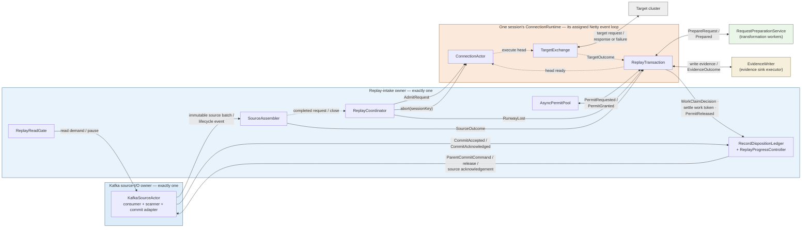
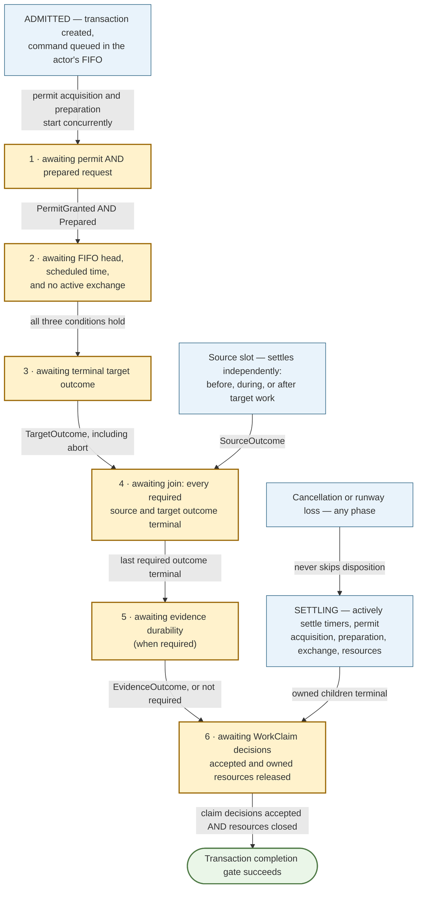
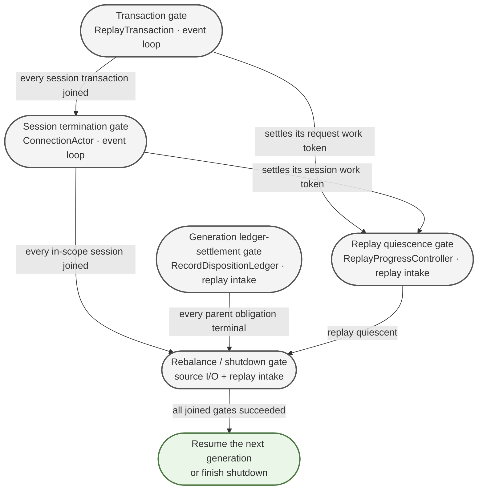
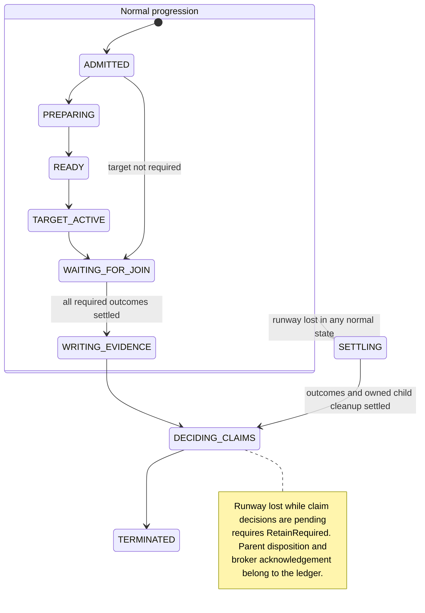

# Hardened Traffic Replayer Architecture

**Status:** detailed replayer design contract

**Date:** 2026-09-11

This document is the detailed replayer companion to
[captureAndReplayArchitecture.md](captureAndReplayArchitecture.md). The top-level document defines
the shared observable protocol. This document defines the replayer's serialized owners, HTTP
assembly, target replay, durable tuple handling, whole-record Kafka accounting, partition
reassignment, and process-fatal failure behavior.

The proxy companions define the records consumed here:

- [proxyHorizontalScalingAndNodeDeath.md](proxyHorizontalScalingAndNodeDeath.md) defines
  assignment-scoped writer identities, exact manifests, capture-before-forward, broker-time
  expiration, and clean writer-partition retirement.
- [proxyManagedFleetCaptureRecovery.md](proxyManagedFleetCaptureRecovery.md) adds managed session
  fencing and the clock-skew operational requirement.

The replayer relies on these settled facts:

- every new proxy group assignment increments a process-local `assignmentSequence`, and new source
  connections use `writerNodeId = captureActivationId + ":" + assignmentSequence`;
- existing connections retain their original writer identity;
- empty manifests remain ordinary heartbeats for an active identity and never reset its continuous
  broker-time baseline;
- serialized manifest publication prevents a proxy that observes a late manifest from publishing a
  later manifest that restores freshness; the replayer adds no sticky-lapse state;
- manifest omission expires only the specific incomplete request or incomplete source-response
  accumulator whose earliest contributing `TrafficObservation` is covered;
- a skew-valid later partition record may expire only already-known incomplete accumulators under
  the `E + S` rule;
- terminal connection observations, applicable omissions, and valid `NoMoreWrites` records impose
  the validation cutoffs defined by the top-level protocol; and
- `CaptureCapabilityProbe` uses `writerNodeId = captureActivationId + ":PROBE"` only to confirm
  that the proxy can publish to Kafka; it has no replay meaning.

---

## 0. How to Read This Document

**The short version.** Today the replayer's lifecycle decisions are spread across a graph of
callbacks running on whichever thread happens to settle a future, so answering "does this Kafka
record reach a deliberate commit-or-retain decision on every path?" requires inspecting every path.
This design replaces the graph with two single-owner state machines — a **connection actor** owning
ordered target-side execution and connection termination, and a **replay transaction** owning one
request's resources, evidence, and final record disposition. Everything else becomes a producer of
typed messages to one of those two, so each lifecycle question is answerable from one state machine.

**What is *not* being claimed.** Kafka delivery stays at-least-once: a record may be redelivered
after a crash, a rebalance, or any staged offset never durably acknowledged — and deliberate
`Retain` decisions exist precisely to cause that. The guarantee is one **explicit disposition
decision per accepted record inside a process** — never zero (an orphaned offset), never two (a
double-commit crash). Nor does correctness become purely local: actors and transactions localize the
lifecycle state that today leaks across callbacks, but source assembly, offset low-watermarks,
permit accounting, and the disposition ledger remain genuinely cross-component, held together by
§6's invariants.

**Reading order.** §1–§4 are conceptual and worth reading in sequence: the problem, the core
idea, the vocabulary, and a worked example that traces one request end to end. §5–§14 are the
mechanisms; each opens with the problem it solves, so they can be read in any order once you have
the example in mind. §15–§18 are rules, metrics, tests, and gates. §19 records the design decisions
that constrain the first implementation.

**Deliberate omissions.** Current class names and the migration sequence live in the companion
crosswalk, not here. And the current replayer is not claimed to be broken in general: Kafka
consumption, HTTP reconstruction, transformation, Netty I/O, tuple sinks, and offset-commit
mechanics are all retained. Only their orchestration contracts change.

---

## 1. The Problem

The trouble is concentrated in one place: **the connective tissue that decides when work is
finished.** Four distinct failure mechanisms found there share one shape, and that shape is what the
design makes impossible. They are four *mechanisms*, not four outages — F3 and F4 surfaced while
diagnosing the same rebalance incident, which is itself telling: one incident hid two independent
instances of the same structural defect.

### 1.1 The recurring failure: a required signal silently disappears

| Mechanism | What silently disappeared |
| --- | --- |
| F1 | A request spanning two Kafka records hit a `connectionException`. The handler reset state and discarded the held record keys *without committing them*. Those offsets pinned their partition forever. |
| F2 | An expiring keep-alive connection committed its held keys, then a `finally` block committed the same keys again and threw. Because commits are only staged, the crash meant Kafka never learned — so restart re-delivered the records and re-crashed. |
| F3 | `BlockingTrafficSource` implements the traffic-source interface but did not override two lifecycle methods, which are `default {}` no-ops. Production wires the close callback *through* that wrapper, so every close notification was swallowed and the termination gate never reopened. |
| F4 | Closing a connection called `schedule.clear()`, dropping pending futures without completing them. Everything waiting on them — limiter permits, tracker entries, the ordering sorter — waited forever. |

None of these is an exotic race. Each is a **required notification or decision that had no
owner**, so when one path forgot it, nothing noticed. F3 is the purest form: an empty default
method on an interface is a legal, invisible way to lose a mandatory signal.

### 1.2 Why the current structure invites this

Four structural properties, each of which this design targets directly.

**Ordering is reconstructed after the fact.** Requests are admitted in source order, then pass
through a concurrency limiter, asynchronous transformation, and an event-loop submission — after
which an `OnlineRadixSorter` puts them *back* in order using a request index. Ordering is a repair
operation, and the repair needs its own cancellation and settlement semantics, which are themselves
state that can leak (that is F4).

**Terminal decisions are inferred rather than stated.** Whether to commit an offset is derived
from a `ReconstructionStatus` plus a boolean, at a call site that may or may not be reached.
`EXPIRED_PREMATURELY` commits; `CLOSED_PREMATURELY` does not. One status therefore cannot express
"reset because complete applicable manifest M omitted this connection" (limited commit authority)
versus "timed out or ran out of runway" (must not commit) — and the code has no precise value to
reach for.

**Cancellation can masquerade as success, or as nothing at all.** A cancelled send produces an
exception that is rethrown during tuple packaging, *before* the commit decision. So the request's
local bookkeeping closes — making dashboards look healthy — while its offsets stay pinned and its
tracing contexts stay open. Cancellation is neither success nor failure in the current vocabulary.
It is a gap.

**"Done" is not represented by anything.** `cancelConnection` returns an already-completed future
while its cleanup, channel close, and acknowledgement are still in flight. A synthetic-close gate is
an `AtomicInteger` that a missing callback can leave nonzero forever. Shutdown relies on the
process exiting. No object anywhere means "this operation's entire effect has settled."

---

## 2. The Core Idea

Give every mutable thing exactly one owner, and make every "done" a real completion.

Two new owners absorb the *per-connection and per-request* lifecycle responsibilities that are
currently spread across callbacks. They are not the only owners in the system — §3.3 lists the rest,
and source intake, progress accounting, and record disposition stay separate on purpose — but they are
where the failures in §1 live:

**A connection actor** owns everything about one target connection: the queue of things to do on
it (send this request, then close), the timer for when the next thing is due, the Netty channel,
the single exchange in flight, and the connection's terminal state. It processes one command at a
time, in admission order.

**A replay transaction** owns everything about one request: source request and response state, the
WorkClaims that attribute Kafka observations to it, the concurrency permit, the transformed
request buffers, the target outcome, the evidence outcome, its generation-scoped runway state, the
tracing contexts, and—crucially—the single typed decision for each WorkClaim it owns. It never
selects a Kafka-record disposition.

Everything else becomes a *producer of typed messages* to one of those two. The assembler produces
source outcomes. Preparation produces a `Prepared` message. Netty produces a target outcome. The
evidence writer produces a durability outcome. The Kafka scanner produces proof-bearing control
events. None of them decides anything terminal.

Three consequences make this worth doing:

- **Ordering stops being a repair.** A request is admitted to its actor's queue *while source
  order is still known* — before the permit, before transformation. Preparation may then finish in
  any order, because the actor only ever looks at the head of its queue. Ordering holds by
  construction, so the sorter and schedule map are deleted rather than hardened.

- **Every policy decision has one home.** The transaction invokes one pure exhaustive policy over
  what the source did, what the target did, whether evidence is durable, and its runway
  observation. It produces one typed WorkClaim decision. The ledger validates and applies that
  decision; it does not independently rerun replay policy. Cancellation becomes a first-class
  outcome that can never satisfy a claim.

- **"Done" becomes checkable.** Aborting an actor returns a gate that completes only after its
  queue is settled, its in-flight exchange has been actively cancelled and its owned cleanup joined,
  its channel is closed, every transaction has submitted terminal WorkClaim decisions and released
  its resources, and its source acknowledgement is delivered. The generation ledger-settlement gate
  separately covers parent Kafka-record disposition and any broker acknowledgement. Gates await real
  completions instead of counting or passively waiting for a normal callback that cancellation made
  impossible.

The design also carries the expiration-hardening policy: optional read-ahead bounded by a small
epsilon and coupled to replay progress; exact manifest-cycle reset for incomplete per-connection
HTTP accumulation; optional metadata scanning on the same Kafka consumer and assignment as replay;
reassignment and shutdown retaining for redelivery; a capture-side maximum connection duration
that produces ordinary close observations and bounds resource use; and an evidence API that can
evolve toward independent tuple parts.

---

## 3. Vocabulary

Several of these words are overloaded in the existing code and docs. This section is the authority
for what they mean here.

Within the replayer only, **admit** means that the replay-intake owner has accepted an immutable
work item, registered its obligations, and become responsible for driving it to a terminal
disposition. It does not mean that a proxy may accept a new client connection, that the target has
accepted a request, or that Kafka has accepted a commit.

This document reserves **drain** for the two aggregate proxy operations defined by the proxy
design: writer-partition drain and proxy connection-set drain. Replayer lifecycle descriptions
use **settlement**, **quiescence**, or **termination** instead. The lifecycle of one closed captured
connection is **connection retirement**.

### 3.1 The five different things called "close"

This ambiguity is a real source of bugs, so the design keeps the five lexically distinct:

| Term used here | Means |
| --- | --- |
| **Captured close** | A `close` observation *in the recorded data* — the original client's connection ended. This is input to be reconstructed. |
| **Source-side settlement** | The assembler's conclusion that a captured request or one incomplete accumulation segment is finished, for example complete request, captured close, manifest-cycle reset, terminal self completion, interruption, or shutdown. |
| **Ordered close command** | A target-side close placed in a connection actor's queue at its time-shifted position, so it happens *after* the requests preceding it. |
| **Channel close** | The Netty target socket actually closing. |
| **Source acknowledgement** | Telling the Kafka layer "that session is gone," which releases its termination gate. **Not** an offset commit. |

### 3.2 Terminal-decision vocabulary

- **Settled / terminal** — reached a final state that will never change. Said of outcomes and
  gates, never of "the callback ran."
- **Disposition** — the terminal decision for a Kafka record: close its contexts, and either
  `Commit` or `Retain`. Every accepted record gets exactly one.
- **Commit** — advance the Kafka offset past this record, meaning *on restart we will never see it
  again*. This is the irreversible act, which is why it requires commit authority.
- **Retain** — deliberately do *not* advance the offset. The record stays eligible for redelivery
  to this or another consumer. Contexts still close; only the offset is held.
- **Commit authority** — the justification required before advancing a Kafka offset. This design
  recognizes these alternatives:
  - **Replay evidence** — durable output written to a store (today, the tuple) recording *what replay
    did*. Normal replay requires this evidence.
  - **Manifest-cycle reset** — a complete exact manifest M omits a captured client connection. It
    authorizes satisfying only an incomplete request or incomplete source-response accumulator
    whose earliest contributing `TrafficObservation` is stamped M or earlier. An accumulator whose
    earliest contributing observation is stamped after M is unaffected.
  - **Terminal self completion** — a valid `NoMoreWrites` whose Kafka record header identifies the
    retiring writer permanently retires one
    `(writerNodeId, partition)` after the proxy's terminal barrier and authorizes settling its
    already-known incomplete accumulations.
  - **Skew-adjusted broker-time expiration** — while the declared clock-skew bound `S` is healthy, a
    later higher-offset partition record whose Kafka `LogAppendTime` is at least `E + S` beyond the
    writer's last accepted manifest time authorizes expiring only the incomplete accumulators
    already known for that writer and partition.
  Replayer wall-clock time alone is never commit authority. `--packet-timeout-seconds` may support
  diagnostics, but it cannot advance the Kafka commit watermark.
- **Evidence** — reserved for the normal replay output managed by `EvidenceWriter`. A manifest-cycle
  reset or terminal self completion is commit authority, but is not an `EvidenceWriter` artifact.
- **Completion gate** — see §6.4. A future for a whole lifecycle operation, with an owner and
  documented postconditions that are already true when it completes successfully.
- **Parent record obligation, child obligation, and work claim** — the ledger owns one parent
  obligation per Kafka record. `Commit` and `Retain` are reserved for that indivisible parent
  record. A valid traffic record creates one deterministic observation child per wire-array index.
  A valid control record, or a record rejected by a record-level rule such as managed-session
  mismatch, creates one deterministic control child. An observation that contributes to one or
  more accumulations or transactions carries distinct attributable work claims beneath its one
  child; multiple claims may depend on the same observation bytes. Each claim and child reaches
  one local decision: `Satisfied` or `RetainRequired`. `RetainRequired` may become known early, but
  the claim, child, and parent remain lifecycle-active until every owned dependency and sibling has
  settled. The first `RetainRequired` decision immediately and irrevocably selects parent
  `Retain`, making the whole Kafka record ineligible for commit, while cleanup continues. Only the
  commit path waits for every child to become terminal and `Satisfied` before creating a
  `CommitCandidate` that still requires source-owner acceptance. Child obligations are accounting
  units, not independently committable Kafka offsets. Registration has explicit child and claim
  seals so commit reduction cannot race discovery of another dependency.
- **Out of runway** — we lost the right or the time to finish this work (partition reassigned,
  process shutting down). Never commit-eligible: someone else must be able to pick it up.
- **Runway state** — generation-scoped authority to accept a parent commit. `KafkaSourceActor`
  owns the authoritative source-generation state. `RecordDispositionLedger`, on the replay-intake
  owner, keeps a monotonic observed runway so it can reject known-stale commits early, but source
  acceptance is final only when the source actor processes the commit command in order with poll
  and rebalance callbacks. It starts `Available` and may transition once to
  `Lost(REASSIGNMENT)` or `Lost(SHUTDOWN)`. Transactions hold only a monotonic local observation
  delivered as `RunwayLost`. Runway is orthogonal to source and target outcomes: reassignment can
  occur after both have already settled but before evidence or disposition has finished. Losing
  runway never rewrites an existing outcome; it vetoes any commit that the source actor has not
  already accepted.
- **Parent retained / commit candidate / commit accepted / commit result** — deliberately distinct
  stages. Transactions and accumulations decide only their WorkClaims. The first
  `RetainRequired` decision immediately selects parent `Retain`; the ledger still tracks every
  child and owner until process-local cleanup finishes. If no retain veto exists and every child is
  terminal `Satisfied`, `RecordDispositionLedger` creates a nonterminal `CommitCandidate`. The
  ledger sends the candidate to `KafkaSourceActor`; only source-owner
  generation validation and pending-offset registration select final parent `Commit`. A typed
  generation rejection instead selects parent `Retain`. Kafka acknowledges the accepted commit
  only when the broker commit succeeds. After source acceptance, `KafkaSourceActor` owns the
  pending broker-commit operation until acknowledgement, explicit failure, or assignment
  revocation records the result as unknown. The ledger continues to own process-local cleanup until
  one of those source-owned results arrives.
- **Per-connection HTTP accumulation** — the source-side state currently assembling HTTP
  observations for one captured client connection. A manifest-cycle reset discards only the
  incomplete request or incomplete source-response accumulator covered by an applicable omission.
  Applicability is based on the earliest `TrafficObservation` contributing to that specific
  accumulator, not on the connection-opening observation or every uncommitted Kafka record.
- **Manifest cycle** — a monotonically increasing logical value scoped to one
  `(writerNodeId, partition)`. The proxy stamps each `TrafficObservation` with the
  current value and closes one cycle when it atomically copies its exact active-connection set and
  increments the value. It is not a Kafka producer epoch, group generation, timestamp, or offset.
- **Epsilon** — an optional small read-ahead margin (~30s) that smooths source admission. It is not
  an expiry trigger, proof source, or hard memory bound.
- **Settled watermark** — the contiguous point in source time up to which all admitted work has
  settled. The read gate is `settledWatermark + epsilon`.

### 3.3 Component names

All working names; the crosswalk maps them to current classes. `Side` identifies where a term
originates so a proxy manifest is not mistaken for a direct replayer observation.

| Name | Side | One-line role |
| --- | --- | --- |
| `KafkaSourceActor` | Replayer | Owns the Kafka consumer, both cursors, offset tracking, and rebalance |
| `ProxyManifestIndex` | Replayer | Reconstructs complete open-connection manifests and tracks their `manifestCycle` per `(writerNodeId, partition)` |
| `CaptureKafkaPublisher` | Proxy | Publishes proxy traffic, manifests, and terminal self-completion records to Kafka while preserving producer acknowledgement and terminal ordering |
| `ProxyOpenConnectionRegistry` | Proxy | Exact capture-side registry from which open-connection manifests are copied |
| `ProxyOpenConnectionManifest` | Proxy record | Complete, immutable set of the proxy's open connections for one partition |
| `ConnectionPartitionAssignment` | Shared protocol | Group-assigned partition chosen once and stored for one connection |
| `ReplayProgressController` | Replayer | Owns work tokens and the contiguous settled watermark |
| `ReplayReadGate` | Replayer | Decides whether another source record may be admitted |
| `SourceAssembler` | Replayer | Reconstructs requests, responses, and closes; single-threaded |
| `ReplayCoordinator` | Replayer | Registries; creates transactions; admits commands to actors |
| `ConnectionRuntime` | Replayer | A session's event-loop assignment, holding its actor and transactions |
| `AsyncPermitPool` | Replayer | Cancellable, future-based replacement for `TrafficStreamLimiter` |
| `RequestPreparationService` | Replayer | Transformation and signing; yields an owned prepared request |
| `ConnectionActor` | Replayer | FIFO command queue, one head timer, channel, one live exchange |
| `TargetExchange` | Replayer | Owner-controlled target attempt, retry, response/finalizer, abort, and cleanup lifecycle |
| `ReplayTransaction` | Replayer | One request's resources, outcomes, and WorkClaim decisions |
| `EvidenceWriter` | Replayer | Durable whole-tuple output; internal adapters may model future parts |
| `RecordDispositionLedger` | Replayer | Owns parent Kafka-record obligations, observation and control children, WorkClaims, context closure, reduction, generation settlement, and parent commit commands; source-generation runway authority remains with `KafkaSourceActor` |

---

## 4. Worked Example: One Request, End to End

This is the section to return to when a later mechanism seems abstract. Nothing here is new
machinery — it is §2 traced concretely.

### 4.1 The normal path

1. **Read.** `KafkaSourceActor` polls immutable raw record envelopes on its source-I/O owner thread.
   It sends one immutable batch, including generation identity, to the replay-intake owner.
   Replay intake registers each parent `KafkaRecordObligation`, validates the minimal wire envelope,
   and, for a managed run, checks its session before payload decode. A valid nonmatching session
   takes the authorized record-level discard path without parsing the untrusted payload. A matching
   or unmanaged record then receives full semantic decode and creates the required observation or
   control children. An unparseable envelope or malformed expected-session payload takes the
   explicit decode-failure path in §14.1 instead of exposing partial observations. The parent now
   *must* receive one disposition.
   `ReplayReadGate` admits the batch only if its source time is within
   `settledWatermark + epsilon`.

2. **Reconstruct.** `SourceAssembler`, on the replay-intake owner, feeds observations into the
   per-connection state machine and recognizes the end of a request.

3. **Admit — the pivotal step.** `ReplayCoordinator`, still on the replay-intake owner and therefore
   still in source order, does three things at once:
   - finds or creates the session's `ConnectionRuntime`, pinning it to one existing Netty event
     loop;
   - registers the new transaction's WorkClaims beneath the ledger-owned child observation
     obligations and
     registers a work token with `ReplayProgressController`;
   - posts one immutable `AdmitRequest` envelope to the assigned event loop. That event loop creates
     the mutable `ReplayTransaction` and appends its `ReplayRequest` command to the actor's FIFO queue.

   Nothing has been transformed and no permit has been acquired yet. Because admission precedes
   all asynchrony, **the actor's queue is source order** — which is why no sorter is needed later.
   Admission itself is bounded O(1) control work (registry lookup, occasional runtime creation,
   token allocation, one event-loop enqueue); it never waits for a permit, transformation, signing,
   a timer, target I/O, retry, or evidence output. Benchmarks should confirm the intake owner
   stays cheap, but no expensive request processing moves onto it.

4. **Prepare, concurrently.** The transaction asynchronously acquires a permit from
   `AsyncPermitPool`, then asks `RequestPreparationService` to transform and sign. That yields an
   `OwnedPreparedRequest`: one explicit handle the transaction now owns. Preparation for many
   requests runs in parallel and may finish in *any* order. That is fine.

5. **Execute in order.** The actor examines only its head command. It sends when two conditions
   hold: the head's preparation has completed, and its time-shifted send time has arrived. If a
   later command became ready first, it waits. The actor never blocks its event loop — it reacts to
   a `Prepared` message or a timer firing.

6. **Target exchange.** The actor performs one request/response against the target (with retries
   per policy) and settles the command with a `TargetOutcome`. Because the transaction lives on the
   same event loop, that outcome is delivered without another executor hop.

7. **Source settles independently.** Meanwhile the assembler has been accumulating the captured
   *response*. When it finishes, it posts `SourceResponseOutcome.Complete` to the transaction. If a
   terminal observation, applicable manifest omission, valid `NoMoreWrites`, or skew-valid
   broker-time expiration ends an incomplete response, it instead posts
   `SourceResponseOutcome.Expired`. This may arrive before, during, or after step 6—the transaction
   does not care about order, only that the target and source-response slots both become terminal.

8. **Join and write evidence.** With every required outcome terminal, the transaction asks
   `EvidenceWriter` to persist the tuple and waits for an `EvidenceOutcome`.

9. **Decide each WorkClaim exactly once.** On its event-loop owner, the transaction invokes the
   exhaustive `ReplayWorkClaimPolicy` over its three outcomes and runway observation and produces
   one typed `Satisfied` or `RetainRequired` decision for each WorkClaim. It sends those
   decisions—not the raw outcomes for a second policy decision—to `RecordDispositionLedger` on
   replay intake. The ledger validates them and reduces each sealed child independently. The first
   `RetainRequired` decision immediately selects parent `Retain`; cleanup remains active. If no
   retain veto exists, every child must become terminal `Satisfied` before the ledger creates a
   nonterminal `CommitCandidate`. It sends a candidate to `KafkaSourceActor`. The source actor serializes it
   with rebalance and poll state, accepts or rejects it after validating the generation, and
   reports the result. Acceptance selects final parent `Commit`; generation rejection selects final
   parent `Retain`; an accepted commit remains ledger-owned until broker acknowledgement.

10. **Release.** The transaction closes its owned resources exactly once: prepared request, permit,
    tracing contexts. Its completion gate completes after all of its WorkClaim decisions have been
    accepted by the ledger and its owned resources are closed. It does not wait for unrelated
    sibling claims or children, the parent disposition, or a broker commit acknowledgement. The
    ledger independently owns unresolved child reduction, parent disposition, and broker
    acknowledgement.

11. **Progress.** The transaction gate settles its work token, `ReplayProgressController` advances
    the settled watermark, `ReplayReadGate` raises, and step 1 can happen again.

### 4.2 The same request, cancelled by a partition reassignment

This is the failure path that motivated the design, and it shows where each mechanism earns its keep.

1. `KafkaSourceActor`'s rebalance callback fires: this partition is revoked. On its owner thread it
   marks the old generation's authoritative runway `Lost(REASSIGNMENT)`, stops admitting records
   from that generation, and sends one ordered **interruption control event** to replay intake.

2. The replay-intake owner applies that event in order with delivered source batches. The
   disposition ledger marks its observed runway lost; the assembler settles an unfinished source
   side as `SourceOutcome.Interrupted` without rewriting an already terminal outcome. Independently,
   the coordinator posts `RunwayLost(REASSIGNMENT)` to every still-active transaction in the
   generation. This covers a request whose source and target already completed but whose evidence or
   record disposition has not. Source acceptance remains race-free because commit commands and
   authoritative revocation are serialized by `KafkaSourceActor`; the intake-side runway is an
   early rejection and settlement signal.

3. The coordinator aborts the matching connection actors **by typed `ConnectionSessionKey`** — not
   by a concatenated string, not via a placeholder session number. `abort()` returns a **session
   termination gate**.

4. Each actor, on its own event loop: marks itself terminal; settles every queued command as
   `TargetOutcome.Cancelled(REASSIGNMENT)` **without invoking their send callbacks**; actively aborts
   the in-flight exchange; joins its owned cleanup; closes the channel and awaits it; removes itself
   from the cache. "Abort" means settling retry and pacing timers, channel acquisition, packet
   sending, response decoding/finalization, attempt resources, and the owner-controlled exchange
   result. It does not mean closing the channel and then waiting for the ordinary response future.

5. Each active transaction actively settles its owned asynchronous operations and reaches
   `DECIDING_CLAIMS`.
   Transactions that were still reconstructing usually have source `Interrupted` and target
   `Cancelled`; transactions that had progressed further may retain earlier terminal source or
   target outcomes. Lost runway makes every still-undecided owned claim `RetainRequired`. The
   transaction terminates after the ledger accepts those decisions and its resources close. The
   ledger immediately selects parent `Retain` when the first retain veto arrives, while keeping the
   parent lifecycle-active until all sibling claims and children settle. It closes each record
   context exactly once and joins any source-accepted broker commit.

6. Only now—after step 5 has settled for *every* transaction of the session—does the actor deliver
   its source acknowledgement and its session termination gate complete. Per §6.4 rule 5,
   transaction settlement is one of that gate's postconditions, so step 4's channel-level teardown
   is a *child* of the gate, not the whole of it. An actor whose channel is closed but whose
   transactions have not submitted terminal claim decisions is not terminated.

7. The lifecycle owner awaits every session termination gate, the generation ledger-settlement
   gate, and replay quiescence for the revoked generation. The session set includes an explicit
   acknowledgement for connections that never opened a session at all. Real records for the new
   generation resume only after all three gate classes complete, which means every parent record
   has a terminal disposition and no actor, transaction, target exchange, timer, permit, target
   context, or in-memory source obligation from the old generation remains.

**What joining an exchange means.** The exchange adapter owns a terminal result and a cleanup gate
that it can settle without cooperation from the normal response path. A library future may be
uncancellable, but it is not allowed to own the session lifecycle: abort fences its late completion,
settles the adapter's result as `Cancelled`, closes or detaches every owner-held context, and joins the
adapter's cleanup. A late callback may release a self-owned library resource; it may not restart work,
complete a transaction a second time, or find mutable state belonging to a newer generation.

---

## 5. Goals

1. Make correctness locally provable from state-machine transitions rather than global callback
   inspection.
2. Preserve source ordering for requests on the same connection.
3. Preserve replay timing where possible without weakening connection ordering.
4. Guarantee that every admitted request and connection command terminates exactly once.
5. Guarantee that every accepted Kafka record receives exactly one parent disposition, every
   decoded observation receives exactly one terminal child decision, and every attributable
   WorkClaim settles exactly once within a process. This is not exactly-once delivery; Kafka may still
   redeliver a retained or unacknowledged record (§0).
6. Guarantee that cancellation cannot be interpreted as successful replay.
7. Bound read-ahead and make every incomplete-state reset fact-based.
8. Make rebalance and shutdown completion observable through real completion gates.
9. Give every reference-counted resource one documented owner.
10. Support deterministic tests over all terminal transitions and event interleavings.

---

## 6. Governing Invariants

The rules, each with the failure it prevents. Where a rule maps to an audit row or an incident
from §1.1, that is named.

### 6.1 Ownership

| Rule | Without it |
| --- | --- |
| Every mutable state object has one executor or thread owner | Concurrent mutation of accumulator or session state — the class of bug that a `volatile` on one flag does not fix |
| Cross-thread completions post typed messages to the owner; they never mutate foreign state | A second thread calling into single-threaded machinery (the wall-clock heartbeat-expiry hazard) |
| Generation runway authority is owned by `KafkaSourceActor`; the ledger and transactions hold only monotonic observations | A transaction, ledger, and Kafka consumer disagree about whether an old generation may still commit |
| Every resource is released by whoever accepted ownership of it | The refcount leaks of §13 (R16–R18) |
| No required lifecycle notification is an optional no-op callback | **F3** — a `default {}` method silently swallowing every close notification |

Mandatory lifecycle interfaces use **no Java default methods and no built-in `NO_OP` instance**.
Every required collaborator is an explicit constructor argument, so omitting lifecycle forwarding
is a compile failure. If a capability is genuinely optional, split it into a separate interface and
make the composition root choose an explicit adapter. Do not make a required interface look
optional for test convenience.

### 6.2 Ordering

| Rule | Without it |
| --- | --- |
| Connection commands are admitted while source order is still known | You need a sorter, and the sorter needs its own cancellation and teardown semantics — more state to leak (**F4**) |
| An actor executes one command at a time in FIFO admission order | Out-of-order sends on one connection |
| Asynchronous preparation may complete out of order but cannot reorder execution | A fast-transforming request overtaking a slow one ahead of it |
| Sequence numbers are validation and diagnostic data, not the ordering mechanism | Ordering silently depends on an index staying consistent across rebuilds |

### 6.3 Disposition

| Rule | Without it |
| --- | --- |
| Closing a traffic-stream context and committing its offset are separate actions | Retained records leak open contexts — F1/F2 territory |
| Every accepted record is deliberately committed or deliberately retained | Records with no decision at all: offsets pinned, dashboards clean (**F1**) |
| Normal replay commits only after required evidence is durable | Committing data whose evidence was never written |
| Work whose runway is lost before source acceptance, and any unclassified failure, does not commit | Teardown masquerading as successful replay — silent data loss |
| A deterministic poison record commits only under an explicit classifier, with durable, loud skip evidence | Either an unskippable crash loop or a silent skip — and no way for an operator to choose which |
| A complete manifest-cycle reset may commit only the incomplete accumulation covered by that cycle; replayer wall-clock time may not | An old omission or an impatient timeout committing newer or still-live data |

### 6.4 Completion gates

A **completion gate** is the future for a lifecycle operation *together with* an explicit owner and
documented successful postconditions. It is deliberately none of the following: a Java Memory Model
barrier, a separately cancellable aggregate waiter, or a notification that cleanup has merely
started. Getting this distinction wrong is exactly what makes `cancelConnection` return "done"
while work is still in flight.

1. Every public lifecycle operation that starts, stops, cancels, or waits for work returns **one**
   gate representing the complete operation.
2. The operation owner registers every child operation before it can run, and composes every
   child's terminal stage into the gate. No owned child may be launched as an unreturned
   fire-and-forget branch.
3. Successful gate completion means all documented postconditions are **already** true. A child
   failure propagates through the gate unless the operation's typed result explicitly accounts for
   it.
4. Requesting cancellation does not complete the gate. The gate completes only after queued and
   active children have reached terminal outcomes *and* their owned resources have been released.
   The owner must actively drive cancellable children to those outcomes; waiting on the normal
   success path after making success impossible is not a cancellation implementation.
5. Session termination completes only after queued commands, active work, channel closure, cache
   removal, transaction settlement, and source acknowledgement have all settled. No mutable or
   resource-owning object from the terminated generation may remain reachable by the next generation.
6. Active target-exchange abort is total over every phase: before channel acquisition, during
   acquisition, pacing, packet send, response wait, retry delay, response finalization, and late
   completion. Its gate describes owned cleanup, not merely the exchange result.
7. A timeout or watchdog may report or fail the operation. It may never reset state or complete the
   gate successfully while postconditions remain false.
8. Reusable shutdown does not rely on process exit for cleanup.
9. End-of-input completion uses a replay-quiescence gate owned by `ReplayProgressController`. Admission
   opens a new interval when outstanding work changes from zero to one; settlement completes that
   interval only when the count returns to zero. Top-level completion joins this gate with request
   tracking while servicing the replay-intake mailbox. It does not poll `isWorkOutstanding()`, and
   cancellation of a caller's aggregate waiter cannot cancel the controller's authoritative gate.
10. Every source generation has one ledger-settlement gate owned by
    `RecordDispositionLedger`. It covers every parent record obligation registered for that
    generation, including committed, retained, decode-failed, and still-unresolved parents. It
    succeeds only after child and WorkClaim registration is sealed, every local obligation is
    lifecycle-terminal, every parent disposition is selected, all record contexts are closed, and
    every source-accepted commit has reached broker acknowledgement, explicit failure, or
    `UnknownAfterRevocation`. A
    transaction gate does not substitute for this gate because one transaction may cover only some
    WorkClaims beneath one child, and one parent may contain work for several transactions.

Callers chain subsequent lifecycle work from the gate. They do not infer completion from a callback
firing, a counter reaching zero, a cache entry disappearing, or the cancellation of a separate
aggregate waiter.

**Enforce this mechanically, not by convention** — every one of the four failure mechanisms in §1.1
was a convention that one code path did not follow:

- The owner keeps the mutable `CompletableFuture` private and exposes a non-mutable view, such as
  `minimalCompletionStage()` or a dedicated wrapper.
- Cancellation is requested through an owner method such as `abort(reason)`. Callers cannot cancel
  or complete the gate directly.
- Each child enters the owner's pending set *before* its asynchronous work is launched, and leaves
  that set exactly once when its terminal message is processed.
- Pending-child diagnostics include the child identity and phase, so a stuck response finalizer,
  retry delay, context close, disposition acknowledgement, or source acknowledgement is distinguishable
  without a thread dump.
- One owner-thread method — `tryCompleteTermination()` — is the only code allowed to complete the
  gate successfully.
- That method asserts the operation is terminal, the pending set is empty, all required resources
  are released, and all required acknowledgements and dispositions have settled.

Tests must attempt early completion, caller-side cancellation, child failure, late child
completion, timeout paths, and multiple consecutive generation terminations, and prove that none can
produce a false successful result or leave state that the next generation can observe.

---

## 7. Proposed System

Three views answer three different questions: §7.1 which thread owns which state, §7.2 what one
request waits on and what releases each wait, §7.3 what must settle before a lifecycle operation may
complete. In every diagram an arrow is a message, a future completion, or a network exchange — never
direct cross-thread mutation, and never a thread blocking.

### 7.1 Thread ownership and cross-thread messages

Containers are execution domains: everything inside one mutates state only on that container's
thread. **Solid arrows cross a thread boundary** and are always queued messages or future
completions. **Dotted arrows stay on one thread** and show phase order or direct delivery.



`AdmitRequest` lands on the session's assigned event loop, which creates the `ReplayTransaction` and
appends its command to the actor's FIFO — so the actor, exchange, and transaction for one session
share one event loop and exchange no cross-thread messages among themselves. Other sessions may use
other loops from the existing group.

Kafka polling, scanning, source-generation state, and commit acceptance belong to the source-I/O
actor. Reconstruction, admission, permits, progress, and disposition bookkeeping belong to replay
intake. The two owners exchange immutable batches, lifecycle events, source commands, and
acknowledgements. When source admission is closed, the source actor keeps servicing Kafka
heartbeats, commits, rebalances, and bounded scans while replay intake continues processing mailbox
work. `ReplayTransaction` receives `RunwayLost` so it can begin settlement promptly; the source actor
still makes the final source-acceptance decision.

### 7.2 One request: wait states and their releasing events

The numbered states are the only places a request can be waiting. No wait blocks an OS thread: the
owner records which conditions remain unsatisfied, returns to its event loop, and reevaluates only
when one of the labeled events arrives. The table under the diagram gives each wait's owner and
thread.



| # | Waiting for | Wait owner (thread) | Released by |
| --- | --- | --- | --- |
| 1 | Permit and prepared request | `ReplayTransaction` (event loop) | `AsyncPermitPool`: `PermitGranted` **and** `RequestPreparationService`: `Prepared` |
| 2 | FIFO head, scheduled send time, previous exchange terminal | `ConnectionActor` (event loop) | All three conditions holding at once |
| 3 | Terminal target outcome | `ConnectionActor` (event loop) | `TargetExchange`: `TargetOutcome` or abort outcome |
| 4 | Every policy-required source and target outcome | `ReplayTransaction` (event loop) | The last required outcome turning terminal |
| 5 | Evidence outcome, when required | `ReplayTransaction` (event loop) | `EvidenceWriter`: `EvidenceOutcome`, or policy: not required |
| 6 | WorkClaim decisions accepted by the ledger and owned-resource release | `ReplayTransaction` computes one decision per owned claim (event loop); `RecordDispositionLedger` validates and applies it (replay intake) | Ledger acceptance and transaction resource closure; this wait does not include sibling claims, parent reduction, source acceptance, or broker acknowledgement |

The two side entries are orthogonal to the main path on purpose. The source slot may settle at any
time relative to target work—state 4 simply requires both. Cancellation from any phase actively
settles every owned asynchronous operation, then rejoins the same WorkClaim-decision path; it never
jumps to successful completion. And a later request may already hold `Prepared` yet sit in state 2
until it is the FIFO head—that is the ordering rule.

### 7.3 Lifecycle dependencies and completion gates

An arrow means the downstream gate cannot complete until the upstream gate has completed. Each gate
additionally has local postconditions (table below) that must already be true when it completes.
Requesting cancellation, closing a channel, removing a cache entry, or observing a counter change
releases nothing by itself.



| Gate | Local postconditions, beyond joined child gates |
| --- | --- |
| Transaction | Required outcomes terminal; all owned WorkClaim decisions accepted by the ledger; transaction contexts and resources released. It does not wait for parent disposition or commit acknowledgement. |
| Generation ledger settlement | Every registered parent has sealed coverage or an explicit decode-failure transition; every child and WorkClaim is lifecycle-terminal; every parent disposition is selected; all record contexts are closed; every source-accepted commit has broker acknowledgement, explicit failure, or `UnknownAfterRevocation`. |
| Session termination | Queue empty; `TargetExchange` cleanup joined; channel closed; cache entry removed; source acknowledgement delivered |
| Replay quiescence | Every admitted request and session work token settled — outstanding work reaches zero |
| Rebalance / shutdown | Every in-scope transaction, session, generation ledger-settlement, and quiescence gate succeeded. |

Two further waits gate record flow rather than lifecycle completion: `ReplayReadGate` admits another
source record only when the settled watermark plus epsilon allows it and lifecycle intake is open,
and the Kafka commit watermark advances only across a contiguous prefix of commit-eligible
obligations whose broker commits have been acknowledged. A `Retain` decision closes local contexts
and settles the process-local lifecycle, but it continues to block the Kafka commit watermark so
the record remains eligible for redelivery.

`ReplayProgressController` computes the contiguous settled watermark and owns the replay-quiescence
gate. Completion gates and `ScanEvidence` are threadless values: each owner completes its private
mutable future on its own thread, while other components hold only a non-mutable stage view.

---

## 8. Thread and Executor Model

**The design uses two explicit serialized source-side owners: one Kafka source-I/O actor and one
replay-intake mailbox.** Kafka's consumer API is blocking and thread-confined, while replay intake
must continue servicing actor completions, permits, progress, and disposition callbacks. Treating
those as one thread forced the implementation toward locks and concurrently mutable maps. The
sound boundary is two owners with typed messages, not three threads sharing lifecycle state.

The application-owned execution domains on the normal request path are therefore:

1. Exactly one Kafka source-I/O owner thread.
2. Exactly one replay-intake owner thread.
3. The existing transformation worker pool, with its configured worker count.
4. The existing Netty event-loop group, with its configured thread count; each session is pinned to
   one of those threads, not given a new thread.
5. The sink-specific evidence executor, when the configured sink uses one.

Actors, transactions, completion gates, permit waiters, and source accumulations do not create
threads. Kafka or Netty libraries may own internal housekeeping threads, but those threads own none of
the replay lifecycle state described here. A blocking read adapter may not own or mutate source
lifecycle state and may not invoke the Kafka source from a third thread. The current
`BlockingTrafficSource` executor is therefore migration residue: replace its blocking handoff with
an asynchronous read-gate signal or fold it into replay intake.

When the first command for a `ConnectionSessionKey` is admitted, `ReplayCoordinator` assigns a
`ConnectionRuntime` to one existing Netty event loop and records that assignment in the session
registry. The runtime is created *before* permit acquisition, transformation, or target-channel
creation. Its `ConnectionActor` and every `ReplayTransaction` for that session execute all state
transitions on that same event loop. An actor or transaction is a **mailbox-bound state machine,
not a dedicated thread.**

| Owner | Thread/executor | Mutable state |
| --- | --- | --- |
| `KafkaSourceActor` | One source-I/O owner thread | Consumer assignment, source-generation runway, replay/scan positions, offset trackers, commit acceptance and acknowledgement |
| `SourceAssembler`, `ReplayCoordinator`, and `ProxyManifestIndex` | One replay-intake owner thread | Reconstruction state, manifest/control-record state, session admission, affinity registry |
| `AsyncPermitPool` | Replay-intake owner | Permit queue and available capacity; releases are posted back to this owner |
| `ConnectionRuntime` | One assigned existing Netty event loop | `ConnectionActor`, session transactions, command mailbox, timers, target channel, terminal state |
| `RequestPreparationService` | Transformation/event-loop workers as appropriate | No shared connection lifecycle state |
| `EvidenceWriter` | Sink-specific executor | Sink-local buffering and durability |
| `ReplayProgressController` | Replay-intake owner | Admitted-work tokens, replay-quiescence gate, and contiguous settled watermark |
| `ReplayReadGate` | Replay-intake owner | Source admission using settled watermark, epsilon, and lifecycle state |
| `RecordDispositionLedger` | Replay-intake owner | Parent record obligations, observation and control children, WorkClaims, observed runway, context closure, reduction state, generation ledger-settlement gate |

Cross-thread completions are converted into messages: `Prepared`, `SourceSettled`,
`EvidenceSettled`, `PermitReleased`, `RunwayLost`, `ParentCommitCommand`, `CommitAccepted`,
`CommitAcknowledged`, and `AbortRequested`. Target exchange callbacks already run on the assigned
Netty event loop, so **the actor and transaction communicate with no extra executor hop** — this is
why co-locating the transaction with its actor matters rather than giving transactions their own
executor.

Every mutable owner has an always-enabled `OwnerThreadGuard`. Every state-mutating method checks the
guard and invokes the fatal replay handler on violation; this is not a Java `assert`, which
production commonly disables. Interfaces exposed across owners accept immutable command values and
return `CompletionStage` acknowledgements where ordering matters. They never expose live maps,
queues, lifecycle registries, or callbacks that mutate foreign-owned state directly. A lock or
`ConcurrentHashMap` is not a substitute for assigning an owner.

The sole cross-owner mutable primitive is a process-wide, one-way `ReplayFatalFence`. It carries no
per-request state, registry, cleanup operation, or recovery authority. Its
`tryAcceptCommit(registration)` and `close()` operations share one bounded synchronization point:

- `KafkaSourceActor` calls `tryAcceptCommit` on its owner thread. If open, the gate executes only the
  bounded generation validation and pending-commit registration before releasing the gate.
- A fatal observer calls `close`. Closure waits only for any acceptance already inside that bounded
  critical section, then permanently rejects later acceptance.

Kafka I/O and broker acknowledgement never run while holding the gate. This creates one exact order:
a commit is accepted before fatal closure or rejected after it; a check-then-register race is
impossible.

The normal logical handoffs are bounded and explicit:

1. Kafka source-I/O owner → replay-intake owner, with an immutable raw-record batch or
   source-lifecycle event. Replay intake is the only full semantic decoder on the normal replay
   path.
2. Replay-intake owner → Kafka source-I/O owner, with commit, release, scan-blocker, or session-
   termination commands; the source replies with immutable acceptance/acknowledgement results.
3. Replay-intake owner → the assigned Netty event loop, with an immutable admission envelope.
4. Netty event loop → replay-intake owner for permit acquisition, and back when granted.
5. Netty event loop → a transformation worker, and back with `Prepared`.
6. Netty event loop → the evidence sink, and back with `EvidenceSettled`.
7. Netty event loop → replay-intake owner, with immutable disposition, progress, and permit-release
   messages.

Removed relative to today: direct intake-thread mutation of `TrackingKafkaConsumer`,
`commitDataLock`, source-state `ConcurrentHashMap` sharing, the blocking-source third-thread call
into Kafka, the limiter-feeder thread, the post-transformation sorter handoff, the independent
schedule executor, any actor-to-transaction hop, and any per-connection thread. Actual OS context
switches remain scheduler-dependent.

The Kafka source actor must remain responsive to Kafka's poll contract. It processes source commands
under a bounded record-count or elapsed-time budget and returns to Kafka before that budget can
threaten `max.poll.interval.ms`. When `ReplayReadGate` closes, replay intake stops requesting
ordinary data; the source actor continues short polls or equivalent touches for heartbeats, commits,
rebalance callbacks, source-control messages, and bounded scanner cycles. The replay-intake mailbox
continues servicing transaction completions independently, so neither owner blocks the other's
progress.

---

## 9. Identity Model

**The problem.** Identity is currently assembled ad hoc — `connectionId + ":" + sessionNumber +
":" + generation` strings, with a `PENDING_CLOSE_SESSION_NUMBER_PLACEHOLDER` constant that three
separate call sites must keep in lockstep or the termination gate leaks forever. Elsewhere identity is
recovered from "whichever traffic-stream key is still in this list," which is why a normal close
with an empty key list can skip a required notification.

**The mechanism.** Identity is typed and travels with every message:

```java
record SourceConnectionKey(String writerNodeId, String connectionId) {}

record ConnectionSessionKey(
    SourceConnectionKey connection,
    int sessionNumber,
    int sourceGeneration
) {}

record ReplayRequestId(
    ConnectionSessionKey session,
    int requestIndex
) {}

record KafkaRecordId(String topic, int partition, long offset, int generation) {}

sealed interface ChildObligationId
    permits ObservationObligationId, ControlObligationId {}

record ObservationObligationId(
    KafkaRecordId parent,
    int observationIndex
) implements ChildObligationId {}

record ControlObligationId(
    KafkaRecordId parent,
    ControlKind kind
) implements ChildObligationId {}

record WorkClaimId(
    ChildObligationId child,
    int claimIndex
) {}

record ManagedCaptureRunKey(
    String captureDomainId,
    long captureDomainRecoverySequence,
    String captureSessionId,
    String trafficKafkaClusterId,
    String trafficTopicId
) {}
```

All source acknowledgement, actor lookup, scan evidence, tracing, and record disposition use these.
No callback reconstructs identity from whichever traffic-stream key happens to remain in a list.

Managed replay batches and checkpoints also carry `ManagedCaptureRunKey`. A managed run receives it
from the trusted replay plan; it never infers the key from the first traffic or reset record. This
is mandatory for every managed run. A distinct topic changes how the trusted starting offsets are
established; it does not make the session, plan, or checkpoint identity optional.

**Why this shape.** Two sites cannot disagree about a key when the key is one shared type — the
lockstep problem is *deleted* rather than documented. `sessionNumber` distinguishes logical sessions
on one captured connection (keep-alive reuse, restarts). `sourceGeneration` is what makes a stale
commit from a previous assignment structurally impossible rather than defensively filtered.

**Writer identity is assignment-scoped, and that is load-bearing.** The proxy creates one fresh
`captureActivationId` for a capture-authoritative process lifetime. It increments a process-local,
strictly increasing `assignmentSequence` for every new Kafka group assignment before accepting a
connection under that assignment. Newly opened connections use:

```text
writerNodeId = captureActivationId + ":" + assignmentSequence
```

Existing connections permanently retain the writer identity under which they opened. The replayer
therefore keys connection state, complete manifests, broker-time baselines, and `NoMoreWrites`
cutoffs by `(writerNodeId, partition)`. Rapid rebalances may leave records from several draining
writer identities on the same Kafka partition.

An empty manifest for an active writer identity is an ordinary heartbeat and may advance that
identity's continuous accepted-manifest baseline. It never resets the baseline. If a manifest is
late, serialized proxy publication prevents any later manifest from being submitted after the
proxy enters its compromised state. The replayer does not create a separate sticky-lapse state.

The out-of-group Kafka reachability probe uses
`writerNodeId = captureActivationId + ":PROBE"`. It confirms only that the proxy can publish to
Kafka. If the replayer encounters one, it allows the Kafka record to become commit-eligible
without creating traffic, manifest, connection, writer-baseline, or expiration state.

---

## 10. Source Intake and Structural Scanning

### 10.1 Why metadata lookahead is useful

Lookahead answers two questions: *does a follow-up observation for this connection exist, or has its
proxy produced a complete manifest-cycle boundary that lists or omits it?*

The replay cursor will eventually encounter the same traffic and manifests in normal offset order.
The scan cursor is therefore not required for correctness. It is a metadata-only optimization that
can reach a distant follow-up or manifest without buffering all intervening payloads. Its job is to
decouple **decision distance** from **buffered bytes**.

Scanner enabled and scanner disabled must produce the same eventual disposition for the same
durable log once normal replay reaches the same records. They may differ in memory use and latency.
Scanner budget exhaustion is `Inconclusive`; it does not authorize expiration or commit.

Traffic silence, group departure, process-health observations, and replayer wall-clock time do not
prove that a proxy stopped publishing or forwarding source traffic. A complete applicable
manifest, a valid `NoMoreWrites`, or the skew-adjusted broker-time rule below may resolve
already-known incomplete state. Without one of those facts, the incomplete Kafka obligations
remain retained.

### 10.2 One consumer, two logical cursors

`KafkaSourceActor` owns the Kafka consumer and provides:

* **Replay cursor:** polls full records for normal reconstruction.
* **Scan cursor:** temporarily seeks ahead and reads the metadata needed to determine whether a
  blocked connection has follow-up observations.

A scan cycle:

1. Copy assignment, generation, and the exact replay position for every partition.
2. Select commit-head blockers and the required follow-up kind for each.
3. Seek ahead within a bounded operational scan budget.
4. Poll and decode **only** Kafka offset and `LogAppendTime`, connection identity, recognized record
   type, observation kind, observation `manifestCycle`, and `LivenessSnapshotChunk` metadata.
5. Discard payloads.
6. Stop early per blocker when a required follow-up is found, one complete exact manifest resolves
   an applicable cycle boundary (§10.8), a valid `NoMoreWrites` supplies its terminal cutoff, or a
   later partition record establishes the skew-adjusted broker-time threshold in §10.5. A
   discovered `NoMoreWrites` at cutoff K settles that blocker early only if the scan covered every
   offset from the blocker's replay frontier through K without finding its required follow-up.
7. Restore every replay position before returning control.
8. Discard all scan results if assignment or generation changed during the cycle.

The scanner never advances replay positions, record lifecycles, replay time, or commit offsets.
Exhausting the operational scan budget produces `Inconclusive`. Its parser is a separate,
stateless, read-only metadata decoder. It recognizes only enough framing to extract the fields
listed above, creates no parent, child, or WorkClaim obligations, and must agree with the full
replay decoder on record type and identity. Replay intake remains the sole full semantic decoder.

**Why the same consumer rather than a second consumer?** A separately grouped consumer does not
automatically share assignment or generation with replay; manual assignment could reproduce that
relationship, but would create a second ownership and rebalance protocol to keep correct. One consumer
with two logical cursors gives exact assignment and generation coupling by construction.

### 10.3 Verdicts are proof-bearing

```java
sealed interface ScanEvidence {
    record FollowUpPresent(...) implements ScanEvidence {}
    record ManifestCycleResolved(ManifestCycleDecision decision, ...) implements ScanEvidence {}
    record TerminalSelfCompletion(ProxyPartitionCompletion completion, ...) implements ScanEvidence {}
    record BrokerTimeExpiration(BrokerTimeExpirationDecision decision, ...) implements ScanEvidence {}
    record Inconclusive(...) implements ScanEvidence {}
}

sealed interface ManifestCycleDecision {
    record Listed(
        String writerNodeId,
        int partition,
        String connectionId,
        CompleteManifest manifest
    ) implements ManifestCycleDecision {}

    record Omitted(
        String writerNodeId,
        int partition,
        String connectionId,
        CompleteManifest manifest
    ) implements ManifestCycleDecision {}
}

record CompleteManifest(
    long manifestCycle,
    long firstOffset, // chunk 0 / lowest chunk offset; applicable-omission cutoff
    long lastOffset,  // final chunk / highest chunk offset; completeness/scan boundary
    long manifestLogAppendTime, // maximum LogAppendTime across every chunk
    Set<String> openConnectionIds
) {}

record ProxyPartitionCompletion(
    String writerNodeId,
    int partition,
    long completionOffset
) {}

record BrokerTimeExpirationDecision(
    String writerNodeId,
    int partition,
    long lastAcceptedManifestLogAppendTime,
    long laterRecordOffset,
    long laterRecordLogAppendTime
) {}

enum FollowUpRequirement {
    REQUEST_COMPLETION,
    RESPONSE_COMPLETION,
    CONNECTION_TERMINATION
}
```

`ManifestCycleResolved` is usable only when:

- every index in `0..chunkCount-1` was consumed exactly once and all
  chunks carry a consistent header;
- chunk Kafka offsets increase with `chunkIndex`, making `firstOffset` chunk 0's offset and
  `lastOffset` chunk `chunkCount-1`'s offset;
- `manifestLogAppendTime` is the maximum Kafka `LogAppendTime` over every chunk;
- the observations and manifest use the same `writerNodeId` and partition;
- the partition stamped inside every traffic record and manifest chunk equals the Kafka partition
  from which it was consumed.
- the manifest's `manifestCycle` is valid for that writer identity and partition; and
- malformed records, contradictory chunks, duplicate indexes, partition mismatches, or cycle
  regression have made neither the manifest nor its decision ambiguous.

A complete manifest M that lists a connection preserves that connection's incomplete request and
source-response accumulators across boundary M. When M omits the connection, applicability is
evaluated separately for each current incomplete accumulator:

- if the earliest `TrafficObservation` contributing to that accumulator is stamped after M, M
  predates the accumulator and does not expire it; or
- if that earliest contributing observation is stamped M or earlier, M expires that incomplete
  accumulator.

The connection-opening observation is irrelevant when it is no longer part of an incomplete
accumulator. Manifest omission does not complete or cancel independent target replay or durable
tuple work.

The proxy's connection-retirement ordering makes the second case strong. Netty reports closure,
the kernel and Netty provide no further network traffic for the connection, the connection's
event-loop owner submits the terminal connection observation after every earlier observation,
Kafka acknowledges the terminal and all earlier observations, and only then does the event-loop
owner remove the connection from the active set. An applicable omitting manifest is prepared after
that removal. Therefore every valid observation for the connection has a Kafka offset lower than
the complete manifest's `firstOffset`. An observation or listing manifest for that connection at or
above the cutoff is a protocol violation, including one interleaved between chunks.

Scan-ahead may discover the applicable omission before normal replay consumes lower-offset records.
That is cursor inversion, not publication after retirement. The scanner may settle a blocker only
after it has reconstructed every chunk and scanned every intervening offset through
`lastOffset` without finding a required follow-up. Normal replay still processes the valid
lower-offset observations in Kafka order.

`TrafficRecord` may contain observations from multiple manifest cycles. Replay intake fully decodes
and validates the parent, then creates deterministic child observation obligations in wire-array
order. For one connection, `manifestCycle` must be nondecreasing as
`connectionObservationSequence` increases; a later sequence carrying a lower cycle is a protocol
violation. Classification is per observation, but a manifest decision acts only on the
incomplete-accumulator WorkClaims that it actually resolves:

- an incomplete-accumulator WorkClaim is eligible for `Satisfied(MANIFEST_CYCLE_RESET)` only when
  the earliest observation contributing to that specific accumulator is stamped M or earlier;
- a transaction WorkClaim beneath the same child remains pending until that transaction settles;
- a child becomes terminal only after every WorkClaim beneath it is terminal; and
- an accumulator whose earliest contributing observation has a cycle greater than M is outside M's
  coverage.

No local claim or child decision commits part of a Kafka offset. The parent record obligation
becomes commit-eligible only after every child is terminal `Satisfied`; a `RetainRequired` or
unresolved child prevents parent commit. Under the current one-connection record schema and clean
connection-retirement protocol, an observation at or above an applicable omission's first chunk
offset is a protocol violation, not a valid partial-coverage case.

A request already recognized as complete is detached from connection liveness and is never
discarded merely because a later applicable manifest retires its connection.

Terminal self completion is offset-scoped. Scan-ahead may install cutoff K immediately, but it may
settle only the particular blocker for which the scanner covered every intervening offset through K
and found no required follow-up. Other known accumulations wait. Traffic and manifests from that
writer identity and partition at offsets below K remain valid when normal replay later reaches
them. When the replay cursor reaches K, every lower offset has been processed, so remaining
incomplete state for that `(writerNodeId, partition)` may settle and the identity becomes fully
retired. Any
traffic or manifest record above K is the protocol violation; only a duplicate self
`NoMoreWrites` is idempotent. Discovering K early does not turn earlier records into
post-completion traffic.

### 10.4 Verdicts enter through the normal control loop

The scanner does not call into mutable assembler state reentrantly. On the Kafka source actor it
creates a typed `SourceControlEvent.ManifestCycleResolved` or
`SourceControlEvent.TerminalSelfCompletion`, or
`SourceControlEvent.BrokerTimeExpiration` and delivers it through the same ordered source-batch
channel used for traffic records. The explicit message boundary preserves ordering and keeps
source-I/O callbacks from mutating source-assembly state directly. `SourceAssembler`, on replay
intake, applies the event to the matching generation and emits source outcomes or
accumulator-expiration results to the owning transaction or connection coordinator.

This preserves the accumulator's single-threaded contract and — more valuably — provides **one
ordering point** for six things that would otherwise race:

* real source observations,
* captured closes,
* scanner-delivered manifest-cycle decisions or terminal self completion,
* scanner-delivered broker-time expiration decisions,
* partition-reassignment interruption,
* shutdown.

### 10.5 Expiration policy

| Cause | Commit authority or observation | Commit eligible? | Required action |
| --- | --- | --- | --- |
| Complete request/response | Captured observations | Yes | Finish transaction and evidence requirements; later liveness facts cannot discard it |
| Terminal connection `TrafficObservation` | Netty-reported connection termination captured after all earlier observations | Yes, for the incomplete request and source-response accumulators it ends | Mark those incomplete accumulators expired; continue any independent target transaction; require a durable tuple for every reconstituted request; require no tuple when no request was reconstituted |
| Manifest M lists a connection | Complete exact manifest-cycle decision | No reset | Preserve that connection's current incomplete accumulators across M |
| Manifest M omits a connection, but an accumulator's earliest contributing `TrafficObservation` is stamped after M | Complete exact manifest-cycle decision | No for that accumulator | M predates that accumulator and has no effect on it |
| Manifest M omits a connection and an accumulator's earliest contributing `TrafficObservation` is stamped M or earlier | Complete exact manifest-cycle decision | Yes, for that incomplete accumulator's WorkClaims | Mark only that accumulator expired and leave target, tuple, or other independent work to settle normally |
| Valid `NoMoreWrites` with an authoritative writer header | Writer completion after the proxy's terminal barrier | Yes, for already-known incomplete state | Settle incomplete state for that writer and partition and permanently retire the identity |
| Skew-adjusted broker-time threshold | A later higher-offset partition record satisfies `R - M >= E + S` while the declared skew bound is healthy | Yes, for already-known incomplete accumulators only | Expire those accumulators; do not retire the writer or partition; do not combine a later unknown connection with the expired state |
| Follow-up found before a cycle decision | Scan metadata | No terminal decision | Preserve it in the applicable segment |
| Scan inconclusive | Incomplete or ambiguous manifest information | No | Continue or halt according to resource policy |
| Replayer wall-clock timeout or traffic silence | Local elapsed time | **No** | May trigger diagnostics; it does not authorize a Kafka commit |
| Partition reassignment | Ownership lost | No | Abort old generation and redeliver |
| Shutdown | Process runway ended | No | Abort and retain |

For broker-time expiration, the proxy, replayer, and fleet clock monitor must use the same
configured `E` and `S` values for the run. In Kubernetes, the orchestration layer supplies and
keeps those parameters in agreement. Without that agreement, the proof does not authorize
expiration.

Let:

- `E` be the agreed manifest expiration interval;
- `S` be the maximum permitted backward movement between Kafka `LogAppendTime` values at increasing
  offsets in one partition;
- `M` be the writer and partition's accepted manifest baseline; and
- `R` be any later higher-offset record's `LogAppendTime`, regardless of which writer published it.

The replayer may expire already-known incomplete accumulators when:

```text
R - M >= E + S
```

For a later observation from the silent writer with timestamp `O`, the skew bound gives
`O >= R - S`, so `O - M >= E`. The proxy's capture-before-forward rule therefore cannot forward the
corresponding Critical Mutation Traffic to the source. Kafka backlog does not cause expiration,
because the proof uses durable broker timestamps rather than consumer wall-clock time.

Expiration does not retire the writer identity or partition. A later first observation for an
unknown connection starts fresh initialized state, exactly as after a replayer restart at that
cursor. Legitimate new connections after rebalance use the new assignment's `writerNodeId`. A
rogue old-identity observation is also isolated from expired state.

The replayer does not maintain a sticky record that a writer identity previously lapsed. Proxy
manifest publication is serialized: the next manifest is not submitted until the current complete
manifest is acknowledged and accepted. A proxy that observes a late manifest closes capture before
it can submit another manifest. Correctness depends on and tests that proxy invariant rather than
adding a second downstream state machine.

If the fleet cannot attest that `S` remains valid, the replayer stops these broker-time expiration
decisions, retains the affected records, and raises a high-severity alarm. Ordinary processing that
does not depend on the timestamp proof may continue.

Finite legacy sources may continue to use their configured inactivity timeout. They retain their
distinct `LegacyExpired` outcome. That source-specific policy must not be reused for Kafka capture.

### 10.6 Epsilon lookahead

Lookahead is an optional smoothing margin rather than the expiry mechanism. The intended default is
approximately 30 seconds, subject to measurement; disabling it must not change any disposition.

`ReplayProgressController` tracks admitted replay work and advances a contiguous settled source-time
watermark. Reads are allowed up to:

```text
settledReplayWatermark + epsilon
```

When no replay work is outstanding, the watermark may advance toward the replay clock. An unsettled
target request prevents idle advancement past the relevant work frontier. This coupling reduces
read-ahead, but it is not by itself an exact memory bound: hard byte, record, and owned-resource
budgets provide that bound. A partial source request that has never become replay work can be
resolved when normal replay reaches its follow-up or manifest, or sooner through the optional
metadata scanner.

Removing the existing `isWorkOutstanding()` coupling without an equivalent low-watermark rule is not
permitted. Read-ahead bounded only by the replay clock is unbounded in exactly the scenario where
bounding matters most: a stalled target. Scanner budget exhaustion pauses or retains; it never
changes the eventual disposition.

### 10.7 Capture-side incomplete-request bounds

The capture proxy must prevent a client from retaining unbounded proxy and replayer state by
extending one incomplete request indefinitely.

For every incomplete request, the proxy enforces:

- an absolute maximum assembly duration measured from the first request byte and never reset by
  later progress; and
- hard limits on request and header bytes retained before the request becomes complete.

When either limit is exceeded, the proxy does not forward Critical Mutation Traffic for that
request, closes the connection, and publishes exactly one terminal connection
`TrafficObservation` after all earlier observations in the connection-local publication order.
Connection retirement then waits for Kafka acknowledgement before the connection leaves the exact
registry.

When the replayer consumes the terminal observation, it expires the connection's incomplete request
and source-response accumulators. A target transaction already started from a reconstituted request
continues, and that request still requires a durable tuple. An incomplete request that was never
reconstituted requires no tuple. The affected Kafka records become commit-eligible only after all
independent processing associated with those records finishes.

These limits bound malicious slow-header and slow-body behavior. They are not a substitute for the
manifest or broker-time rules and do not make replayer wall-clock time commit authority.

### 10.8 Proxy open-connection manifests and proxy completion

**The problem.** Kafka append order can differ from proxy-side lifecycle order because connection
events, packet capture, and periodic manifest preparation run concurrently. The replayer therefore
needs an explicit logical boundary that says which connection lifecycle interval a complete
manifest covers. Kafka offsets alone cannot supply that boundary.

The authoritative proxy contract is
[`proxyHorizontalScalingAndNodeDeath.md`](proxyHorizontalScalingAndNodeDeath.md). Membership assigns
partitions for new captured client connections. Group departure triggers rebalance and has no replay
meaning. Exact manifests resolve `manifestCycle` boundaries. A listing preserves continuity across
the boundary; an applicable omission settles the covered incomplete per-connection accumulation
and retires that connection identity.

The Kafka record header for `NoMoreWrites` carries the authoritative `writerNodeId`. The proxy
publishes the record only after the routing and acceptance gate stops new connections, every
existing connection is disconnected and fully retired with its terminal and preceding observations
acknowledged, and the exact registry is empty. Only then does the publisher lane move one-way from
`OPEN` to `RETIRING`, quiesce periodic manifests, await every remaining accepted send, and publish
the final empty manifest followed by `NoMoreWrites`. Only the retirement barrier may submit those
two records while `RETIRING`. Acknowledged completion moves the lane to `RETIRED`, which rejects
every later submission.

A valid `NoMoreWrites` promptly settles prior incomplete state and terminally retires that
`(writerNodeId, partition)`. A missing or malformed writer header makes the record inert: the
replayer warns and may commit the inert record, but it does not retire any state.

After every new proxy-group assignment, `assignmentSequence` increments and newly opened
connections use the new assignment-scoped `writerNodeId`. Existing connections retain their
preceding identities. Each old
`(writerNodeId, partition)` continues periodic manifests while its connections drain; after its
connection set becomes empty, it publishes a final empty manifest and valid `NoMoreWrites`.

An empty manifest for an active writer identity is an ordinary heartbeat. It does not end or reset
that identity's timestamp baseline. A late manifest irreversibly compromises the proxy before a
later manifest can be submitted; the replayer adds no sticky-lapse state.

The `NoMoreWrites` Kafka offset is its terminal cutoff. Traffic and manifests below that offset
remain valid even when scan-ahead discovered completion first. Every traffic or manifest record
above the cutoff is retained, produces high-severity diagnostics and an alarm, and terminates the
replayer process. Only an exact duplicate valid `NoMoreWrites` is idempotent.

A hard crash may emit neither a final manifest nor `NoMoreWrites`. In that case an applicable
complete manifest or the skew-adjusted broker-time rule in §10.5 may still settle already-known
incomplete accumulators. Without either fact, the affected obligations remain retained. Group
departure supplies no replay completion evidence.

The proxy's stronger end-to-end ordering is still essential:

```text
SourceApplied(Q)
    implies
Kafka acknowledged the complete replay representation of Q
```

After complete Kafka acknowledgement and immediately before source execution, strict-mode proxies
also require a recent acknowledged manifest. If a suspended process resumes after the stale
threshold, it may finish Kafka capture but cannot newly complete the request at the source. A
request whose source-forwarding operation had already passed the gate was completely captured
first.

This guarantee is scoped to source handlers that do not apply effects before receiving the complete
HTTP request. HTTP chunked transfer encoding is compatible when it is only wire framing and the
source waits for end-of-message. Handlers that mutate while consuming an incomplete body remain
unsupported in this redesign; supporting them requires complete-request buffering or spooling
before any effect-causing source bytes are released.

The current round also retains the proxy's existing HTTP-method predicate for deciding which
requests require the complete-request barrier. Source-specific classification, an explicit
read-only allowlist, and default-mutating treatment of unknown requests are future hardening work.

**What is emitted.** Every `manifestInterval` (default 30s), each current or still-draining writer
identity records **all** of its open captured client connections for each relevant partition. Every
`TrafficObservation` also carries the current `manifestCycle` for that writer identity and
partition.

The manifest is chunked before serialization:

```proto
message TrafficRecord {
  string writerNodeId = 1;
  bytes connectionId = 2;
  int32 partition = 3;
  repeated TrafficObservation observations = 4;
}

message TrafficObservation {
  int64 connectionObservationSequence = 1;
  int64 manifestCycle = 2;
  // existing observation fields follow
}

message LivenessSnapshotChunk {
  string writerNodeId = 1;
  int32 partition = 2;
  int64 manifestCycle = 3;
  int32 chunkIndex = 4;
  int32 chunkCount = 5;
  int64 emittedAtMillis = 6;       // diagnostic only
  repeated bytes openConnections = 7;
}
```

Every `TrafficRecord` remains homogeneous in `(writerNodeId, partition, connectionId)`, but may
contain observations from multiple manifest cycles. Replay intake fully decodes and validates the
record, creates one `ChildObservationObligation` per wire-array index, and only then seals the
parent `KafkaRecordObligation`. Manifest-cycle decisions satisfy only the
incomplete-accumulator WorkClaims they resolve; transaction or other claims beneath the same child
remain pending. Kafka offsets remain indivisible at the broker: claims and children are accounting
units, not partial offset commits, and the parent offset commits only after every child is terminal
`Satisfied`.

The proxy may flush a batch when the cycle changes. That is a batching optimization, not a
correctness invariant. Flushed and mixed batching must produce the same per-observation semantics,
the same WorkClaim decisions, and no loss or duplication. They need not produce the same parent
record identities, commit timing, or redelivery granularity: one mixed record can remain
uncommitted because of one pending child where two flushed records would allow the predecessor
record to commit.

`connectionObservationSequence` is monotonically increasing for one captured client connection and
validates the order of its `TrafficObservation` values. Netty's terminal connection
observation is the final sequence value. The proxy submits all observations, including that
terminal value, through one connection-local chain, so the replayer consumes them in contiguous
sequence order even though unrelated connection records and manifests interleave. `SourceAssembler` tracks
`nextExpectedConnectionObservationSequence`; a gap, regression, or conflicting duplicate halts and
retains through the input-protocol-violation path in §14.3 rather than buffering indefinitely or
guessing. It also tracks the last cycle seen for the
connection; a lower `manifestCycle` on a later sequence value is a protocol violation. Incidental diagnostics
that cannot affect HTTP reconstruction are not part of this sequence.

Consuming the terminal observation immediately closes the connection's traffic-observation state.
Any later `TrafficObservation` for the same connection identity is a protocol violation even if it carries the next
contiguous sequence number. A manifest prepared before acknowledged active-set removal may still
list the connection and may be consumed after the terminal observation; that listing is valid
registry history but cannot reopen the connection's traffic-observation state.

The replayer validates and reconstructs complete manifests into its `ProxyManifestIndex`. The
index is derived replayer state; it is not the proxy registry and does not independently observe
whether connections are alive.

An empty set still emits one chunk. The scanner may use a manifest only after receiving every chunk
exactly once and validating a consistent header. A missing, duplicate, oversized, or contradictory
chunk makes that manifest unusable; it can never be interpreted as an empty manifest. Chunking is
required because inbound frontside connections are not bounded by one host's ephemeral-port range,
so no fixed connection-count estimate proves that one record fits under Kafka's pre-compression size
limit. `manifestCycle` increases monotonically per `(writerNodeId, partition)`, and `chunkIndex`
covers exactly `0..chunkCount-1`. `emittedAtMillis` and captured observation timestamps remain
diagnostic or pacing values; they do not participate in manifest-cycle decisions.

Kafka assigns each chunk a `LogAppendTime`. The complete manifest's
`manifestLogAppendTime` is the maximum timestamp over all chunks. That value updates the continuous
broker-time baseline for `(writerNodeId, partition)` only when it is less than `E` after the
previous accepted value. An empty manifest follows the same rule and never resets the baseline.

**The registry is exact and the lifecycle boundary is narrow.** For each
`(writerNodeId, partition)`, the proxy
linearizes only:

1. adding a newly created captured client connection to the exact active set;
2. removing a captured client connection from that set; and
3. copying the active set for manifest M and incrementing the partition's atomic counter from M to
   M+1.

Addition precedes acceptance of the connection's first `TrafficObservation`.
For connection retirement, Netty reports remote closure, local closure, or channel failure. The
kernel and Netty then provide no further network traffic for the connection. The connection's
event-loop owner submits the
terminal connection observation through the Kafka publisher's connection-local chain after all
earlier observations, waits for Kafka to acknowledge the terminal and every earlier
`TrafficObservation`, and only then removes the connection under the writer-partition lifecycle
boundary. A manifest prepared before removal lists the connection; one prepared after removal may
omit it.

Ordinary packet capture does not take this boundary. Each `TrafficObservation` reads
the current counter and carries it to Kafka. The manifest is published after the copy-and-increment
operation and may be appended before or after concurrent observations.

If any required acknowledgement fails or becomes ambiguous, the connection remains in the active
set under this protocol and capture fails closed. No `TrafficObservation` may be published after
connection retirement removes the connection.

Complete manifests are prepared and acknowledged through a non-overlapping per-partition chain. The
proxy does not prepare or submit cycle M+1 until every chunk of M is acknowledged. Cycle regression
or overlapping publication is a protocol failure.

**Kafka submission order is not the manifest-cycle proof.** Producer ordering still protects
records submitted in a known order and is mandatory for terminal self `NoMoreWrites`, but the
replayer must tolerate a manifest and concurrent observations appearing in either Kafka order. The
producer enforces `enable.idempotence=true`, `acks=all`, and
   `max.in.flight.requests.per.connection<=5`. Configuration cannot weaken those correctness
   settings, and startup fails closed if the effective settings cannot preserve same-partition
   append order across retries.

A synchronous or asynchronous send failure closes the proxy capture gate and fails capture closed.
It does not continue emitting authoritative manifests or terminal self completion after publication
outcomes become ambiguous.

The resulting rule combines accumulator-specific applicability with terminal connection
retirement:

> Manifest M omitting a connection expires an incomplete request or incomplete source-response
> accumulator only when that accumulator's earliest contributing `TrafficObservation` is stamped M
> or earlier. The omission does not finish independent target or tuple work.

The required inversion cases are:

- an observation accepted before M but appended after M is continued when M lists the connection;
  and
- an open observation accepted after M's lifecycle boundary but appended before M is safe because
  its cycle is greater than M and M predates that connection lifecycle.

Scan-ahead may encounter an applicable omission before normal replay reaches lower-offset
observations. That cursor inversion is valid because connection retirement guarantees those
observations were appended before the omission's `firstOffset`. Publication at or after that cutoff
is not valid.

**Structural requirements this places on the rest of the design.**

| Requirement | Why |
| --- | --- |
| One immutable routing decision is shared by traffic, registry, and manifest publishing for each connection | Computing routing independently can split one connection across partitions while every individual record still looks valid |
| A proxy writes traffic and manifests for one connection to the same explicit partition | The replayer must compare an observation's cycle with the complete manifests for the same writer identity and partition |
| The explicit partition is stamped in every traffic record and manifest chunk and asserted on read | A mismatch immediately retains the record and follows the bounded input-protocol-violation path; validation detects routing bugs instead of trusting that publishers used the same helper |
| Every `TrafficObservation` is stamped with `manifestCycle` | Kafka order alone cannot distinguish an observation accepted before the manifest boundary from one accepted after it |
| Add, remove, and manifest copy-and-increment share one partition-local lifecycle boundary | A manifest must be an exact statement about the active set at one logical point |
| Every decoded observation has exactly one deterministic child obligation, and every semantic dependency has one attributable WorkClaim | A mixed-cycle parent must not lose or duplicate observations or dependencies; several claims may legitimately depend on the same observation |
| Parent reduction waits for every child; any `RetainRequired` or unresolved child blocks parent commit | Kafka offset indivisibility is preserved without requiring cycle-homogeneous records |
| The terminal connection observation is the connection's final traffic-observation sequence value | A contiguous later value must not be mistaken for valid traffic merely because an omitting manifest has not arrived yet |
| Netty terminal observation and all earlier observations are acknowledged before active-set removal | An applicable omission can expire the remaining incomplete accumulators; later traffic after the terminal validation cutoff is a violation rather than a second accumulation |
| `CompleteManifest.firstOffset` is the cutoff and `lastOffset` is the completeness/scan boundary | Interleaved records between chunks cannot receive ambiguous pre/post-retirement treatment |
| Manifest batches are complete and size-bounded before submission | A truncated manifest must never look like an empty one |
| Manifest chunks create one control child, not replay accumulations | The replay cursor validates and applies the control semantics before marking that child `Satisfied`; scan-cursor decoding remains read-only and creates no obligations |

Kafka metadata discovery and producer qualification happen in `PROBING` before the process joins
the group. The proxy writes semantically inert capability probes using
`writerNodeId = captureActivationId + ":PROBE"` to one representative traffic partition per current leader
broker, waits for acknowledgement, refreshes metadata, and then joins as `PROBATIONARY`. It accepts
no captured connections until an assignment promotes it to `ACTIVE`. A probe creates no
reconstruction, target-replay, writer-baseline, manifest, connection, or expiration state. If the
replay cursor encounters the record, it performs no replay action; ordinary whole-record accounting
allows the record to become commit-eligible.

After every new assignment, the proxy increments `assignmentSequence`, creates that assignment's
`writerNodeId`, and acknowledges its initial complete manifests before accepting new connections.
For each newly
accepted connection, the current group assignment chooses one traffic partition. The proxy stores
both the writer identity and partition and uses them for every traffic record and manifest entry for
the life of the connection. Later rebalances move only eligibility to accept new captured client
connections. Existing connections retain their preceding writer identities and partitions until
they close.

Each older `(writerNodeId, partition)` continues periodic manifests while its connections drain,
then publishes a final empty manifest and valid `NoMoreWrites`. Rapid rebalances may therefore
leave several writer identities active on the same Kafka partition. Topic recreation or loss of a
stored partition fails capture rather than silently selecting a different partition.

**Why `assignmentSequence` is part of `writerNodeId`.** An empty manifest also occurs when a
healthy proxy temporarily has no open connections, so it cannot safely mean “reset this writer's
timestamp baseline.” Reusing the same identity after a rebalance would let an old producer appear
to resume legitimately. A new assignment-scoped identity gives new connections an independent
initial manifest baseline while old connections keep their continuous old baseline until final
retirement.

---

## 11. Connection Actor

**The problem.** Per-connection ordering is currently reconstructed *after* transformation by a
sorter, alongside a separate due-time schedule map, a separate transformation-timer collection, a
volatile cancellation flag, and a close-callback graph. Each is state with its own teardown and
cancellation semantics, and F4 is what happens when one of them is cleared without settling.

**The mechanism.** One actor per connection session owns all of it.

### 11.1 Command model

```java
sealed interface ConnectionCommand permits ReplayRequest, CloseConnection {}
```

Conceptually:

```java
record ReplayRequest(
    ReplayRequestId id,
    Instant scheduledStart,
    CompletionStage<PreparationOutcome> preparation,
    CompletableFuture<TargetOutcome> completion
) implements ConnectionCommand {}

record CloseConnection(
    ConnectionSessionKey session,
    Instant scheduledStart,
    CloseReason reason,
    CompletableFuture<SessionOutcome> completion
) implements ConnectionCommand {}
```

Commands are admitted from the serialized source path **before** limiter acquisition or
transformation. Admission creates or finds the session's `ConnectionRuntime` and enqueues the command
onto its assigned Netty event loop. **This is the key change that makes a plain FIFO sufficient.**

### 11.2 Actor state

```text
OPEN
  -> command queued
  -> head waiting for preparation and scheduled time
  -> ACTIVE
  -> head settled
  -> next command
  -> ORDERED_CLOSE
  -> TERMINATED

OPEN / ACTIVE
  -> ABORTING
  -> queued commands cancelled
  -> active exchange abort requested
  -> active exchange cleanup joined
  -> channel closed
  -> source acknowledged
  -> TERMINATED
```

The actor owns:

* the FIFO command deque,
* **one** head timer,
* **one** active target exchange,
* channel creation and reconnection policy,
* the cancellation token,
* the target-exchange abort and cleanup gate,
* the session close acknowledgement,
* the termination completion gate.

Every method that reads or mutates this state must run on the runtime's assigned Netty event loop.

There is no independent sorter, schedule map, cancellation marker, or close-callback graph. Those are
not hardened — they are **deleted**.

### 11.3 Ordering and asynchronous preparation

Preparation may run concurrently across requests and connections, so a later command may become ready
first. The actor examines only the head command. That single rule preserves ordering without
re-sorting completed preparation callbacks, and it is why the sorter can go.

The actor never blocks its Netty thread. It reacts when the head's preparation future posts a
`Prepared` message, or when its scheduled timer fires.

### 11.4 Failure behavior

* Ordinary target failure settles the request with `TargetOutcome.Failed`. Policy is decided by the
  **transaction**; the actor does not advance as though it succeeded.
* Session abort settles queued commands as cancelled **without invoking their send callbacks** — a
  cancelled command must never look like it ran.
* An active exchange is explicitly aborted and its owned cleanup joined before session termination
  completes. Channel close is one child of that cleanup, not a substitute for it.
* Late preparation or target callbacks observe terminal session state, release their own resources,
  and do not restart the session.

### 11.5 Active target-exchange abort contract

`TargetExchange` is the adapter between actor lifecycle and the existing Netty/request machinery. It
owns the wrapper result returned to the actor and a separate cleanup gate:

```java
interface TargetExchange<P, R> {
    CompletionStage<TargetOutcome<R>> execute(P request);
    CompletionStage<Void> close();
    CompletionStage<Void> abort(CancellationException cause);
}
```

Successful `abort` completion proves all of the following:

1. The owner-controlled `execute` result is terminal exactly once, normally as
   `TargetOutcome.Cancelled` carrying the original cause.
2. No new pacing timer, retry delay, channel acquisition, packet send, response decode, or response
   finalization for that exchange can start.
3. Every scheduled timer is cancelled and the future or mailbox obligation depending on it is
   settled. Cancelling only the scheduler handle is insufficient.
4. An active packet receiver/decoder/finalizer has received the cancellation signal and released its
   target request/response contexts. Its cancellation path must not depend on receiving another byte
   or a normal end-of-response callback.
5. Channel acquisition and close are accounted for. A channel that arrives after abort is immediately
   closed and cannot be installed into the runtime.
6. Attempt payloads, response buffers, tracing scopes, and other exchange-owned resources are closed
   exactly once.
7. Any uncancellable foreign callback is fenced by the exchange identity and generation. It may
   perform only self-cleanup when it eventually runs; the session gate does not wait for a semantic
   result that the adapter has already replaced with cancellation.

The exchange also owns the target-response timeout. That timeout begins only after the complete
request has been handed to the target channel and the exchange starts waiting for a response. Channel
acquisition, replay pacing, transformation, and time between request fragments do not consume the
target's response budget. Once response waiting begins, decoded response activity may refresh the
inactivity timer, while cancellation settles the timer as part of the exchange's owned cleanup.

`abort` and `close` are idempotent. Repeated calls join the same cleanup rather than starting another
teardown. This contract is what makes a never-completing response finalizer a test case instead of a
permanently stuck session.

---

## 12. Asynchronous Permit Pool

**The problem.** The concurrency limiter hands work to a dedicated `requestFeederThread`, which is what
blocks on the semaphore — intake itself does not block; `queueWork` only `offer`s onto an unbounded
queue. So the cost is not a stalled intake thread but three other things: a queued acquisition is not
addressable, so "cancel this request's pending acquisition" cannot be expressed at all; `close()`
interrupts the feeder and leaves every queued `WorkItem` stranded, its task never invoked and its
waiters never settled (audit row R2, and one of the ways a shutdown fails to be a shutdown); and the
unbounded queue means backpressure shows up as memory rather than as refusal.

`AsyncPermitPool` is the replacement for `TrafficStreamLimiter`, not a wrapper, subclass, or second
limiter. It preserves the weighted-capacity policy while replacing the feeder thread, blocking
semaphore acquisition, anonymous `WorkItem`, and callback-based release with an addressable waiter and
an explicitly owned permit. The first implementation currently charges one unit per replay request;
the `cost` field preserves the existing weighted-policy option.

**The mechanism.** A lease expressed as a future:

```java
interface AsyncPermitPool {
    CompletionStage<Permit> acquire(ReplayRequestId requestId, int cost);
}

interface Permit extends AutoCloseable {
    @Override
    void close();
}
```

Requirements:

* Fair FIFO acquisition unless an explicit policy says otherwise.
* Queued acquisition can be cancelled by request, session, partition, or shutdown.
* Pool shutdown settles **every** queued acquisition exceptionally.
* Permit release is idempotence-guarded and owned by `ReplayTransaction`.
* Queue mutation occurs on the replay-intake owner; cross-thread release posts a `PermitReleased`
  event to that owner.
* No dedicated feeder thread, and no bare callback accepting a `WorkItem`.

**Why.** A cancellable future makes "cancel this request's queued acquisition" expressible at all,
which an anonymous queue entry behind a blocking `acquire` does not. Making the permit `AutoCloseable`
and transaction-owned turns "the permit gets released somewhere in a `whenComplete`" into a single
named owner. Removing the feeder thread is a secondary benefit — its real defect is that its queue has
no settlement contract, not that it exists.

---

## 13. Replay Transaction

**The problem.** A request's concerns are spread across several owners: the limiter releases the
permit, the orchestrator releases a temporary buffer retain, a tracker holds the join future, tuple
packaging closes some contexts, and a commit helper may or may not be reached. Audit rows R13–R15 are
all the same story — the last link breaks and nothing owns the decision.

### 13.1 Responsibilities

A `ReplayTransaction` owns:

* source request and response state,
* references to its ledger-owned WorkClaims beneath child observation obligations,
* the permit lease,
* transformed-request ownership,
* the target outcome,
* the tuple/evidence outcome,
* the latest monotonic observation of generation-scoped runway,
* tracing contexts,
* and one terminal decision for every WorkClaim it owns.

The transaction does not close Kafka record contexts or advance offsets. `RecordDispositionLedger`
owns those obligations and applies each accepted WorkClaim decision exactly once. All transaction
transitions execute on the same assigned Netty event loop as the owning connection actor. Source,
preparation, evidence, runway-loss, and abort inputs arriving from other threads are mailbox
messages; target outcomes are delivered directly on that event loop.

### 13.2 State model



Two facts are deliberately *not* linear states:

* **Source settlement is orthogonal.** It may occur before, during, or after target work. The guard on
  `WAITING_FOR_JOIN -> WRITING_EVIDENCE` requires every outcome needed by the request's policy to be
  terminal, including source completion, target completion or explicit target omission, and any
  required preparation result.
* **Runway is orthogonal.** Reassignment or shutdown may arrive in any phase, including while evidence
  or WorkClaim decisions are in flight. It does not overwrite a terminal source or target outcome. It moves
  unfinished work through `SETTLING`, where cancellable children are actively settled and
  uncancellable children are joined or failed loudly before a claim decision. Once the ledger has
  accepted every decision owned by the transaction, the transaction has no further authority over
  parent disposition. `KafkaSourceActor` later serializes authoritative runway revocation against
  parent commit acceptance.

The invariant that matters: **`DECIDING_CLAIMS` is reached once and only once, from every path.**
Cancellation does not bypass it—it settles through it.

### 13.3 Outcomes

```java
sealed interface TargetOutcome {
    record Succeeded(...) implements TargetOutcome {}
    record Failed(...) implements TargetOutcome {}
    record Cancelled(CancellationReason reason) implements TargetOutcome {}
    record Filtered(...) implements TargetOutcome {}
}

sealed interface SourceOutcome {
    record Complete(...) implements SourceOutcome {}
    record CapturedClose(...) implements SourceOutcome {}
    record ManifestCycleReset(ScanEvidence evidence) implements SourceOutcome {}
    record TerminalProxyCompletion(ScanEvidence evidence) implements SourceOutcome {}
    record BrokerTimeExpired(ScanEvidence evidence) implements SourceOutcome {}
    record LegacyExpired(...) implements SourceOutcome {}
    record Interrupted(...) implements SourceOutcome {}
    record Shutdown(...) implements SourceOutcome {}
}

sealed interface SourceResponseOutcome {
    record Complete(...) implements SourceResponseOutcome {}
    record Expired(SourceResponseExpirationReason reason, ...) implements SourceResponseOutcome {}
    record NotObserved(...) implements SourceResponseOutcome {}
}

sealed interface EvidenceOutcome {
    record Durable(...) implements EvidenceOutcome {}
    record Failed(...) implements EvidenceOutcome {}
    record NotRequired(...) implements EvidenceOutcome {}
}

sealed interface BrokerCommitResult {
    record Acknowledged(...) implements BrokerCommitResult {}
    record Failed(...) implements BrokerCommitResult {}
    record UnknownAfterRevocation(...) implements BrokerCommitResult {}
}

sealed interface RunwayObservation {
    record Available(int sourceGeneration) implements RunwayObservation {}
    record Lost(int sourceGeneration, RunwayLossReason reason) implements RunwayObservation {}
}
```

Visitors or exhaustive switches must handle every subtype. This is where `Cancelled` stops being a
gap: it is a value the disposition matrix must have a row for, and the compiler forces every new
outcome to be considered everywhere. `RunwayObservation` is different: it is monotonic local state,
not a replacement outcome or the authoritative Kafka generation fence. Its only transition is
`Available -> Lost`, and the transaction mailbox serializes that transition with entry into
WorkClaim decision. The ledger validates its monotonic observed runway before selecting a parent
commit, and `KafkaSourceActor` makes the authoritative generation check when it accepts or rejects
the parent commit command.

`BrokerCommitResult.UnknownAfterRevocation` is process-local bookkeeping, not a claim that Kafka
did or did not commit the offset. After revocation, the replayer neither retries nor waits
indefinitely for a previously submitted commit. It records the unknown result, ignores a late
callback except for diagnostics, releases the old assignment's process-local bookkeeping, and lets
Kafka's next assigned offset determine whether redelivery occurs.

`SourceOutcome` is also where the overloaded-status problem is fixed — but the problem is narrower than
"today everything collapses into one status," so it is worth stating exactly.
`ReconstructionStatus` already distinguishes `CLOSED_PREMATURELY` from
`TRAFFIC_SOURCE_READER_INTERRUPTED`, and the commit path already suppresses both. The three real gaps:

* **Manifest-cycle reset is not represented precisely.** `EXPIRED_PREMATURELY` does not say which
  manifest cycle authorizes satisfying which incomplete-accumulator WorkClaims or whether the
  manifest is applicable to that connection. `ManifestCycleReset` carries that exact decision.
* **Replayer wall-clock expiration must not reach Kafka commit policy.** Existing
  `ConfiguredExpired` production paths are migration residue to disable or remove for Kafka input.
  `BrokerTimeExpired` is distinct: it carries the offset, timestamps, accepted writer baseline, and
  healthy-skew attestation required by the `E + S` proof.
* **Legacy finite sources still need an honest timeout value.** They have no durable offset to retain,
  but calling a timed-out reconstruction `Complete` would make the model lie. `LegacyExpired` preserves
  their existing local release behavior while making the compatibility boundary exhaustive and
  preventing that outcome from authorizing a Kafka commit.
* **Shutdown has no value of its own.** It currently arrives as reader-interruption, which happens to
  suppress commits and therefore happens to be safe — a correct outcome reached by coincidence of
  another cause's policy rather than by stating it.

`SourceResponseOutcome` is independent of request reconstruction and target replay. Once a source
request is reconstituted, target replay continues through its normal lifecycle. If the incomplete
source response later expires, only the source-response accumulator and its WorkClaim are resolved.
The transaction still waits for target replay and durable tuple output. The tuple either stores an
explicit expired-source-response status or omits the response body while explicitly recording that
expiration occurred; it may not represent partial response bytes as a complete source response.
Mainline's internal `EXPIRED_PREMATURELY` state approximates this lifecycle today, but the new model
and tuple contract make the independent source-response outcome explicit.

Those source values remain useful because they describe how reconstruction ended. They do not replace
runway state: a source-complete request may still lose commit authority while evidence is being
written, and a target-success outcome must not be rewritten as cancellation merely to make the
disposition policy retain it.

---

## 14. Record Disposition

**The problem.** Committing is currently inferred from a status plus a boolean at a site that can be
skipped, and closing a record's context is entangled with committing its offset. F1 and F2 are both
failures of that arrangement.

### 14.1 Record obligations

Each accepted Kafka record creates one ledger-owned parent `KafkaRecordObligation`. Replay intake
owns both stages of normal-path decoding:

1. validate the minimal wire envelope needed to trust wire version, record type, Kafka partition
   stamp, `writerNodeId`, and managed `captureSessionId`; then
2. only for an unmanaged or expected-session record, perform full semantic payload decode.

The envelope is framing, not a Kafka-source-owner interpretation. If it is missing, malformed, or
cannot establish a trustworthy session identity, the parent takes the decode-failure path. If the
envelope is valid and its managed session is nonmatching, replay intake does not parse the payload:
it takes the explicit authorized-discard branch. This prevents a corrupt abandoned-session payload
from blocking the current run without allowing malformed session framing to bypass validation.
Replay intake then takes exactly one of these branches:

```text
PARENT_DECODING
  -> valid traffic record
       -> one ObservationObligation per wire-array index
  -> valid control record or record-level authorized discard
       -> one ControlRecordObligation
  -> malformed envelope or partial/failed expected-session payload decode
       -> PARENT_DECODE_FAILED_RETAINED
```

A traffic child is the accounting identity for one observation, including its connection and
`manifestCycle`. If that observation contributes to several transactions or accumulations, those
dependencies receive separate `WorkClaimId`s beneath the same child; claims may depend on the same
bytes and therefore are not “disjoint coverage.” The disjointness rule applies to children: every
wire-array index appears in exactly one child.

A valid currently defined control record—manifest chunk or self `NoMoreWrites`—creates one
`ControlRecordObligation`. A managed-session mismatch also creates one control child representing
the required payload discard, log, metric, alarm, and authorization to continue processing. The
child becomes `Satisfied` only after that semantic action completes; Kafka offset advancement then
follows the ordinary parent commit path. Future fleet reset or coverage-establishment records use
this shape only after their managed-fleet protocol is fully defined.

Control records do not manufacture observation children. A missing or malformed `writerNodeId`
header on an otherwise recognized `NoMoreWrites` record is the explicit exception: the replayer
warns, treats it as inert, and allows the whole record to become commit-eligible without retiring
state. Other malformed or partially decoded records take the direct parent transition
`PARENT_DECODING -> PARENT_DECODE_FAILED_RETAINED`: they create no settleable children and
immediately select parent `Retain(DECODE_FAILURE)`.

`CaptureCapabilityProbe` is the no-op exception. It exists only to prove that the proxy can publish
to Kafka. When consumed, it creates no replay state or protocol action; whole-record accounting
marks its record complete immediately.

An observation or control child takes one of two shapes:

```text
ChildObligation
  -> zero WorkClaims + one typed direct decision
  OR
  -> one or more uniquely identified WorkClaims + CLAIMS_SEALED
```

The zero-claim branch is used for semantically inert observations and authorized direct discards;
it does not allow a child to disappear without a decision. Every other semantic dependency gets one
attributable WorkClaim. Replay intake assigns deterministic `claimIndex` values before sealing the
child. Transferring a claim from an accumulation to a transaction preserves its `WorkClaimId`,
revokes the old owner's authority, and gives exactly one new owner the right to decide it.

The registration lifecycle is:

```text
PARENT_DECODING
  -> all required child obligations created
  -> PARENT_CHILDREN_SEALED
  -> each child registers and seals its WorkClaims, or records a direct decision
  -> first RetainRequired decision, if any -> PARENT_RETAIN
  -> every WorkClaim or direct child decision becomes lifecycle-terminal
  -> each child decision reduced exactly once
  -> when no Retain was selected and all children are Satisfied -> PARENT_COMMIT_CANDIDATE
  -> candidate source result:
       generation accepted -> PARENT_COMMIT
       generation rejected -> PARENT_RETAIN
  -> accepted commit broker acknowledgement, explicit failure, or UNKNOWN_AFTER_REVOCATION
```

- Parent child coverage is total and disjoint. A valid traffic record covers every decoded
  observation index exactly once. A valid control or record-level-discard path has exactly one
  control child.
- WorkClaim attribution is total, but claims need not cover disjoint bytes: one observation can
  support an incomplete-accumulator claim and one or more transaction claims.
- Claim registration seals only after replay intake has assigned every semantic dependency of the
  child. Registration after seal, duplicate identity, or a decision from a revoked owner is fatal.
- `RetainRequired` is a monotonic veto, not permission to abandon cleanup. A claim may record that
  decision before all of its owned resources settle, but the claim is lifecycle-terminal only after
  both the decision and its owner-settlement acknowledgement exist.
- A child may know that its eventual decision is `RetainRequired` as soon as one claim records that
  veto, but the child becomes terminal only after every claim is lifecycle-terminal.
- The first retain veto immediately and irrevocably selects parent `Retain`. The parent, child, and
  claim lifecycles remain active until all admitted work and cleanup settle.
- Only the commit path waits for sealed registration and every child to become terminal
  `Satisfied`. All-`Satisfied` children create only a `CommitCandidate`; they do not select
  `Commit`.

All split, transfer, and seal operations execute on replay intake. Event-loop transactions hold
only immutable `WorkClaimId`s and return decisions.

```java
sealed interface ObligationDecision {
    record Satisfied(SatisfactionReason reason) implements ObligationDecision {}
    record RetainRequired(RetainReason reason) implements ObligationDecision {}
}

sealed interface RecordDisposition {
    record Commit(CommitReason reason) implements RecordDisposition {}
    record Retain(RetainReason reason) implements RecordDisposition {}
}
```

There is no nullable or boolean decision. `Satisfied` and `RetainRequired` describe local semantic
obligations; `Commit` and `Retain` describe only the parent Kafka record. Every variant carries a
reason, which makes reduction and operator diagnostics auditable.

The ledger reduces terminal local decisions mechanically:

- all terminal WorkClaims `Satisfied` makes their child `Satisfied`;
- any WorkClaim `RetainRequired` makes the child's eventual decision `RetainRequired`, but the child
  still waits for every claim to become lifecycle-terminal;
- a missing decision or owner-settlement acknowledgement leaves the claim and child unresolved;
- the first `RetainRequired` decision selects parent `Retain` immediately;
- after every child is terminal, all children `Satisfied` creates one parent `CommitCandidate`; and
- before every child is terminal, a retained parent remains lifecycle-active even though its
  disposition is final.

This reduction is not a second replay policy engine. The transaction or accumulation computes each
WorkClaim decision from its own outcomes; the ledger only joins claims into child decisions and
children into the one indivisible Kafka-offset disposition. Retaining a mixed parent redelivers all
of its children, including children that were `Satisfied` in the previous attempt, under the
system's at-least-once contract.

`CommitCandidate` is a ledger reduction state, not a `RecordDisposition`. The source owner converts
it exactly once:

- generation-valid acceptance and pending-offset registration select `Commit`;
- authoritative generation loss before acceptance selects `Retain(RUNWAY_LOST)`; and
- an unclassified rejection or fatal-fence closure fails the lifecycle loudly rather than silently
  inventing either disposition.

### 14.2 Decision matrix

Runway is evaluated before deciding an undecided WorkClaim. A local lost-runway observation makes
that claim `RetainRequired`, but it never rewrites a claim decision already accepted by the ledger.
Independently, `KafkaSourceActor` owns authoritative generation state at parent commit acceptance:
it may reject an all-`Satisfied` parent's `CommitCandidate` and thereby select parent
`Retain(RUNWAY_LOST)`.

`ReplayWorkClaimPolicy` is a pure exhaustive function invoked exactly once by the transaction on
its owner event loop. Its result is the transaction's typed `Satisfied` or `RetainRequired`
decision for each WorkClaim. The ledger validates that each decision references an owned claim,
comes from the current owner, and has not already been applied. It never recomputes the matrix from
outcomes.

A complete captured request leaves the liveness accumulator as soon as it is recognized. It may be
sent to the target without waiting for a complete captured source response or connection close.
The source response then has its own terminal `SourceResponseOutcome`: `Complete`, `Expired`, or
`NotObserved`. An incomplete source response is not a terminal tuple value. Missing response data
is not permission to discard the request. Later manifest-cycle decisions affect only the remaining
incomplete source-response accumulator.

| Runway state | Source outcome | Target outcome | Evidence outcome | Local WorkClaim decision |
| --- | --- | --- | --- | --- |
| Locally observed reassignment before this WorkClaim's decision | Any | Any | Any | `RetainRequired(REASSIGNMENT)` |
| Locally observed shutdown before this WorkClaim's decision | Any | Any | Any | `RetainRequired(SHUTDOWN)` |
| Available | Complete request; source response `Complete`, `Expired`, or `NotObserved` | Succeeded | Durable evidence explicitly encodes the terminal source-response outcome; partial response bytes are never represented as complete | `Satisfied(REPLAY_EVIDENCE_DURABLE)` |
| Available | Complete request; incomplete source response expires while target replay is active or complete | Active, succeeded, or failed according to target policy | Not written until target replay reaches its required outcome; then durable evidence explicitly records source-response expiration | The source-response accumulator claim becomes `Satisfied` at expiration; the transaction claim remains pending until target replay and evidence finish |
| Available | Captured close with incomplete request | Not sent | Not required; captured close is durable | `Satisfied(INCOMPLETE_CAPTURE_DISCARD)` under the non-streaming source contract |
| Available | Manifest-cycle reset of an incomplete accumulator | Not sent | Not required; complete applicable manifest present | `Satisfied(MANIFEST_CYCLE_RESET)` for that accumulator claim only |
| Available | Terminal self completion with incomplete state | Not sent | Not required; valid self `NoMoreWrites` present | `Satisfied(TERMINAL_SELF_COMPLETION)` for the already-known incomplete claims |
| Available | Skew-adjusted broker-time expiration of already-known incomplete state | Not sent | Not required; `E + S` proof and healthy-skew attestation present | `Satisfied(BROKER_TIME_EXPIRATION)` for those accumulator claims only |
| Available | Replayer wall-clock timeout or traffic silence | Not sent | None | `RetainRequired(NON_AUTHORITATIVE_TIMEOUT)` and diagnostic |
| Available | Captured explicit drop/ignore | Not sent | Durable discard evidence | `Satisfied(DELIBERATE_DISCARD)` |
| Available | Deterministic poison | Failed | Durable classified-skip evidence | `Satisfied(CLASSIFIED_SKIP)` only when configured |
| Available | Transient failure | Failed | Any | `RetainRequired(TRANSIENT_FAILURE)` and halt after retry exhaustion |
| Available | Tuple/evidence failure | Any | Failed | `RetainRequired(EVIDENCE_FAILURE)` and halt |
| Any | Unknown combination | Any | Any | **`RetainRequired(UNCLASSIFIED)` and halt** |

Properties to internalize:

- **Context closure happens for both parent `Commit` and parent `Retain`.** Kafka commit happens only
  for parent `Commit`. Separating the two actions is the point; conflating them is how retained
  records leaked open contexts.
- **The default is fail-closed.** An unrecognized combination retains and halts loudly. A failure
  that forces a human to look is strictly better than a silent skip.
- **Runway loss is not represented by rewriting outcomes.** A request may legitimately retain
  `SourceOutcome.Complete`, `TargetOutcome.Succeeded`, and even durable evidence while still being
  `RetainRequired` because reassignment arrived before the source accepted the parent commit.
- **Parent source acceptance is the linearization point.** Transactions do not submit commits. Once
  every child is terminal `Satisfied`, the ledger creates a `CommitCandidate` and asks the
  source-I/O owner to register the offset as pending. Runway revocation and this source acceptance are
  serialized by that owner:
  - if revocation runs first, candidate rejection selects parent `Retain` and no commit is
    registered;
  - if source acceptance runs first, acceptance selects parent `Commit` and `KafkaSourceActor` owns
    the pending broker commit until
    acknowledgement, explicit failure, or revocation records
    `BrokerCommitResult.UnknownAfterRevocation`; the ledger does not later relabel the parent as
    `Retain`.
- **Broker acknowledgement is a later stage.** After revocation, the replayer neither retries nor
  waits indefinitely for an accepted attempt. `UnknownAfterRevocation` closes only the
  process-local wait. Kafka's next assigned offset determines whether the record was committed or
  is redelivered.

Failure classification cannot be judged at catch time, so it comes from retries plus an
operator-declared poison classifier — see §19.1.

A manifest-cycle reset has no replay result to preserve for the incomplete-accumulator WorkClaims it
resolves. The complete applicable manifest authorizes those claims to become
`Satisfied(MANIFEST_CYCLE_RESET)`. It does not decide transaction claims beneath the same child and
does not partially commit the parent Kafka offset. Emit a reason-coded metric and a trace/debug
diagnostic containing the writer identity, partition, connection, manifest cycle, and affected
claim and child identities. Do not expand `EvidenceWriter` merely to persist an empty result.

A broker-time expiration similarly resolves only the already-known incomplete accumulator claims
covered by its proof. It does not complete target replay, durable tuple work, or unrelated claims
from the same Kafka record.

The same separation applies to terminal connection observations, applicable manifest omissions,
and valid `NoMoreWrites`. When one of them expires an incomplete source response for a request that
has already been reconstituted, the source-response accumulator claim becomes `Satisfied`, the
target HTTP transaction is not cancelled, and the transaction remains active until target policy
and durable tuple output finish.

The captured-close row relies on the same supported-source boundary as capture-before-forward: a
source handler cannot apply a mutating request before receiving the complete request. If a
deployment has true streaming mutation semantics, this discard is not safe and that deployment is
outside the protocol.

### 14.3 Input protocol violations

When input violates the capture protocol, the containing Kafka record immediately and irrevocably
becomes parent `Retain`. That decision blocks the commit watermark at the record's offset. Replay
intake pauses before admitting more Kafka work, emits the high-severity log and metric, and raises
the operator alarm. The Kafka source owner may continue the minimum polls needed for group
heartbeats, but it does not admit additional records to replay.

The replayer then performs a bounded drain of target replay and tuple work that was already
admitted. The drain allows already-started side effects to reach their required final states and
releases process-local resources. It does not determine or delay the record disposition:
`Retain` was selected when the violation was recognized. The process terminates after the bounded
drain, or immediately when the bound expires. The uncommitted record remains eligible for
redelivery.

Failures that indicate an unstable process rather than invalid input—including event-loop death,
OOM-like failure, or corrupted internal ownership—terminate immediately. They do not attempt the
bounded protocol-violation drain.

### 14.4 Disposition ledger

`RecordDispositionLedger`:

1. Accepts one parent obligation per Kafka record.
2. Owns full semantic decode on replay intake. A decode failure takes the direct retained-parent
   transition and exposes no partial children.
3. For a valid traffic record, registers and seals one observation child per wire-array index. For
   a valid control record or record-level authorized discard, registers one control child.
4. Registers, transfers, and seals every dependent `WorkClaimId` beneath its child, preserving the
   identity and revoking the old owner on transfer.
5. **Rejects duplicate registration, post-seal registration, decisions from revoked owners, and
   conflicting WorkClaim, child, or parent decisions**—this is F2 structurally prevented.
6. Immediately and irrevocably selects parent `Retain` on the first retain veto, while keeping
   claims, children, and the parent lifecycle-active until all required owner-settlement
   acknowledgements and sibling decisions arrive.
7. Closes child and parent contexts exactly once after their process-local lifecycle is terminal.
8. Validates and applies each owner's one typed WorkClaim decision without recomputing policy, then
   mechanically reduces claims into children and children into the parent.
9. Sends only reduced parent `CommitCandidate`s to `KafkaSourceActor`; generation-valid acceptance
   selects final `Commit`, while authoritative generation rejection selects final
   `Retain(RUNWAY_LOST)`.
10. Tracks source-accepted parent `Commit` dispositions and joins broker acknowledgement, explicit
    failure, or `UnknownAfterRevocation`.
11. Rejects a parent commit when its observed generation is already lost or stale before submission;
    `KafkaSourceActor` repeats the authoritative check.
12. Closes retained records' process-local contexts without advancing the Kafka commit watermark.
   The retained offset continues to block every later offset in that partition from being committed
   past it.
13. Keeps unresolved cleanup explicit after a retain veto; inevitable parent retention is not
    permission to abandon child or claim resources.
14. Owns one generation-scoped ledger-settlement gate covering every registered parent and exposes
    unresolved parent, child, and WorkClaim identities for shutdown and diagnostics.

The existing `OffsetLifecycleTracker` may remain behind the commit adapter initially.

---

## 15. Resource Ownership

**The problem.** Three reference-counted lifetimes are currently conflated: the transformer returns a
producer with refcount 1 that **nobody releases**; the scheduler retains and releases only its own
extra share; and each `get()` may return a shared list or a fresh one depending on the producer.
Signing plus retries therefore leaks per attempt. The diagnostic copy is released only if tuple
packaging is reached.

**The mechanism.** Explicit handles instead of shared refcounts:

```java
interface OwnedPreparedRequest extends AutoCloseable {
    AttemptPayload newAttempt();
    DiagnosticPayload retainDiagnosticCopy();
}

interface AttemptPayload extends AutoCloseable {}
interface DiagnosticPayload extends AutoCloseable {}
```

Contract:

* Preparation transfers **one** `OwnedPreparedRequest` to the transaction.
* Every send attempt owns and closes **one** `AttemptPayload`.
* Tuple evidence owns and closes one diagnostic payload.
* Closing the transaction closes the prepared request exactly once.
* No component releases a child buffer owned by another live wrapper.

**Why handles rather than just adding the missing release.** With a shared refcount this cannot be
repaired incrementally: the trivial producer's list is simultaneously the producer's, the attempt's,
and the summary's, so any release you add is correct for one caller and wrong for another. Handles
make each transition a distinct object with a distinct owner, so "who releases this?" has exactly one
answer per handle.

The same ownership rule applies to tracing contexts, permits, timers, sink handles, and record
obligations. `TargetExchange` owns target request/response contexts, attempt payloads, response
finalization, and any adapter future that fences a foreign callback. `ReplayTransaction` owns the
prepared request, permit, references to ledger-owned WorkClaims, evidence handle, and transaction
tracing scopes. A
resource must not be owned by both merely because both have a completion callback that can see it.

---

## 16. Rebalance and Shutdown

**The problem.** "Done" is not represented. `cancelConnection` returns a completed future while work
is in flight (F4 territory); the synthetic-close gate is a counter that a missing callback can leave
nonzero (F3); shutdown relies on process exit.

### 16.1 Rebalance

For each revoked partition:

1. Stop admitting new records from the old generation.
2. On the Kafka source-I/O owner, mark the old generation's authoritative runway lost. This is the
   linearization point after which any newly processed old-generation commit command is rejected.
   Enqueue one ordered `GenerationRevoked` event to replay intake.
3. Return from the Kafka rebalance callback after that bounded owner-thread work. The callback must
   not await replay intake, actor mailboxes, target cancellation, evidence, disposition, or channel
   closure. Waiting there can violate Kafka's poll contract and deadlock the very completions needed
   for settlement.
4. Replay intake applies that one event idempotently and in order with source batches. It first
   marks the ledger's observed runway lost, then settles unfinished assembler state as
   `SourceOutcome.Interrupted`, then delivers `RunwayLost` to active transactions, and finally
   requests actor abort. It does not receive a second independently ordered interruption event.
   Correctness does not depend on mailbox delivery winning a race with commit submission because
   step 2 is authoritative.
5. Abort matching connection actors **by typed `ConnectionSessionKey`**.
6. Settle queued and active target work as reassignment cancellation, join exchange cleanup, and
   drive every transaction to terminal WorkClaim decisions. Lost runway makes undecided claims
   `RetainRequired`; transactions do not select parent `Retain` or `Commit`.
7. Close target channels and remove actors from the registry.
8. Acknowledge **every** registered old-generation session — including an explicit acknowledgement
   for sessions that never existed, so absence is an *answer* rather than a missing callback. A
   session's acknowledgement comes after its transactions have submitted terminal claim decisions
   and released their resources, per §6.4 rule 5; steps 6 and 7 are children of the termination
   gate, not substitutes for it.
9. Continue short Kafka polls while asynchronous settlement runs. Records from a newly assigned
   generation may be polled or buffered under a hard bound, but replay intake does not deliver them
   until all old-generation session gates, the generation ledger-settlement gate, and replay
   quiescence complete successfully. The ledger gate—not transaction or session completion—proves
   that every affected parent record has a selected disposition and any accepted commit has a
   broker acknowledgement, explicit failure, or `UnknownAfterRevocation`. Revocation records an
   accepted commit with no known broker result as `UnknownAfterRevocation`; the replayer does not
   retry it or wait indefinitely for its callback.
10. Before delivering the next generation, assert that old-generation actor, transaction, exchange,
   timer, permit, target-context, and in-memory source-obligation registries are empty. Deliberately
   retained Kafka records are not live in-memory obligations.
11. Do not commit unfinished old-generation obligations.

After process-local cleanup finishes, a late callback for an
`UnknownAfterRevocation` attempt is ignored except for logging and metrics. Kafka's next assigned
offset—not that callback—determines whether the record is redelivered.

**No timeout is allowed to reset the termination gate and continue lossily.** A timeout may halt loudly. A
watchdog that discards records on a timer is impatience wearing a safety vest; when it eventually
fires it will be for an unrelated reason and it will cause a fresh incident.

### 16.2 Shutdown

Shutdown is a structured operation:

1. Stop source admission and scanner cycles.
2. Copy transaction and connection registries into immutable shutdown work lists.
3. On the Kafka source-I/O owner, revoke authoritative runway for every unfinished generation and
   deliver the matching shutdown events to replay intake.
4. Deliver `RunwayLost(SHUTDOWN)` to unfinished transactions.
5. Abort all actors.
6. Await their termination completion gates.
7. Drive every unfinished WorkClaim to `RetainRequired(SHUTDOWN)` unless it was already terminal,
   and await the generation ledger-settlement gates.
8. Flush and acknowledge eligible parent Kafka commits.
9. Close Kafka, evidence sinks, transformation resources, and event loops only after ledger
   settlement has completed or the shutdown has failed loudly.

Normal shutdown remains a reusable, testable completion-gate protocol. Unexpected event-loop death
is different: it invalidates the owner itself and is process-fatal.

### 16.3 Unexpected event-loop death terminates the replay process

A session's Netty event loop is simultaneously the channel's I/O thread and the actor mailbox
(§7.1, §8). That identity is load-bearing: it is what makes connection and transaction state
single-owner and lock-free. If the loop terminates while its session is live, no legal owner remains
that can advance the channel, actor, transaction, timer, or target exchange.

The required response is therefore:

1. detect termination through `EventLoop.terminationFuture()`;
2. atomically close the process-wide `ReplayFatalFence`. Its shared commit-acceptance critical
   section establishes whether a concurrent source commit was accepted before closure or rejected
   after it; a command merely queued before closure receives no authority;
3. post an immutable `InvalidateSession` command to replay intake, which remains the sole owner of
   the affinity registry. The termination callback does not mutate that registry directly;
4. emit an ERROR log and `replayFatalFailures{reason=event_loop_terminated}`;
5. invoke the required process-level fatal handler immediately without waiting for owner-thread
   cleanup;
6. stop source intake and issue no new commit commands;
7. begin bounded best-effort resource closure without making process termination depend on a dead
   mailbox; and
8. force non-successful process termination if bounded shutdown cannot finish.

A commit accepted by `KafkaSourceActor` before the fatal fence closed remains source-actor-owned and
may have an indeterminate broker outcome at process death. A commit processed after the fence closes
is rejected even if its command was queued earlier. This is the fatal-path linearization point.

This path does **not** transfer actor or transaction ownership to a cleanup thread and does not
synthesize successful lifecycle completion. Cross-thread structures such as
`terminateAfterMailboxLoss`, handoff/claim records, or alternate mutation paths are migration
residue from an attempted local-recovery policy and should be deleted. They expand the production
state machine precisely when its owner is already gone.

The fatal handler is a mandatory constructor dependency for production composition; there is no
log-only default. Tests inject a recording fatal handler and prove the observable contract:

- one fatal signal even if several sessions notice loop termination;
- the process fatal fence closes before the signal;
- a queued-but-unaccepted commit is rejected after the fence closes;
- registry invalidation occurs only on replay intake and is best-effort cleanup, not a precondition
  for signaling fatal;
- no new target or source work is admitted;
- no source offset becomes commit-eligible because of loop death;
- the top-level run terminates exceptionally; and
- a shutdown watchdog prevents the JVM from hanging indefinitely.

Expected event-loop termination after the owning session and normal shutdown gates have completed
is not fatal. The distinction is whether live owner state still exists when the loop terminates.
The durable outcome matches an OOM or hard process kill. Work whose commit was never accepted by the
source actor remains eligible for redelivery. For a commit already submitted to Kafka, process
death may leave the broker result indeterminate: the broker may have committed it even if the
process never observed the acknowledgement. The fatal path must not claim otherwise or attempt
cross-thread recovery; restart relies on Kafka's actual committed offset and the existing
at-least-once/idempotency behavior.

---

## 17. Evidence API and Phase 2 Compatibility

The first implementation keeps the public sink contract whole-tuple:

```java
interface EvidenceWriter {
    CompletionStage<EvidenceReceipt> writeTuple(ReplayRequestId id, ...);
}
```

The transaction may organize source request, source response, target exchange, and comparison as
internal parts, but the adapter produces one receipt and external sink implementors see no premature
four-receipt API. The obligation model must not assume that one receipt is permanent: a future
granular store may make one record depend on several independent receipts without moving disposition
policy back into sink callbacks.

**Why this matters now.** Today the commit waits for the source *response*, which can arrive minutes
after the request, holding the commit head far longer than necessary. Decoupling shrinks that window —
but it has a hard prerequisite: once request offsets commit before response offsets, a crash means
response records are re-delivered while request records are not. So restart must be able to:

* look up durable request evidence by `ReplayRequestId`,
* skip resending when request evidence already exists,
* reconstruct and write only the redelivered source response and required comparison.

That is why `FollowUpRequirement` distinguishes request completion, response completion, and
connection termination. It is also why this API belongs in the transaction rather than back in sink
callbacks: the commit policy must stay with the disposition owner.

---

## 18. Observability, Verification, Acceptance

### 18.1 Required state-machine metrics

| Area | Metrics |
| --- | --- |
| Source | replay position, settled watermark, epsilon utilization, records buffered |
| Scanner | scan distance, latency, bytes discarded, follow-up found, manifest listed, manifest omitted, terminal self completion, broker-time expiration, skew-attestation failure, inconclusive |
| Actor | queued commands, head wait reason, active duration, abort duration, active-exchange phase, pending abort child, channel state |
| Transaction | count by phase, runway state/loss reason, terminal outcome, retry class, disposition reason |
| Permits | available, queued, held duration, cancellation count |
| Evidence | tuple-write latency, failures, retries, durable receipts |
| Kafka | unresolved parent records, observation/control children, and WorkClaims; generation ledger-settlement gate age; commit head identity/age; staged commits; pending commit acknowledgements by generation; commit latency |
| Capture proxy | membership phase, active member count, current and draining writer identities, capture-gate state, open connections, pending connection retirements and oldest acknowledgement wait, accepted manifest broker time by `(writerNodeId, partition)`, manifest cycle, manifest chunks/bytes, incomplete manifests, broker-time expirations, post-applicable-omission violations, publisher failures, capture-abandoned transitions, pass-through gap alarms |
| Resources | owned buffer counts/bytes, duplicate-close attempts, leaked-owner assertions |

Here, **monitoring** means code that reports health without owning lifecycle decisions: OTel metric
exporters, heartbeat loggers, active-context diagnostics, and shutdown progress reporters. Such code
receives an **immutable diagnostic view** — a value object copied by the state owner containing
counts, identifiers, phases, and wait reasons. It does not receive live mutable maps, registries, or
queues and cannot call mutation methods. This diagnostic view is unrelated to a proxy
open-connection manifest; the overloaded word "snapshot" is intentionally avoided.

Two cautions. Diagnostic heartbeat output must not mutate or expire state. Exact proxy manifests are
different: they are source records that resolve manifest-cycle boundaries. Commit-head *age*
measured from insertion wall-clock remains a stall signal only; it never authorizes a commit.

### 18.2 Deterministic model tests

Use fake clocks, fake event loops, and manually controlled futures to enumerate:

Test collaborators should be small plain Java implementations of the design interfaces. Prefer
state-recording fakes and the OTel in-memory exporter for count/metric assertions. Mocking
frameworks are reserved for a narrow third-party interface that cannot reasonably be wrapped; they
must not stand in for lifecycle owners, completion gates, Kafka authority, actor mailboxes, or
resource ownership. If a required behavior is difficult to test without a deep mock graph, improve
the production interface rather than adding callback configuration to the test.

* every permutation of preparation, source completion, target completion, close, and abort;
* request/close admission order with out-of-order preparation;
* cancellation before permit, transformation, channel acquisition, pacing, send, response,
  retry delay, response finalization, and evidence durability;
* a response finalizer and channel acquisition that never complete normally, proving abort settles
  the owner-controlled exchange and cleanup gates;
* late callbacks after actor termination and after a new generation has reused the same source
  connection identity;
* runway loss after source completion, target completion, evidence durability, immediately before
  source acceptance, and immediately after source acceptance but before broker acknowledgement;
* revocation after a commit attempt is submitted but before its broker result is known records
  `UnknownAfterRevocation`, releases old-assignment bookkeeping without retrying or waiting
  indefinitely, and lets the next assigned offset determine redelivery;
* runway loss after some WorkClaims are already terminal leaves those decisions unchanged, makes
  only undecided active claims `RetainRequired`, and independently causes the source owner to reject
  an unaccepted parent `CommitCandidate` as `Retain(RUNWAY_LOST)`;
* at least two consecutive generation terminations in one process, with the second beginning only
  after every first-generation registry and ownership counter has returned to baseline;
* duplicate and missing lifecycle events;
* scanner follow-up, manifest-listed, manifest-omitted, terminal-self-completion,
  broker-time-expiration, skew-attestation-failure, inconclusive, and generation-change results;
* manifest-cycle cases: an incomplete manifest has no effect; M listing a connection preserves its
  incomplete accumulators across M; M does not expire an accumulator whose earliest contributing
  `TrafficObservation` is stamped after M; an applicable omission expires only the covered
  incomplete request or source-response accumulator;
* a reconstituted request whose source response expires before, during, or after target replay:
  only the source-response accumulator claim settles at expiration, the target transaction
  continues, durable tuple output explicitly records the expired response outcome, and commit waits
  for target and tuple completion;
* the Kafka-order inversions: an open accepted before M and appended after M, and an open accepted
  after M but appended before it;
* connection retirement after remote close, local close, and channel failure: Netty reports
  closure, the kernel and Netty provide no later network traffic for the connection, its event-loop
  owner submits exactly one terminal observation through the Kafka publisher after every earlier
  observation, Kafka acknowledges all of them, and only then may the owner remove the connection
  from the active set;
* consuming a connection's terminal observation rejects a later `TrafficObservation` even when it
  has the next contiguous sequence value; a listing manifest prepared before removal remains valid
  but cannot reopen the connection;
* a manifest prepared while any connection acknowledgement is pending lists the connection; the
  first manifest prepared after acknowledged retirement may omit it;
* an observation or listing manifest for a connection at or above its applicable omitting
  manifest's `firstOffset` retains the affected parent, emits the protocol-violation diagnostics
  and alarm, and terminates the replayer process, including when the record is interleaved between
  manifest chunks;
* scan-ahead uses `lastOffset` to prove that the complete chunk set and intervening offsets were
  examined, while using `firstOffset` as the connection-retirement cutoff;
* a mixed-cycle Kafka record fully decodes before any child can settle, creates exactly one child
  per wire-array index, and seals total, disjoint child coverage;
* one observation child may have both an incomplete-accumulator WorkClaim and a transaction
  WorkClaim; an applicable manifest satisfies only the accumulator claim, so the child and parent
  remain pending until the transaction claim settles;
* one child with multiple WorkClaims, including one `Satisfied` and one `RetainRequired`, records an
  early retain veto but does not become terminal until every claim's owner-settlement
  acknowledgement arrives;
* all-`Satisfied` children permit exactly one parent commit command; the first
  `RetainRequired` decision immediately selects parent `Retain`; unresolved claims or children keep
  the retained parent lifecycle-active for cleanup; redelivery of a retained mixed parent includes
  all children;
* WorkClaim transfer preserves `WorkClaimId`, revokes the old owner, accepts one decision from the
  new owner, and rejects a late decision from the old owner;
* a valid direct-decision observation child has zero WorkClaims and one typed local decision;
* a valid manifest, self-completion, or managed-session mismatch has one control child whose
  semantic handling must finish before it becomes `Satisfied`; the probe is an immediate no-op, and
  future reset or coverage records receive control children only after their protocols are defined;
* malformed or partial decode creates no children, selects direct parent
  `Retain(DECODE_FAILURE)`, pauses intake, drains admitted target and tuple work within the bound,
  and terminates; internal fault injection covers duplicate child
  registration, registration after seal, duplicate WorkClaim identity, and parent reduction before
  sealing;
* a protocol violation in one part of a mixed record immediately selects parent `Retain` and blocks
  the commit watermark while already-admitted target and tuple work for sibling parts drains before
  process termination;
* registration/sealing races cannot omit a child or WorkClaim and cannot reduce a parent early;
* cycle-boundary flushing and mixed-cycle batching produce the same per-observation semantics and
  WorkClaim decisions with no loss or duplication, while allowing different parent identities,
  commit latency, and redelivery granularity;
* exact-registry races: connection add during manifest preparation, remove during preparation, and
  manifest copy-and-increment on each side of those lifecycle operations while ordinary packets
  continue concurrently;
* same-connection callbacks become ready out of order, but the connection-local submission chain
  preserves sequence order; an injected Kafka sequence gap, regression, or conflicting duplicate
  immediately retains the record and follows §14.3 rather than being reordered;
* `manifestCycle` is nondecreasing with increasing `connectionObservationSequence`; a later
  sequence carrying a lower cycle immediately retains, alarms, pauses intake, drains admitted
  target and tuple work within the bound, and terminates;
* overlapping manifest timer callbacks coalesce, and M+1 is never prepared or submitted before M
  is completely acknowledged;
* chunk handling: missing, duplicate, oversized, contradictory, or index/offset-reordered chunks
  all make the manifest unusable rather than empty; unrelated traffic may still interleave;
* timestamp separation: `manifestCycle`, captured observation time, proxy-local monotonic time,
  Kafka timestamp, and Kafka offset never substitute for one another;
* publisher failure: asynchronous or ambiguous send failure closes the capture gate and prevents
  later authoritative manifests or terminal self completion;
* proxy membership: startup capability probing with
  `writerNodeId = captureActivationId + ":PROBE"`,
  `PROBATIONARY` receiving no new traffic, active capacity boundaries, cooperative scale-up, leader
  replacement, and cold-start configurations that cannot satisfy their new-connection eligibility
  predicate; probe records create no replay writer or manifest state;
* immutable routing and identity: every new assignment increments `assignmentSequence` and creates
  a new `writerNodeId` for new connections, while existing connections retain their stored writer
  identity and partition;
  rapid rebalances may leave several old identities draining concurrently;
* proxy completion: permanent new-connection revocation, complete acknowledged connection
  retirement, an empty registry, transition to `RETIRING`, manifest-publisher quiescence, and every
  remaining accepted send precede the final empty manifest and terminal self `NoMoreWrites`; a
  periodic callback racing `RETIRING` either settles as earlier accepted work or exits without
  submission; a missing or malformed writer header is inert, duplicate valid completion is
  idempotent, and later traffic or manifests retain and terminate the replayer process as a
  protocol violation;
* scan-ahead self completion: offset K may settle known blockers below K, replay later accepts
  previously unseen records below K, every traffic or manifest record above K violates the
  protocol, and only duplicate self completion is idempotent;
* pre-forward capture gating: complete Kafka acknowledgement precedes source execution, stale
  acknowledged-manifest age blocks strict execution, and a request admitted just before gate
  closure is already completely captured, under the documented non-streaming source-execution
  scope;
* broker-time expiration: a later record from any writer may expire only the silent writer's
  already-known incomplete accumulators when `R - M >= E + S` and skew attestation is healthy;
  replayer wall-clock time alone never creates a commit-eligible disposition, and the test
  deployment supplies identical `E` and `S` parameters to proxy, replayer, and skew monitor;
* identity continuity: an empty manifest remains a heartbeat and never resets an identity's
  baseline; serialized publication prevents a late manifest from being followed by a
  freshness-restoring manifest; a later unknown connection is isolated from an expired
  accumulator;
* source-owner ordering: commit proposal before versus after revocation, broker acknowledgement
  before versus after lifecycle notification, unknown broker result at revocation, scan-blocker and
  connection-completion commands ordered with reads, and shutdown while source commands remain
  queued;
* decode ownership: the source owner transfers immutable raw envelopes, replay intake performs the
  only full semantic decode, and the scanner's limited metadata decoder creates no obligations and
  agrees with the full decoder on record type and identity;
* fatal-fence ordering: commit registration paused inside the bounded acceptance section versus
  event-loop fatal closure, proving exactly one order, no check-then-register gap, and immediate
  termination without the bounded input-violation drain;
* owner-affinity enforcement: every source-I/O and replay-intake mutator succeeds on its owner,
  fails fatally off-owner, and exposes only immutable diagnostic views across the boundary;
* routing mismatches: partition stamp mismatch and attempted connection-partition mutation both
  immediately retain and follow §14.3 rather than expire;
* a known incomplete accumulator remains commit-blocking unless an applicable complete manifest,
  valid terminal completion, or skew-valid `E + S` broker-time proof resolves it.

Assertions:

* one terminal outcome per command and transaction,
* one disposition per parent Kafka record, one terminal local decision per child, and one terminal
  local decision per WorkClaim,
* every actor and transaction transition occurs on its assigned Netty event loop,
* every Kafka consumer, scan-cursor, source-generation, and source-commit mutation occurs on the
  Kafka source-I/O owner,
* every full semantic decode, reconstruction, manifest-index, permit, progress, and disposition
  mutation occurs on replay intake,
* no send, retry, target-response decode, or response-finalization work starts for an exchange after
  its actor accepts abort; already queued foreign callbacks may perform only fenced self-cleanup,
* active-exchange abort does not complete before all owner-held contexts and resources are released,
* runway loss before source acceptance prevents commit submission,
* no commit on teardown,
* no owned resource remains,
* completion gates do not complete successfully before their postconditions hold,
* a new generation cannot observe, settle, or be blocked by state from a terminated generation.

### 18.3 Property tests

Generate captured observation sequences containing requests, responses, closes, connection exceptions,
dropped requests, partition changes, and scanner evidence. Check invariants rather than only expected
examples — F1 and F2 both hid behind generators that never produced a triggering input (no
close/exception directives, and every observation at the same timestamp so the expiry sweep never
fired).

### 18.4 Integration tests

* Kafka rebalance with active requests, and with no replay session at all.
* Two or more consecutive rebalances in one long-lived replayer, proving that each generation
  settles independently and later Kafka reads resume.
* Deleting or recreating the traffic topic while a replay is running is unsupported. An observed
  offset rewind fails the replay closed; operators must restart against a deliberately selected
  source rather than merge two unrelated offset namespaces in one process.
* Same-consumer partition round trip.
* Dead and slow targets under epsilon lookahead.
* Long legitimate connection with scanner follow-up present.
* Manifest M at the commit head omits a connection whose incomplete accumulator begins with a
  `TrafficObservation` stamped M+1; M does not expire that accumulator.
* An applicable omitting manifest at the commit head expires only the covered incomplete request or
  source-response accumulator. Injected traffic or a listing manifest for that connection at or
  above the manifest's first chunk offset retains the record, emits high-severity diagnostics and
  an alarm, and terminates the replayer process, including for a record interleaved between chunks.
* A mixed-cycle parent has one child become `Satisfied` through ordinary replay while another child
  remains pending; the parent offset stays uncommitted. Separately, an applicable manifest
  satisfies one incomplete-accumulator WorkClaim while a transaction claim beneath the same child
  remains pending. A `RetainRequired` sibling selects parent `Retain` immediately while all
  siblings continue lifecycle settlement, and redelivery includes every child.
* A mixed record containing a protocol violation and already-admitted target or tuple work becomes
  `Retain` immediately, pauses intake and commit advancement, completes the bounded drain, and then
  terminates with the record eligible for redelivery.
* A source response expires while its target request is in flight and after its target request has
  completed; both cases preserve target replay, write a durable tuple with an explicit expired
  source-response outcome, and commit only after tuple durability.
* Proxy incomplete-request duration and byte limits producing exactly one terminal
  `TrafficObservation` through ordinary channel teardown.
* Open keep-alive connection retained across many manifest intervals, then closed — its incomplete
  remainder resets on the applicable omission, not before.
* Every new proxy-group assignment increments `assignmentSequence` and creates a new
  `writerNodeId`; existing connections retain their original identity, and the new identity
  acknowledges its initial complete manifests before accepting connections.
* Repeated assignments, including assignments whose Kafka generation metadata repeats, still
  produce distinct `writerNodeId` values because only `assignmentSequence` participates in the
  identity.
* Rapid rebalances leave multiple older writer identities draining independently; each publishes a
  final empty manifest and valid `NoMoreWrites` after its connections and publisher work settle.
* An empty manifest for an active identity remains a heartbeat and never resets its accepted
  broker-time baseline.
* A late acknowledged manifest closes the proxy's capture gate before any later manifest can be
  prepared or submitted; the replayer has no sticky-lapse state.
* Proxy, replayer, and broker skew monitor receive identical `E` and `S` parameters in the test
  deployment.
* Revocation after commit submission with no broker result completes old-assignment cleanup as
  `UnknownAfterRevocation`; the next assignment starts from Kafka's chosen offset.
* Injected traffic after valid terminal `NoMoreWrites` retains the record, emits high-severity
  diagnostics and an alarm, and terminates the replayer process.
* Proxy killed with connections open (`SIGKILL`, no close observations): complete requests replay;
  known incomplete blockers expire only when an applicable manifest or skew-valid later partition
  record supplies authority, and otherwise remain retained and alarmed.
* Stalled strict-mode proxy that resumes after the stale threshold: delayed records are consumed
  normally, but no newly completed source request lacks a complete earlier Kafka representation.
* Manifest spanning the 1 MiB boundary: the proxy emits complete chunks, and dropping one chunk
  makes the manifest unusable.
* Group-assigned routing keeps every connection's traffic and manifests on its stored immutable
  partition while eligibility for new captured client connections follows the current cooperative
  assignment.
* Scanner enabled and scanner disabled produce identical eventual dispositions for the same durable
  log; they differ only in latency and resource use.
* A complete manifest whose chunks have unrelated traffic or another proxy's records between them is
  reconstructed and used normally.
* Total proxy-fleet loss does not fabricate completion; a replacement process never emits
  completion or manifests for an old assignment-scoped writer identity.

### 18.5 Leak tests

Enable Netty leak detection and instrument permits, contexts, actor entries, parent record
obligations, observation and control children, WorkClaims, generation ledger-settlement gates, and
evidence handles. Every test finishes
with all registries empty. Repeated-generation tests assert that the same baseline is reached after
each cycle, not only when the process exits.

### 18.6 Acceptance criteria

The redesigned path is ready to replace the current path when:

1. The responsibility audit maps every concern to one proposed owner.
2. All deterministic terminal-transition tests pass.
3. Active target-exchange abort passes at every phase, including retry delay, channel acquisition,
   response wait, and a finalizer that never completes normally.
4. Rebalance and shutdown completion gates prove their documented termination and quiescence
   postconditions.
5. Consecutive generation turnovers in one long-lived process return all ownership counters and
   registries to baseline before the next generation is admitted.
6. No teardown test commits work whose runway was lost before source acceptance.
7. Hard byte, record, and owned-resource budgets remain bounded during a stalled target; scanner and
   epsilon settings affect latency and resource use, not disposition.
8. Scanner settlement validates complete manifests and the `E + S` proof, applies expiration only
   to covered incomplete-accumulator WorkClaims, and never treats replayer wall-clock time alone as
   commit authority.
9. Long live connections listed by manifests preserve continuity.
10. A silent writer identity without an applicable manifest, valid terminal completion, or
    skew-valid broker-time proof remains retained and visible in alarms.
11. Incomplete manifests remain non-authoritative; publisher failure closes capture; and partition
    mismatch immediately retains and follows §14.3 instead of creating a manifest-cycle reset.
12. Connection addition, removal after acknowledged connection retirement, and manifest
    copy-and-increment share the narrow proxy lifecycle boundary; ordinary packet capture remains
    concurrent and carries `manifestCycle`.
13. Mixed-cycle records have total, disjoint child coverage and attributable WorkClaims; partial
    claim or child settlement never advances the parent offset, and any `RetainRequired` or
    unresolved child blocks parent commit. Batch flushing is not required for correctness.
14. Netty leak detection and ownership counters remain clean.
15. Existing replay timing and ordering integration tests pass, or have an explicitly approved policy
    change.
16. The old sorter/schedule/callback orchestration can be **deleted** rather than retained as a
    fallback inside the new path.
17. Executor inventory shows exactly one Kafka source-I/O owner and one replay-intake owner, with no
    third blocking-source caller; affinity tests show each actor and its transactions remain on one
    existing Netty event loop.
18. Owner checks prove that `TrackingKafkaConsumer`, source scan state, reconstruction state,
    disposition state, permits, and progress are each mutated only by their documented owner.
19. Reflection/architecture tests reject Java default methods and built-in `NO_OP` instances on
    every required lifecycle interface. Lifecycle tests use hand-written state-recording
    implementations and in-memory OTel exporters; no mocking framework stands in for an owner,
    completion gate, mailbox, Kafka authority, or resource lifecycle.

Criterion 16 is the real gate. A migration that leaves the old orchestration reachable has added a
second way to be wrong rather than removing the first.

---

## 19. Resolved Design Decisions

These choices constrain the first implementation. They can be revisited only with an explicit change
to the corresponding invariant, matrix row, and tests.

### 19.1 Poison-record classification follows the RFS allowlist pattern

Use an explicit exception-type allowlist, default empty. The existing shared
`BulkDocErrorTypes.NON_RETRYABLE` vocabulary answers whether retrying is useful; it does **not**
authorize committing a failed replay. Those are separate policy decisions:

1. Retry classification decides whether another target attempt can help.
2. After retries are exhausted, the operator allowlist decides whether this deterministic failure may
   be recorded as a deliberate skip and committed.

Refactor the RFS `DocumentExceptionAllowlist` shape into a common helper beside
`BulkDocErrorTypes`, and use the same normalization and matching code from both products. Do not use
the replayer's non-empty default non-retryable set as an implicit commit allowlist. An unlisted failure
retains and halts; an allowlisted failure produces loud, durable classified-skip evidence before
commit.

### 19.2 Manifest-cycle resets do not require durable replay evidence initially

A manifest-cycle reset has no replay result to preserve for the incomplete-accumulator WorkClaims it
resolves. The complete applicable manifest and cycle-scoped decision make those claims
`Satisfied(MANIFEST_CYCLE_RESET)`; transaction or other claims beneath the same child remain
independent. Parent commit authority exists only after every child is terminal `Satisfied`. The
first implementation
emits:

* a reason-coded metric without high-cardinality connection labels;
* a high-severity diagnostic containing the writer identity, connection, partition, manifest
  cycle, affected obligation range, and disposition reason.

It does not write a durable discard receipt and does not expand `EvidenceWriter` for this case.
Accordingly, the matrix row is
`(ManifestCycleReset, NotSent, NotRequired) -> Satisfied(MANIFEST_CYCLE_RESET)` for the covered
incomplete-accumulator WorkClaims.

### 19.3 Wall-clock timeout is diagnostic; the `E + S` broker-time proof is authoritative

Group departure, health checks, traffic silence, and replayer wall-clock age do not establish that a
proxy stopped publishing or forwarding source traffic. `--packet-timeout-seconds`, if retained for
Kafka input, may emit a stall diagnostic but does not settle obligations.

Kafka `LogAppendTime` is authoritative only through the proof in §10.5:

```text
laterRecordLogAppendTime - lastAcceptedManifestLogAppendTime >= E + S
```

The proof applies only while the fleet attests that the skew bound `S` is healthy, and it expires
only incomplete accumulators already known for that writer and partition. If the attestation is
missing or violated, the replayer retains those records and alarms.

The capture proxy's mandatory incomplete-request duration and byte limits are separate denial-of-
service protections. They produce an ordinary terminal connection `TrafficObservation`; they do not
make a replayer timeout authoritative.

### 19.4 Source-time progress uses the minimum partition watermark

`ReplayReadGate` uses the minimum settled watermark across the currently assigned partition
generation. This gives the simplest global memory-bound statement, accepting that one slow partition
can throttle the others.

This source-time watermark controls replay pacing only. It is derived from captured observation
time and is never used for manifest-cycle decisions or expiration.

An assigned partition with no outstanding admitted work advances toward the replay clock rather than
contributing negative infinity. Revocation removes its watermark; assignment creates a new
generation-scoped watermark so stale progress cannot leak across ownership changes.

### 19.5 Part-level evidence receipts remain internal

The first implementation exposes the existing whole-tuple behavior publicly. The transaction may use
an internal part-shaped adapter so ownership and future sequencing are not blocked, but external sink
implementors do not receive the four-receipt contract until a store actually persists the parts
independently.

### 19.6 Target retries remain inside one exchange

The target exchange performs retries while its actor command remains at the head of the FIFO. The
transaction supplies the immutable retry and classification policy, receives one terminal
`TargetOutcome`, and does not re-admit retries as new commands. This preserves per-connection ordering
without another actor transition.

### 19.7 Proxy traffic assignments and manifests follow group membership

The accepted routing design is
[`proxyHorizontalScalingAndNodeDeath.md`](proxyHorizontalScalingAndNodeDeath.md). A custom
cooperative assignor moves members through `PROBATIONARY` and `ACTIVE`; PROBATIONARY members
receive no traffic assignments. New connections choose once from the ACTIVE member's traffic
assignments and store both the current assignment-scoped `writerNodeId` and partition immutably.
Existing connections retain that identity through later assignment changes.

Every new assignment increments `assignmentSequence` and creates a new `writerNodeId` for
connections opened afterward. The new identity acknowledges its initial complete manifests before
accepting connections. Older
writer identities continue periodic manifests until their connection sets drain, then publish a
final empty manifest and valid `NoMoreWrites`. Empty manifests during an identity's active lifetime
remain heartbeats and never reset its accepted broker-time baseline.

No witness, peer-visibility, or writer-footprint contract is required. Therefore the old `nodeId`
hash range and startup-only shard-width setting are migration residue, not the target architecture.
Remove them after the group-aware assignor is active.

The manifest interval defaults to 30 seconds and must be positive. A complete listing manifest
resolves continuity across its cycle; an applicable omission settles the covered incomplete
per-connection accumulation and retires that connection identity. Manifest chunking remains
mandatory regardless of assignment width.

---

## 20. Non-Goals

Deliberately out of scope:

* Replacing Kafka or changing its at-least-once delivery model.
* Rewriting HTTP reconstruction or request transformations.
* Introducing a new durable tuple store in the first implementation.
* Providing exactly-once target-side effects across process crashes.
* Reproducing HTTP/2 multiplexing semantics.
* Any path by which replayer wall-clock age alone can commit Kafka records.
