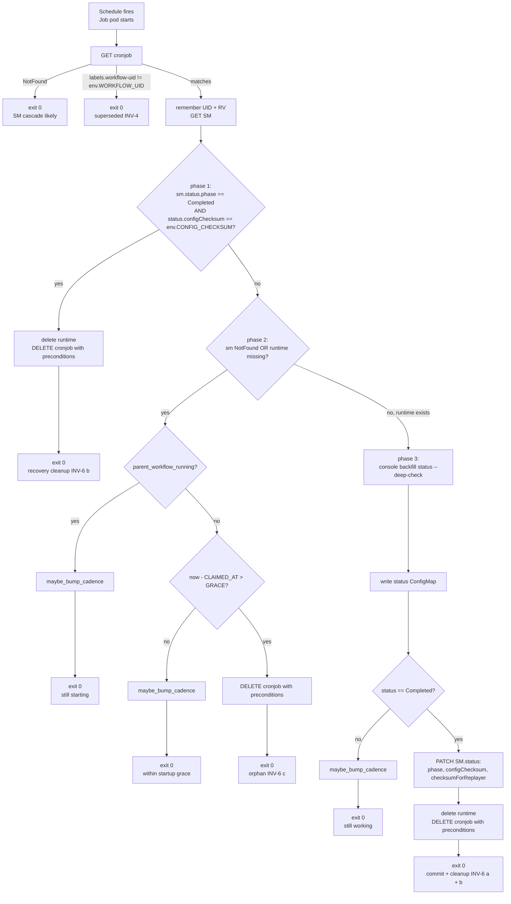
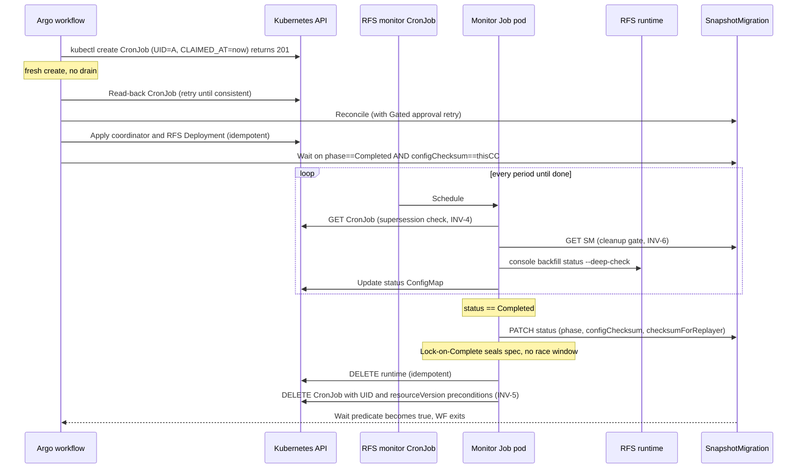
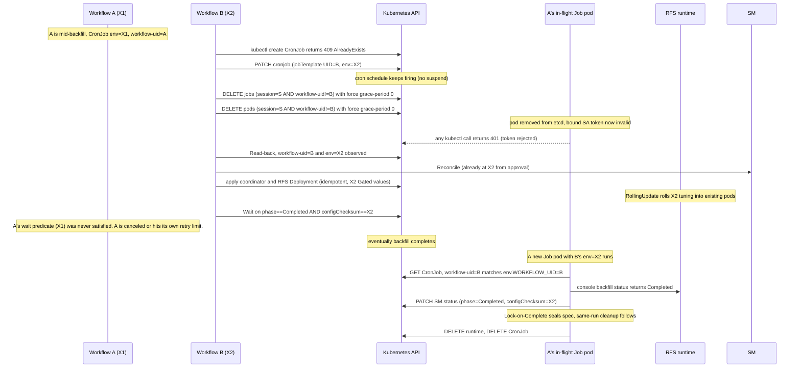
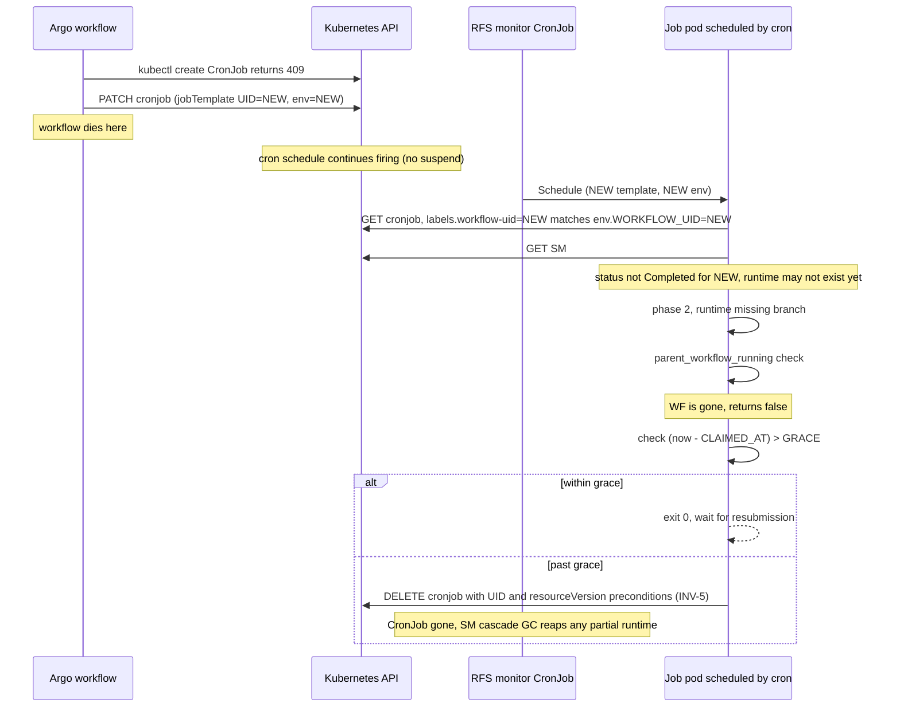
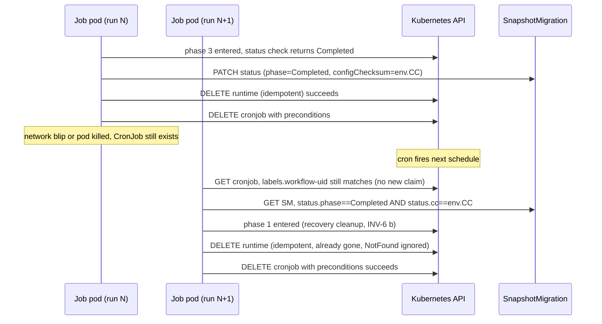

# Design Doc: RFS Completion CronJob for `documentBulkLoad` (v2)

## Objective

Move RFS document-backfill monitoring, `SnapshotMigration` status commit, and RFS runtime cleanup out of the Argo workflow and into a Kubernetes `CronJob` owned by `SnapshotMigration`. After this change:

- Workflow lifetime is decoupled from backfill duration. The workflow may exit (or die) while RFS keeps running.
- A re-submitted workflow (e.g., after a Gated tuning approval) seamlessly inherits the in-flight backfill rather than restarting it.
- Status commit and runtime teardown are owned by the CronJob, not by any workflow step.
- The CronJob tears itself down when work is done or when it can prove no workflow will ever drive it again.

The workflow's only RFS-related responsibilities become: claim the CronJob (apply + read-back), apply the runtime (idempotent), and wait on `SM.status`.

## Background

### The two checksums

The transformed `SnapshotMigration` config carries two distinct checksums:

- **`workloadIdentityChecksum`** — derived from source/target connection identity, snapshot identity, snapshot config, migration label, and the **Impossible-fields-only** subset of `documentBackfillConfig` (e.g., `indexAllowlist`, `allowLooseVersionMatching`, `docTransformerConfigBase64`). Used to compute `sessionName = rfs-${workloadIdentityChecksum}`. **Invariant for a SnapshotMigration's lifetime**, because every input to it is either Impossible (cannot change post-creation) or stable.
- **`configChecksum`** — broader change-detection. Derived from the full `documentBackfillConfig` (Impossible + Gated + Safe), `targetConfig`, snapshot config, and metadata config. Tracked on `SM.status.configChecksum` once committed. May change pre-completion via Gated approval.

Two workflow runs against the same SM (initial run + post-Gated-approval re-run) share `workloadIdentityChecksum`, so they share the same `sessionName`, the same `${sessionName}-rfs-done` CronJob, the same `${sessionName}-rfs` Deployment, and the same `${sessionName}-rfs-coordinator` set. The new run *re-applies* (does not recreate) these resources.

### The VAP system

Three `ValidatingAdmissionPolicy` rules on `snapshotmigrations` enforce spec discipline at the API server. The CronJob design *relies on* these and does not duplicate them.

| VAP | Rule | Implication |
| --- | --- | --- |
| **Impossible** | UPDATE rejected if it touches `metadataMigrationConfig`, `indexAllowlist`, `allowLooseVersionMatching`, or `docTransformerConfigBase64`. | `workloadIdentityChecksum` cannot change for a live SM. |
| **Gated** | UPDATE to operational fields rejected unless the request carries `metadata.annotations["migrations.opensearch.org/approved-by-run"]` matching the current `metadata.labels["workflows.argoproj.io/run-uid"]`. | A re-submitted workflow's reconcile retries through the approval flow. |
| **Lock-on-Complete** | UPDATE rejected if `oldObject.status.phase == 'Completed'` and `object.spec != oldObject.spec`. | Spec is sealed once any commit lands. |

### What the workflow does today

For an RFS-enabled `SnapshotMigration` where `currentConfigChecksum != configChecksum`:

1. Reconcile the SM (with retry-loop for Gated approvals).
2. Optionally run metadata migration.
3. Apply the coordinator (idempotent, owned by SM).
4. Apply the RFS `Deployment` (idempotent — `apply`, not `create`; re-apply with new Gated values rolls in place).
5. Poll `console backfill status --deep-check` from a `MigrationConsole` pod, retrying every ~5 minutes via Argo's `retryPolicy`.
6. On completion: delete RFS `Deployment`, delete coordinator, patch `SM.status` with `phase=Completed`, `configChecksum`, `checksumForReplayer`.

This design replaces steps 5 and 6 with the CronJob.

### Naming

| Resource | Name | Note |
| --- | --- | --- |
| Session ID | `sessionName = rfs-${workloadIdentityChecksum}` | stable for SM's lifetime |
| RFS `Deployment` | `${sessionName}-rfs` | applied idempotently |
| Coordinator `StatefulSet`/`Service` | `${sessionName}-rfs-coordinator` | applied idempotently |
| Coordinator credentials `Secret` | `${sessionName}-rfs-coordinator-creds` | applied idempotently |
| Completion CronJob (new) | `${sessionName}-rfs-done` | applied with try-create-then-patch+drain |
| Status `ConfigMap` (new) | `${sessionName}-rfs-status` | written by CronJob; read by status/manage tooling |

All carry `ownerReferences` to the `SnapshotMigration` with `controller: false, blockOwnerDeletion: true`.

### What could go wrong

The design must hold under: workflow death at any step boundary; two workflow runs against the same session (initial + post-Gated-approval); transient API blips during commit or cleanup; user deletion of the SM; and Argo retry of the apply step. The VAPs above eliminate spec-mutation races; the deterministic naming eliminates resource-multiplicity races. The remaining hazards are sequencing hazards across workflow runs and across script invocations — the invariants below close them, and the worked sequences below the diagrams trace the hardest cases end-to-end.

## Invariants

The design rests on nine invariants. Each carries a one-line *why* tag identifying the scenario it exists to survive.

| # | Invariant | Why |
| --- | --- | --- |
| INV-1 | The CronJob is the **sole writer** of `SM.status.{phase, configChecksum, checksumForReplayer}` for RFS-enabled migrations. The workflow never patches any of these three fields. (Metadata-only path keeps the workflow-side patch.) Patches are field-scoped JSON-merge or strategic-merge; never full-status replacement. | Single committer; lets other controllers update other `status.*` subtrees safely. |
| INV-2 | The CronJob is the **sole application-level deleter** of session resources (RFS `Deployment`, coordinator `StatefulSet`/`Service`/`Secret`, the CronJob itself). Kubernetes garbage collection via `ownerReferences` cascade (when the SM is deleted) is the only other deletion path. | Avoids the workflow tearing down work the CronJob is still managing. |
| INV-3 | Names are deterministic by `workloadIdentityChecksum` (INV-9). At most one of each session resource exists at any time. All apply paths use UPSERT semantics: try-create-then-patch+drain for the CronJob; `kubectl apply` (or server-side apply) for runtime resources. | Removes resource-multiplicity races; lets two workflow runs share one session. |
| INV-4 | Every Job pod carries `WORKFLOW_UID`, `CONFIG_CHECKSUM`, and `CHECKSUM_FOR_REPLAYER` in its env, snapshotted at the moment its parent workflow last applied the CronJob. The Job script's first action is `GET cronjob`; if `metadata.labels[workflow-uid] != env.WORKFLOW_UID`, the script is **superseded** and exits 0 with no mutations. The supersession check happens before any mutating call. | A pod from a prior claim, surviving past drain, must self-arrest before mutating. |
| INV-5 | Any CronJob `DELETE` issued by a Job pod uses API-level `Preconditions{UID, ResourceVersion}` taken from the same GET that satisfied INV-4. Either UID-mismatch or ResourceVersion-advance returns 409, and the script exits 0. | Atomic ownership: at most one of {workflow-update, job-delete} commits. |
| INV-6 | A Job execution's mutating actions are scoped to one of: *(a)* **commit** — patch `SM.status` with `phase=Completed` and the env's checksums; *(b)* **cleanup** — delete runtime resources, then atomically delete the CronJob, gated on `status.phase==Completed AND status.configChecksum==env.CONFIG_CHECKSUM`; *(c)* **orphan-self-delete** — atomic CronJob delete only, gated on the orphan predicate. **Commit and cleanup may run in the same execution.** (c) is mutually exclusive with (a) and (b) by construction. Status `ConfigMap` writes are not a mutating action. | Bounded per-run blast radius; cleanup gated on *my* commit (not just *some* commit) so a stale claim never tears down a future claim's work. |
| INV-7 | All session resources carry `ownerReferences` to `SnapshotMigration` with `controller: false, blockOwnerDeletion: true`. | Deleting the SM cascades cleanup; no special path required. |
| INV-8 | The CronJob is applied **before** SM reconciliation, runtime apply, or the wait step ("janitor first"). The apply step is `try-create → on 409, patch(jobTemplate=new) → force-delete jobs+pods whose `workflow-uid` label differs from the new UID (`--force --grace-period=0`)`. The CronJob is **never** suspended; the cron schedule continues firing throughout. After the apply step's read-back returns, the CronJob spec is the new template; any prior-claim Pod still alive is caught by INV-4 + INV-5 on its next iteration, and on K8s ≥1.21 with `BoundServiceAccountTokenVolume` (default), force-deleted Pods cannot mutate cluster state because the API server rejects every request signed with a deleted Pod's projected service-account token. | Replaces the whole template atomically and reaps prior-claim Pods, without a suspended state that could deadlock if the workflow dies mid-apply. |
| INV-9 | `workloadIdentityChecksum` cannot change for a live SM (Impossible VAP). `configChecksum` may change pre-completion via Gated approval, but Lock-on-Complete VAP makes it immutable post-`status.phase==Completed`. | INV-3's at-most-one claim and INV-6's cleanup gate rest on these spec-immutability guarantees. |

## Responsibilities

| Concern | Workflow | CronJob |
| --- | --- | --- |
| Apply / update CronJob (try-create-then-patch+drain, with read-back) | Yes, **first** (janitor-first, INV-8) | — |
| Reconcile SM (with Gated approval retry) | Yes, **after** CronJob | — |
| Apply coordinator + RFS `Deployment` (idempotent `apply`) | Yes | — |
| Poll RFS status | — | Yes, every period |
| Update status `ConfigMap` for UI tooling | — | Yes |
| Patch `SM.status` (RFS path) | **No** | **Yes** |
| Patch `SM.status` (metadata-only path) | Yes | — |
| Delete RFS runtime | **No** | **Yes**, when `status==env.CONFIG_CHECKSUM` |
| Delete CronJob | **No** (sole-arbiter rule; not even on happy path) | **Yes**, atomically |
| Wait for `SM.status.Completed` | Yes | — |

## CronJob Decision Logic

Each Job pod runs once per schedule and exits. Branches are mutually exclusive: a run enters cleanup, or orphan-self-delete, or status-poll (which may include commit-then-cleanup). Status `ConfigMap` writes are not a phase and may accompany any branch.

### Decision tree



### Pseudocode

```
# Helper used at every non-terminal exit. See "Adaptive cadence" below.
# Inputs: cronjob (the GET captured at script start, satisfying INV-4),
#         rv (cronjob.metadata.resourceVersion from that same GET).
fn maybe_bump_cadence(cronjob, rv):
    raw = cronjob.metadata.labels[CADENCE_LABEL]
    current_step = int(raw) if raw matches "[1-5]" else 1            # bootstrap default
    desired_step = min(current_step + 1, 5)
    if desired_step == current_step:
        return                                                       # already at cap
    kubectl patch cronjob $RFS_CRONJOB_NAME --type=merge -p \
      '{"metadata":{
           "resourceVersion":"<rv>",
           "labels":{"<CADENCE_LABEL>":"<desired_step>"}
        },
        "spec":{"schedule":"*/<desired_step> * * * *"}}'
    # 409 (resourceVersion mismatch) means someone else has touched the
    # cronjob since our INV-4 GET; treat as "no longer mine" and exit 0.
    # NB: this advances cronjob.resourceVersion; do not issue a preconditioned
    # DELETE after this point in the same run.

on schedule:

  # ---- 0. SUPERSESSION CHECK — INV-4, INV-5 prep --------------------------
  cronjob = kubectl get cronjob $RFS_CRONJOB_NAME -o json
  if cronjob is NotFound:
      exit 0    # Most likely SM cascade already happened.
  if cronjob.metadata.labels[workflow-uid] != env.WORKFLOW_UID:
      exit 0    # Superseded by a newer workflow's apply.

  remember (cronjob.metadata.uid, cronjob.metadata.resourceVersion)
            # used later for atomic --uid --resource-version delete

  sm = kubectl get snapshotmigration $SNAPSHOT_MIGRATION_NAME -o json || NOT_FOUND

  # ---- 1. RECOVERY-CLEANUP PHASE — INV-6 (b) ------------------------------
  # A previous run committed but failed to finish cleanup (network blip mid-
  # cleanup, container killed between PATCH and DELETE, etc.). Gated on
  # env.CONFIG_CHECKSUM, not spec.configChecksum, so an older claim never
  # tears down resources committed by a newer claim.
  if sm exists and
     sm.status.phase == "Completed" and
     sm.status.configChecksum == env.CONFIG_CHECKSUM:
      delete_runtime_resources()                   # idempotent
      delete_cronjob_with_preconditions(uid, rv)   # 409 ⇒ no-op next run
      exit 0

  # ---- 2. ORPHAN / STARTUP-WINDOW PHASE — INV-6 (c) -----------------------
  # SM-NotFound is treated identically to runtime-missing (janitor-first
  # ordering means CronJob can exist before SM is reconciled).
  if sm is NotFound or not runtime_resource_exists():
      if parent_workflow_running():
          maybe_bump_cadence(cronjob, rv)
          exit 0
      if (now - env.CLAIMED_AT) <= STARTUP_GRACE_SECONDS:
          maybe_bump_cadence(cronjob, rv)
          exit 0
      delete_cronjob_with_preconditions(uid, rv)
      exit 0

  # ---- 3. STATUS POLL + COMMIT(+CLEANUP) PHASE — INV-6 (a) + (b) ----------
  status_json = console --json backfill status --deep-check  || true
  if status_json is unavailable:
      write_status_configmap("Status check is not available yet", status_json)
      maybe_bump_cadence(cronjob, rv)
      exit 0

  write_status_configmap(summary_from(status_json), status_json)

  if status_json.status != "Completed":
      maybe_bump_cadence(cronjob, rv)
      exit 0    # still working

  # Backfill is done. Commit, then immediately clean up. Lock-on-Complete VAP
  # (INV-9) freezes spec the instant the patch returns; no spec change can
  # land between this commit and the cleanup below. We don't need to wait
  # for the next schedule.
  patch_sm_status(
    phase = "Completed",
    configChecksum = env.CONFIG_CHECKSUM,
    checksumForReplayer = env.CHECKSUM_FOR_REPLAYER
  )

  delete_runtime_resources()                       # idempotent
  delete_cronjob_with_preconditions(uid, rv)       # 409 ⇒ next run is a no-op

  exit 0
```

Notes:

- **Same-run commit-then-cleanup.** Lock-on-Complete makes the spec immutable from the instant the status patch returns; cleanup latency is bounded by API call latency (~1s), not by the cron schedule.
- **Phase 1's gate uses `env.CONFIG_CHECKSUM`, not `spec.configChecksum`.** A Pod from workflow A's claim cleans up only when the visible status is *its* commit. If workflow B has subsequently claimed the CronJob, B's Pods do not enter phase 1 until status reflects B's commit.
- **Check-and-exit, never wait.** Each run is GET cronjob, GET SM, optionally one console call + one patch + two deletes, exit. The cron schedule does the waiting; the script never sleeps internally.
- **Atomic CronJob delete** uses API-level `DeleteOptions{Preconditions{UID, ResourceVersion}}` (kubectl CLI doesn't expose preconditions). A `409 Conflict` (or `Precondition failed`) is expected when a newer workflow has updated the CronJob; treat it as "no longer mine" and exit 0.

### Adaptive cadence

Backfills are bursty: shards spin up in seconds-to-minutes, then long-tail completion stretches over hours. A fixed 5-minute period is wasteful early (we want to catch fast completions and progress updates promptly) and a 1-minute period is wasteful late (most checks return "still working" and burn API budget for nothing).

The script ramps the CronJob's `spec.schedule` over its first several non-terminal runs:

| Cadence step | `spec.schedule` |
| --- | --- |
| 1 (initial / unbootstrapped) | `*/1 * * * *` |
| 2 | `*/2 * * * *` |
| 3 | `*/3 * * * *` |
| 4 | `*/4 * * * *` |
| 5 | `*/5 * * * *` (terminal cadence) |

Mechanics:

- The current step lives on the CronJob as the label `migrations.opensearch.org/rfs-monitor-cadence-step` (value `"1"` through `"5"`). **The CronJob script is the sole writer of this label and of `spec.schedule`.** The workflow's apply step does not touch either field — it owns the `workflow-uid` and `rfs-monitor-session` labels and `spec.jobTemplate`, nothing else.
- A fresh `kubectl create` produces a CronJob with no cadence-step label; the manifest also doesn't pin `spec.schedule` (defaults to whatever the manifest builder leaves blank, typically the K8s controller's nil-handling). The script bootstraps both on its first non-terminal run.
- At the end of each non-terminal branch (phase 2 still-starting-or-within-grace exit, phase 3 still-working exit, phase 3 status-unavailable exit), the script:
  1. Reads `current_step` from the label. **If absent or malformed, treats it as `1`.**
  2. Computes `desired_step = min(current_step + 1, 5)`.
  3. If `desired_step != current_step`, issues a **single PATCH** that updates both the label and `spec.schedule` atomically. The PATCH includes `metadata.resourceVersion` from the script's INV-4 GET as an optimistic-concurrency precondition; on 409 the script exits 0.
- Terminal branches (phase 1 recovery-cleanup, phase 2 orphan-self-delete, phase 3 commit-then-cleanup) skip the cadence patch — about to delete the CronJob anyway.
- **Cross-workflow handoff inherits cadence.** When workflow B's apply patches a CronJob A previously claimed, B leaves cadence-step and `spec.schedule` alone. B's first non-terminal Pod simply continues ramping from wherever A left off. This is fine: the cadence reflects how long this *backfill* has been running, not how long this *workflow* has been driving it, and the new workflow benefits from inheriting the prior claim's accumulated learning that the work is long-running.
- **Ordering rule.** The cadence patch advances the CronJob's `resourceVersion`, which would invalidate any subsequent preconditioned DELETE issued from the same captured GET. Therefore: **the cadence patch is the last mutation in any non-terminal branch; no DELETE follows it.**

The cap at 5 means a freshly-created CronJob reaches `*/5` after `1+2+3+4 = 10` minutes of non-terminal polling. Backfills that complete inside that window see completion within at most 1 minute.

## Workflow Logic

Ordering note (INV-8): CronJob ("janitor") is applied **before** SM reconciliation and runtime apply. Apply the safety net before the thing it's catching. The Job script tolerates SM-NotFound, so this ordering is safe and removes the need for any workflow-side teardown of the CronJob — the CronJob is the sole arbiter of its own lifecycle.

```
for each RFS-enabled SnapshotMigration the workflow handles:

  1. Build cronjob manifest:
       spec.schedule: "*/1 * * * *"                          (initial seed for fresh-create only;
                                                              never patched on update)
       Labels (object and spec.jobTemplate.metadata.labels):
         workflow-uid: this workflow.uid                    (per-claim, INV-4)
         rfs-monitor-session: this sessionName              (stable, drain selector)
       Job template env:
         WORKFLOW_UID, PARENT_WORKFLOW_NAME, PARENT_WORKFLOW_UID,
         CLAIMED_AT = unix-seconds-now,
         SNAPSHOT_MIGRATION_NAME,
         CONFIG_CHECKSUM, CHECKSUM_FOR_REPLAYER,
         RFS_DEPLOYMENT_NAME, RFS_COORDINATOR_NAME,
         USES_DEDICATED_COORDINATOR, RFS_CRONJOB_NAME,
         RFS_STATUS_CONFIGMAP_NAME, STARTUP_GRACE_SECONDS

  2. Apply with try-create-then-patch+drain (INV-8). The CronJob is never
     suspended; the cron schedule keeps firing throughout the apply step.
       try: kubectl create -f cronjob.yaml      # 201 ⇒ done, no drain
       on 409 AlreadyExists:
         kubectl patch cronjob $NAME --type=merge -p \
           '{"metadata":{"labels":{
                "migrations.opensearch.org/rfs-monitor-workflow-uid":"<this.workflow.uid>"
             }},
             "spec":{"jobTemplate":<new>}}'
         OLD_FILTER='migrations.opensearch.org/rfs-monitor-session=<sessionName>,migrations.opensearch.org/rfs-monitor-workflow-uid!=<this.workflow.uid>'
         kubectl delete jobs -l "$OLD_FILTER" --force --grace-period=0
         kubectl delete pods -l "$OLD_FILTER" --force --grace-period=0
     Detect create-vs-update from the API response (201 vs 409 fallthrough),
     not from a pre-apply GET. Drain is skipped on the create path.
     The patch updates the object-level `workflow-uid` label and the
     `spec.jobTemplate` (which carries the new env and the new template-level
     `workflow-uid` label). It does **not** touch `spec.schedule` or the
     `rfs-monitor-cadence-step` label — those are owned by the script.

  3. Read-back loop (with backoff) until ALL of:
       - metadata.deletionTimestamp absent
       - metadata.labels[workflow-uid] == this workflow.uid
       - metadata.labels[rfs-monitor-session] == this sessionName
       - spec.jobTemplate.metadata.labels[workflow-uid] matches
       - spec.jobTemplate.metadata.labels[rfs-monitor-session] matches
       - Job template env contains current CONFIG_CHECKSUM and CLAIMED_AT
     Read-back does NOT assert `spec.schedule` or the `rfs-monitor-cadence-step`
     label — those are owned by the script and may carry over from a prior claim.

  4. Reconcile SM (the existing reconcileSnapshotMigrationResource template,
     including the Gated approval retry loop).

  5. If migrateFromSnapshot guard fires (currentConfigChecksum != configChecksum):
     a. Apply coordinator (idempotent — `apply`, owned by SM).
     b. Apply RFS Deployment (idempotent — `apply`, owned by SM).
     If the guard does NOT fire, skip 5a/5b (already complete for this checksum).

  6. Wait on:
       SM.status.phase == "Completed"
       AND SM.status.configChecksum == this.configChecksum
     Do NOT delete runtime, do NOT patch status, do NOT delete the CronJob.
     All three belong to the CronJob.
```

For metadata-only migrations: no CronJob; keep the existing workflow-side `patchSnapshotMigrationCompleted`.

### Why the apply step looks like this

- **Try-create-then-patch (no pre-apply GET).** The API atomically reports: 201 = created, 409 = exists → fall through to patch. No TOCTOU between "does it exist?" and "create it."
- **Targeted label selector for drain.** `rfs-monitor-session=<sessionName>,rfs-monitor-workflow-uid!=<this.workflow.uid>` matches Jobs and Pods from any prior claim of this session, but excludes the new claim's own Jobs that the controller may have already scheduled between the patch and the LIST. The new claim's Pods survive; old claim's Pods are reaped.
- **No `spec.suspend` toggling.** Suspending the CronJob to drain would create a recovery hazard: if the workflow died between `suspend:true` and `suspend:false`, the CronJob would be permanently halted and the orphan/cleanup logic could never run. Without suspend, the cron schedule continues firing throughout the apply step, so any partial-apply state is self-recovering: the next Job the controller schedules either matches the new claim (proceeds normally) or matches an old claim (INV-4 supersession check at the top → exit 0, no mutation).
- **Force-deleted Pods cannot mutate cluster state.** On K8s ≥1.21 with `BoundServiceAccountTokenVolume` (default), the projected SA token is bound to the pod UID. Once the Pod is removed from etcd, the API server rejects every request that token signs — even from a still-running container the kubelet hasn't reaped. Verify in the target environment that pod specs use `serviceAccountToken` projected volumes (not the legacy `automountServiceAccountToken` mount). Target deployment is K8s 1.35.
- **Server-side apply** would handle one-call upserts but doesn't help here: we still need to know whether we created or updated to decide whether to drain.

### Argo step shape

The apply step is a **container template** (image: `MigrationConsole`, which already has `kubectl` + `jq`), not a resource template. Resource templates can't condition on HTTP status codes (we need to fall through specifically on 409 AlreadyExists), can't chain a multi-call drain sequence cleanly, and have no first-class equivalent of `kubectl ... --force --grace-period=0`. Pod-startup cost is paid once per migration.

```yaml
retryStrategy:
  limit: "5"
  retryPolicy: Always           # Failed (non-zero exit) + Errored (node disruption)
  backoff:
    duration: "2s"
    factor: "2"
    maxDuration: "30s"
```

`Failed` = pod's main container exited non-zero (transient kubectl error); `Errored` = pod itself didn't complete (node eviction, scheduling failure). `Always` retries both.

## Worked Sequences

These four sequences trace the trajectories that actually exercise the invariants. They're not exhaustive; they're the cases worth reasoning about explicitly. A reviewer who wants to attack the design should draw a new sequence and check whether the invariants hold.

### S1 — Happy path

A single workflow drives a backfill from start to finish.



What this proves: phases 0, 3 (with same-run commit + cleanup), and INV-1/2/4/5/6/8 in their nominal use. The `kubectl create` returning 201 confirms the no-drain create path.

### S2 — Workflow B inherits Workflow A's session after a Gated approval

A is mid-backfill with X1 tuning. User submits B with X2. B's reconcile runs the Gated approval flow, advancing spec to X2; B then proceeds to claim the CronJob.



What this proves: INV-8's drain handles cross-workflow handoff without suspend; INV-3 lets one session span two workflow runs; INV-9 keeps `workloadIdentityChecksum` constant so all session names match; INV-6's `env.CONFIG_CHECKSUM` gate prevents an A-Pod from cleaning up B's session if one slipped past the drain. B's apply leaves `spec.schedule` and `cadence-step` untouched; B's first non-terminal Pod continues ramping from A's accumulated cadence.

### S3 — Workflow dies mid-apply

The workflow is killed (Argo controller crash, node failure, etc.) somewhere during the apply step. The CronJob may be in any partial-apply state. We need the system to recover without external intervention.



What this proves: the no-suspend design has no deadlock state. Wherever the workflow died (between create-or-patch, between patch and delete-jobs, between delete-jobs and delete-pods, or after read-back but before runtime apply), the CronJob keeps scheduling Pods, Pods see "runtime missing AND workflow gone," and orphan-self-delete eventually fires. INV-7's owner-ref cascade reaps anything the workflow did create before dying. STARTUP_GRACE_SECONDS gives a resubmitted workflow time to come along and re-claim.

If the workflow died **before** the patch (only the create attempt happened, returning 201), the CronJob's labels still match its own env (it just created itself), and the same recovery path applies: phase 2 sees runtime missing, eventually orphans.

### S4 — Partial cleanup

Phase 3 commits successfully, then `delete runtime` succeeds, but `delete cronjob` returns a transient API error (or the container is killed between the two deletes).



What this proves: phase 1 is the recovery path for any incomplete cleanup. The gate `status.phase==Completed AND status.configChecksum==env.CONFIG_CHECKSUM` is observable on every run and matches whether the partial state was from this same Job pod or from a previous run. Both deletes are idempotent (NotFound is ignored), so re-issuing them is safe.

If a fresh workflow B claimed the CronJob between Job1's commit and Job2's run, Job2's supersession check (INV-4) fails first — Job2 exits 0, and B's own Job pods take over the cleanup gated on B's own `env.CONFIG_CHECKSUM`. Status committed by A (X1) does not match B's env (X2), so B's Pods do not enter phase 1; they continue monitoring until B's commit lands, at which point B's same-run cleanup happens.

## Resource Model

| Resource | Name | Owner | Lifetime |
| --- | --- | --- | --- |
| CronJob | `${sessionName}-rfs-done` | `SnapshotMigration` | Until last run's atomic self-delete (or SM cascade) |
| RFS `Deployment` | `${sessionName}-rfs` | `SnapshotMigration` | Until CronJob's cleanup phase |
| Coordinator (StatefulSet/Service/Secret) | `${sessionName}-rfs-coordinator` and `${sessionName}-rfs-coordinator-creds` | `SnapshotMigration` | Same |
| Status `ConfigMap` | `${sessionName}-rfs-status` | `SnapshotMigration` | Same |

Labels on the CronJob (and `spec.jobTemplate.metadata.labels`):

- `migrations.opensearch.org/rfs-monitor-workflow-uid=<workflow.uid>` — per-claim. Used for INV-4 supersession check and as the `!=` filter in the drain selector so the new claim's own Pods are not reaped.
- `migrations.opensearch.org/rfs-monitor-session=<sessionName>` — session-stable. Used as the positive selector for drain so the LIST is scoped to this session (and to the prior workflow's resources, if any) and not to unrelated CronJobs in the namespace.
- `migrations.opensearch.org/rfs-monitor-cadence-step=<1..5>` — current cadence step. Mirrors the `*/N * * * *` value in `spec.schedule`. **The CronJob script is the sole writer**; the workflow's apply step does not set or update it. The script patches this label and `spec.schedule` atomically (with a `resourceVersion` precondition) when bumping cadence. May be absent on a freshly-created CronJob; the script treats absent/malformed as step 1.

No `cleanup-pending` label is used; INV-5's atomic deletion preconditions cover that case.

## Status ConfigMap

The CronJob persists the most recent `console backfill status --deep-check` summary so `workflow status` / `workflow manage` can render progress without a second polling path.

```text
name:   ${sessionName}-rfs-status
owner:  SnapshotMigration
labels: migrations.opensearch.org/from-snapshot-migration: <migrationLabel>
data:
  summary:    <human-readable one-line progress>
  status.json: <raw console JSON or error text>
  updatedAt:  <UTC timestamp>
```

The CronJob is the only writer. `workflow status` and `workflow manage` read it for RFS wait nodes instead of rerunning live checks.

## Workflow Wait

The workflow waits on:

```text
SM.status.phase == "Completed"
SM.status.configChecksum == this.configChecksum
```

Reusing `ResourceManagement.waitForSnapshotMigration` is fine. The constraint is that the workflow does not run a parallel RFS status loop.

## RBAC

The existing `argo-workflow-executor` role covers everything the CronJob needs except `cronjobs`. Add to the batch rule:

```yaml
- apiGroups: ["batch"]
  resources: ["jobs", "cronjobs"]
  verbs: ["create", "get", "list", "watch", "update", "patch", "delete"]
```

The CronJob's other verbs (`get`/`delete` on deployments, statefulsets, services, secrets; `patch` on `snapshotmigrations/status`; `get` on snapshotmigrations and workflows; `create`/`get`/`update`/`patch` on configmaps) are already present in the existing role.

## Implementation Touch Points

- `documentBulkLoad.ts`:
  - Add `getRfsDoneCronJobName(sessionName)` and `getRfsStatusConfigMapName(sessionName)`.
  - Add a CronJob manifest builder owned by `SnapshotMigration`, with both labels (`workflow-uid` per-claim and `rfs-monitor-session` stable) on the CronJob object and `spec.jobTemplate.metadata.labels`. Env vars per the workflow-logic list.
  - Add an `applyRfsDoneCronJob` Argo container template (image: `MigrationConsole`) that performs try-create-then-patch+drain (INV-8). Wrap in `retryStrategy: {limit: 5, retryPolicy: Always, backoff: {duration: 2s, factor: 2, maxDuration: 30s}}`.
  - Reorder `setupandrunbulkload`: apply CronJob → read-back → apply coordinator (idempotent) → apply RFS Deployment (idempotent) → wait on SM.
  - Remove the workflow-side `waitForCompletion` polling step (lines 393–424 in `runbulkload`), the `stopHistoricalBackfill` step (lines 425–430), and the `cleanupRfsCoordinator` step (lines 510–518 in `setupandrunbulkload`). Replace with `waitForSnapshotMigration`.
  - Do **not** add a workflow-side teardown of the CronJob on the happy path. Sole-arbiter rule.
  - In the Job script: treat `kubectl get snapshotmigration` NotFound as a normal startup state, falling into phase 2 (orphan/startup-window).

- `fullMigration.ts` / `resourceManagement.ts`:
  - Keep the existing `migrateFromSnapshot when:` guard (`currentConfigChecksum != configChecksum`) — already correctly skips RFS work when complete.
  - For RFS-enabled migrations, do **not** run workflow-side `patchSnapshotMigrationCompleted`.
  - For metadata-only migrations, keep the workflow-side `patchSnapshotMigrationCompleted`.
  - Plumb `configChecksum` and `checksumForReplayer` (and `workloadIdentityChecksum`, already plumbed) into `DocumentBulkLoad`.

- `rfsCoordinatorCluster.ts`: remove workflow-side coordinator cleanup from the document-backfill path.

- `MigrationConsole` workflow status/manage code: read the status ConfigMap for RFS wait nodes; avoid live RFS status reruns when the ConfigMap is present.

- `deployment/k8s/charts/aggregates/migrationAssistantWithArgo/templates/resources/workflowRbac.yaml`: add `cronjobs` to the batch RBAC rule.

## Test Coverage

Organized by invariant.

**INV-1, INV-2 (sole writer / sole deleter):**
- RFS-enabled workflow path runs no `patchSnapshotMigrationCompleted` and no runtime delete.
- Metadata-only path still runs the workflow-side `patchSnapshotMigrationCompleted`.
- CronJob's `SM.status` patch is JSON-merge or strategic-merge over only `phase`/`configChecksum`/`checksumForReplayer`; never a full-status replacement.
- CronJob owner-ref points to `SnapshotMigration`; same for RFS Deployment, coordinator, and status ConfigMap.

**INV-3 (deterministic naming, UPSERT):**
- CronJob name resolves from `sessionName = rfs-${workloadIdentityChecksum}`.
- Apply step: `kubectl create` returns 201 on fresh-create path → no drain steps invoked. `kubectl create` returns 409 on update path → drain runs.
- Drain LIST/DELETE selector: `rfs-monitor-session=<sessionName>,rfs-monitor-workflow-uid!=<this.workflow.uid>`.

**INV-4 (supersession check):**
- Script exits 0 with no side effects when CronJob's `workflow-uid` label differs from env UID.
- Script exits 0 with no side effects when CronJob is NotFound (SM cascade case).

**INV-5 (preconditioned delete):**
- CronJob delete uses API-level `Preconditions{UID, ResourceVersion}` (kubectl CLI doesn't expose preconditions).
- Script exits 0 on 409 from the preconditioned DELETE.

**INV-6 (mutating-phase scoping):**
- Phase 3 (poll → commit → cleanup) runs all three steps in the same execution when backfill is Completed: PATCH `SM.status`, DELETE runtime, DELETE CronJob.
- Phase 1 (recovery cleanup) is reached only when entering a run finds status already reflects `env.CONFIG_CHECKSUM`.
- Cleanup gate uses `status.configChecksum == env.CONFIG_CHECKSUM` (not `status.configChecksum == spec.configChecksum`).
- An A-claim Pod whose env.CONFIG_CHECKSUM is X1 does not enter phase 1 cleanup when status was committed by a B-claim Pod at X2.
- Orphan predicate: `(SM-NotFound OR runtime-missing) AND NOT parent_workflow_running() AND (now - env.CLAIMED_AT) > STARTUP_GRACE_SECONDS`. Never reads `metadata.creationTimestamp`.

**INV-7 (owner-ref cascade):**
- All session resources carry `ownerReferences{controller: false, blockOwnerDeletion: true}` to SM.

**INV-8 (apply step):**
- Apply step is implemented as a container template (`MigrationConsole` image), not a resource template.
- Apply retry: `retryPolicy: Always`, `limit: 5`, backoff `2s × 2 ≤ 30s`.
- Apply step does **not** issue `spec.suspend` patches.
- Apply step issues exactly: PATCH cronjob {jobTemplate}, DELETE jobs (with selector), DELETE pods (with selector). In that order. No fifth call.
- Apply step seeds `spec.schedule: */1 * * * *` only on `kubectl create` (201). On the patch path (409), the apply does NOT touch `spec.schedule` or the cadence-step label.
- Read-back loop requires: deletionTimestamp absent, both `workflow-uid` and `rfs-monitor-session` labels present on object and Job template, env `CONFIG_CHECKSUM` and `CLAIMED_AT` current. Read-back does NOT assert `spec.schedule` or `cadence-step`.
- Workflow does not delete the CronJob even on the happy path.

**Adaptive cadence:**
- Non-terminal exits (phase 2 startup-window, phase 3 still-working, phase 3 status-unavailable) end with a single PATCH that updates both `metadata.labels[cadence-step]` and `spec.schedule` atomically. The PATCH carries `metadata.resourceVersion` from the script's INV-4 GET as a precondition; a 409 exits the script 0.
- Terminal exits (phase 1 cleanup, phase 2 orphan-self-delete, phase 3 commit-then-cleanup) issue **no** cadence patch.
- Step ladder: `1 → 2 → 3 → 4 → 5 → 5` (capped). No-op patch when already at 5.
- Bootstrap: when `metadata.labels[cadence-step]` is absent or malformed, the script treats the current step as 1 and the first non-terminal run patches to step 2.
- Cross-workflow re-claim does not reset cadence: B's apply leaves `spec.schedule` and `cadence-step` alone; B's first non-terminal Pod continues ramping from wherever A left off.
- The cadence patch is the last mutation in any non-terminal branch; no preconditioned DELETE follows it.

**Cross-workflow handoff (S2):**
- B's apply on an existing CronJob produces the patch + two force-deletes (no suspend).
- The first Job pod after B's apply has env=X2 and observes status.configChecksum=X1 (if A had committed) → does NOT enter phase 1 cleanup; continues monitoring; eventually commits X2 and cleans up in the same run.

**Workflow death recovery (S3):**
- After the workflow exits cold mid-apply (simulated), the CronJob's next-scheduled Pod sees the workflow gone and (after grace) orphan-self-deletes.

**Partial cleanup recovery (S4):**
- After phase 3's PATCH succeeds and runtime DELETE succeeds but CronJob DELETE fails, the next scheduled Pod observes `status.configChecksum == env.CONFIG_CHECKSUM` and re-issues the deletes via phase 1.

**RBAC and tooling:**
- RBAC includes batch `cronjobs`.
- Status/manage tooling renders cached `ConfigMap` summary for RFS wait nodes; does not reissue live `console backfill status` checks.

## Selected Defaults

- CronJob workflow-UID label key (per-claim, INV-4): `migrations.opensearch.org/rfs-monitor-workflow-uid`
- CronJob session label key (stable, INV-8 drain selector): `migrations.opensearch.org/rfs-monitor-session`
- CronJob cadence-step label key: `migrations.opensearch.org/rfs-monitor-cadence-step`
- Initial cadence (seeded only on `kubectl create`): `*/1 * * * *`
- Cadence ladder (advanced by script on non-terminal exits): `*/1 → */2 → */3 → */4 → */5`, then no further changes
- Cadence ramp time: ~10 minutes from fresh CronJob creation to terminal `*/5`
- Cross-workflow re-claim does NOT reset cadence; the new claim inherits wherever the prior claim left off
- `STARTUP_GRACE_SECONDS`: `600`
- `concurrencyPolicy: Forbid`
- `successfulJobsHistoryLimit: 1`
- `failedJobsHistoryLimit: 3`
- Image: `MigrationConsole`
- ServiceAccount: `argo-workflow-executor`
- Completion writer (RFS path): CronJob
- Completion writer (metadata-only path): workflow
- CronJob `spec.suspend`: never set; the controller schedules continuously
- Apply step: container template, not resource template
- Apply retry: `retryPolicy: Always`, `limit: 5`, backoff `2s × 2 ≤ 30s`
- Drain trigger: 409 AlreadyExists on `kubectl create`
- Drain mode: brutal (`--force --grace-period=0`); bounded by API latency, ≈ 1s
- K8s minimum version: 1.21+ for `BoundServiceAccountTokenVolume` (target deployment is 1.35)
